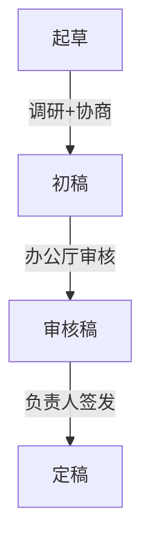
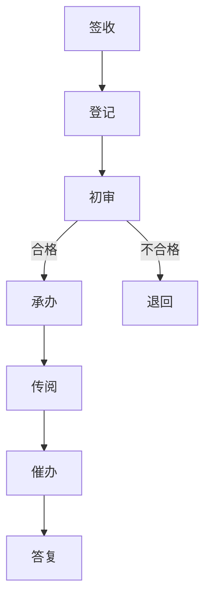

## 📋 第四节 公文办理：咋处理？

> **总览**：公文不是写完就完事儿，得“生出来”（拟制）、“跑起来”（办理）、“管起来”（管理）。《条例》第四条和第五条定了规矩，咱们一步步拆开看，像流水线一样顺溜！🏭

---

### 一、🧠 公文办理的含义和原则

#### （1）含义
- **定义**：公文处理是从写（拟制）、办（办理）到管（管理）的全套活儿，环环相扣。  
- **比喻**：就像做饭：准备食材（拟制）、炒菜端盘（办理）、收拾厨房（管理）。🍳

#### （2）原则（4个，考试重点⭐）
- **实事求是**：别瞎编，得真。  
- **准确规范**：不能马虎，得准。  
- **精简高效**：别啰嗦，得快。  
- **安全保密**：别泄密，得严。  
- **口诀**：真准快严，四字箴言记心间！🔒

---

### 二、✍️ 公文拟制：怎么“生”出来？

拟制是公文的“出生过程”，分起草、审核、签发三步。

#### （1）起草：写初稿
- **7个要求**：  
  1. **合法合规**：跟法律和政策对得上。  
  2. **实打实**：从实际出发，措施靠谱。  
  3. **简明扼要**：主题突出，文字精炼。  
  4. **文种格式对**：别用错“通知”当“请示”。  
  5. **调研论证**：多跑腿、多商量。  
  6. **协商一致**：涉及别人地盘，得先问好。  
  7. **领导把关**：大文件老板得盯着。  
- **例子**：写个教育改革通知，得查数据、问学校、跟领导汇报。

#### （2）审核：检查稿
- **谁审**：办公厅（室）把关。  
- **5个重点**：  
  1. **理由+依据**：为啥发、凭啥发。  
  2. **内容合规**：合法、靠谱、连贯。  
  3. **协商好了没**：别擅自闯别人地盘。  
  4. **格式细节**：文种、标点、人名都得准。  
  5. **其他要求**：起草规矩都得过关。  
- **初核**：重要文件先初审，再上会。  
- **例子**：通知漏了日期，审核退回重写。

#### （3）签发：拍板定
- **谁签**：机关主要负责人，尤其上行文和大文件。  
- **特例**：办公厅授权签，或按规定签。  
- **怎么签**：写意见+姓名+日期，圈阅算同意。  
- **联合发文**：所有负责人会签。  
- **例子**：省长签了个通知，写“同意 张三 2023.10.1”。

- **Mermaid图表**：拟制流程

- **考试重点⭐**：审核5个重点常考多选！

---

### 三、🏃‍♂️ 公文办理：怎么“跑”起来？

办理分发文、收文和归档三大块，像快递收发+存档。

#### （1）发文办理：发出流程
- **复核**：签完的文再查一遍，内容格式都得对。  
  - 例子：发现日期错了，得找领导复审。  
- **登记**：记下发文字号、分送范围、份数。  
- **印制**：确保质量，涉密文在保密处印。  
- **核发**：检查文字和印刷，分发出去。  
- **口诀**：复登印核，四步送出门！📬

#### （2）收文办理：接收流程
- **签收**：清点、签字、记时间。  
- **登记**：记下公文信息和办理情况。  
- **初审**：看该不该本单位办，格式行不行。  
  - 不合格就退回，比如漏了主送机关。  
- **承办**：阅知文分送，批办文提意见，紧急文限时办。  
  - 例子：加急通知当天分送领导。  
- **传阅**：送领导看，别漏传。  
- **催办**：盯着进度，紧急文专人催。  
- **答复**：办完回话，别拖着。  
- **例子**：收到请示，初审OK，分领导批，3天答复。

- **Mermaid图表**：收文流程

#### （3）整理归档：收拾好
- **清退**：退回涉密文、错误文等。  
  - 范围：涉密、错误、阅后退回等。  
  - 程序：通知→清点→交接。  
  - 例子：绝密文发时带清退单，过期退回。  
- **销毁**：毁掉没价值的文。  
  - 范围：草稿、重份、指定销毁等。  
  - 程序：收集→审批→监销。  
  - 例子：绝密文两人监销，登记不漏。  
- **暂存**：留着备查的文。  
  - 范围：参考价值、难定留毁的文。  
- **立卷归档**：整理成档案，按法规归档。  
- **考试重点⭐**：清退和销毁范围常考！

- **表格**：归档分类

| 类型   | 范围                     | 处理方式         |
|--------|-------------------------|-----------------|
| 清退   | 涉密、错误、阅后退回   | 通知→交接       |
| 销毁   | 草稿、重份、指定销毁   | 审批→监销       |
| 暂存   | 参考价值、难定留毁     | 留存备查       |
| 归档   | 有查考价值的文         | 整理成档案     |

---

### 四、🔐 公文管理：怎么“管”好？

管理是公文的“保姆”，得严规范。

#### （1）总体要求
- **制度**：各单位建公文管理制度。  
- **专管**：文秘部门或专人管。  
- **设施**：县级以上单位设机要室，配保密设备。

#### （2）4个注意事项
1. **密级管理**：拟定密级前保密，定后严管，解密才发布。  
   - 例子：绝密文专人管。  
2. **复制汇编**：机密文经批准复制，绝密文慎重，复制件同原件管。  
   - 例子：复制加戳记。  
3. **撤销废止**：发文机关或上级定，撤销自始无效，废止自失效后无效。  
   - 涉密文清退/销毁。  
4. **真题示例**（2021年）：绝密文能否随便复制？  
   - 答案：不能，需发文机关批准。

---

## 🌟 重点与考点
### 1. 重点
- **拟制**：起草7要求，审核5重点。  
- **办理**：发文4步，收文7步，归档4类。  
- **管理**：密级、复制、撤销全把关。

### 2. 口诀
- **拟制**：起草实准简，审核细协商，签发领导定。  
- **办理**：发文复印核，收文签审办，归档清销存。  
- **管理**：密级严，复制批，撤销废止别大意。

---
