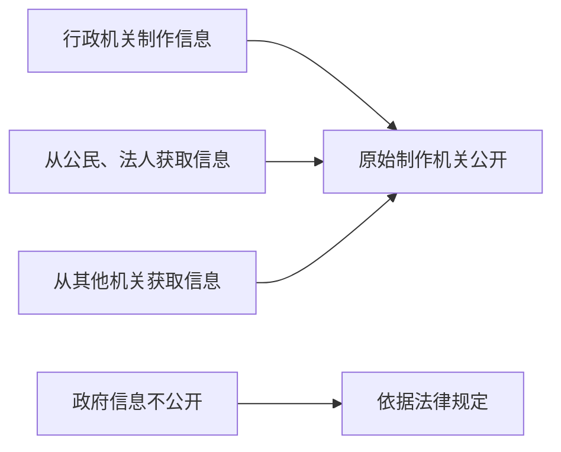

### 一、政府信息公开概述

#### 1. **政府信息的定义**
政府信息，就是行政机关在行使行政管理职能时，制作或获取的记录信息。简单来说，就是政府“在干活”时，产生的“工作记录”。  
举个例子：比如某个政府部门计划修建一条新道路，它会产生一系列相关信息：设计图纸、预算、施工单位等等，这些信息就是政府信息的一部分。

#### 2. **政府信息公开的主管部门**
- **全国主管部门**：国务院办公厅。
- **地方主管部门**：县级以上地方政府办公厅。

就像学校里有个主班长，负责协调、监督和推动所有活动一样，国务院办公厅就像是全国范围内的“主班长”。

#### 3. **工作机构的具体职能**
政府信息公开工作机构的任务就像办公室的“文员”，它需要：
- 处理和公开政府信息。
- 更新信息。
- 编制和发布相关指南、目录、年度报告等。

#### 4. **信息公开的原则**
“公开为常态、不公开为例外”！  
原则就是：公开是第一要务，不公开要有特殊理由。  
**透明化**，是政府信息公开的核心哦！💡

---

### 二、公开的主体和范围【重点】🔑

#### 1. **公开的主体**
- **行政机关制作的**：由制作单位负责公开。
- **从公民、法人获取的**：由保存该信息的机关负责公开。
- **从其他机关获取的**：由原始制作机关负责公开。

举个例子：假如公安局制作了关于某个案件的文件，那么公安局负责公开；如果它从法院拿到了一份判决书，那么法院要负责公开这部分信息。

#### 2. **公开的范围**
- **不公开**的：  
  - 国家机密（安全相关的）。
  - 个人隐私或商业秘密（比如你的小秘密或公司机密）。
  - 内部事务信息（比如人事管理、工作流程等）。
  
#### **图示：信息公开流程**

---

### 三、主动公开 🌟

对于那些公众非常关心的、需要参与决策的，政府要“主动”公开。  
如：政策规划、重大建设项目、财政预算、社会保障等。

#### 1. **主动公开的内容**
- 法规、规章、规范性文件。
- 各种计划和统计信息。
- 行政许可的相关条件、程序。
- 财政预算、决算等。

这些信息如果不公开，群众就会像“被蒙在鼓里”一样，感到政府不透明，信任度会大大降低。所以，主动公开是一个非常关键的环节！👍

#### 2. **主动公开的途径**
政府可以通过：
- 政府公报、网站、新闻发布会等公开。
- 设置查阅场所，为公民提供便利。

#### 3. **主动公开的时间**
政府信息在**20个工作日内**公开。遇到特殊情况，**最长延长20个工作日**。

---

### 四、依申请公开 📝

如果公民对某些信息有兴趣，但不在主动公开的范围内，他们可以申请公开。

#### 1. **申请的方式**
- 通过信件、邮件等形式提出请求。
- 口头申请也可以，但需要填写书面申请。

#### 2. **信息公开申请的流程**
- 提交申请 → 补充材料（如果需要） → 答复（20个工作日内）。
  
如果申请被拒绝，行政机关要说明理由。  

#### 3. **申请费用**
一般来说，不收费用。但是如果申请的数量过多，政府可以收取**信息处理费**。

---

### 五、信息公开工作年度报告 📊

每年政府要提交年度报告，内容包括：
- 主动公开的信息情况。
- 收到的申请和处理情况。
- 存在的主要问题及改进情况。

报告就像是政府的一份“成绩单”，看它是否达标。

---

### 习题考点 🧠

**关于主动公开的政府信息，行政机关的下列哪一做法符合《政府信息公开条例》规定：**  
A. 甲县规定，乡、镇政府制作的政府信息，统一由县政府负责公开  
B. 乙市一项行政事业性收费的标准发生变动，在标准变动以后第30日予以公开  
C. 丙区规定，行政机关应当编制、公布政府信息公开指南或政府信息公开目录，并及时更新  
D. 丁市政府在市图书馆设置政府信息查阅场所，并配备相应的设备，为公民、法人或者其他组织获取政府信息提供便利

#### **答案：**
C 和 D 都符合规定！🏆
