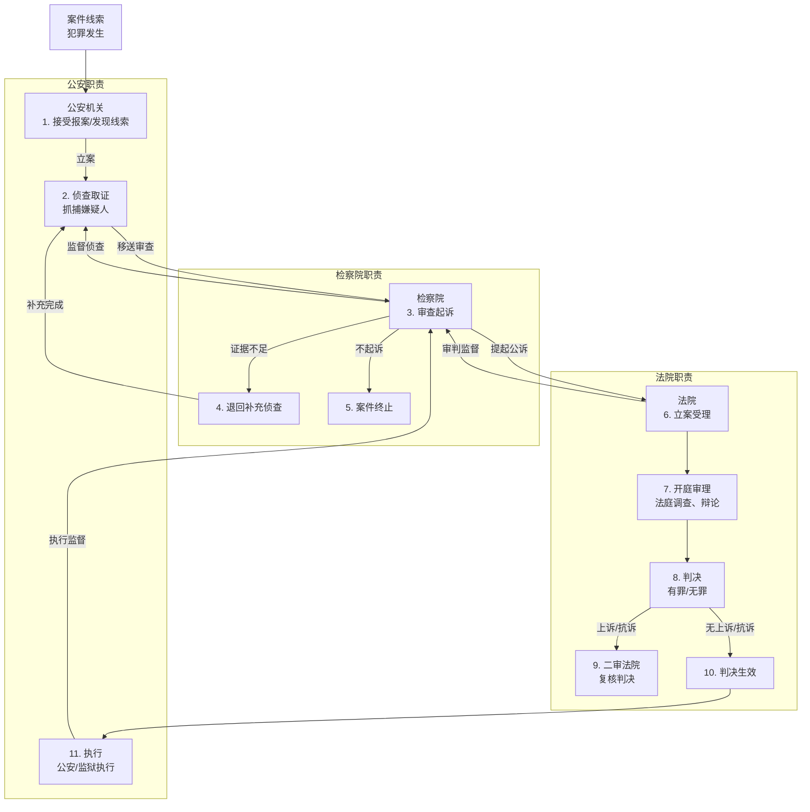
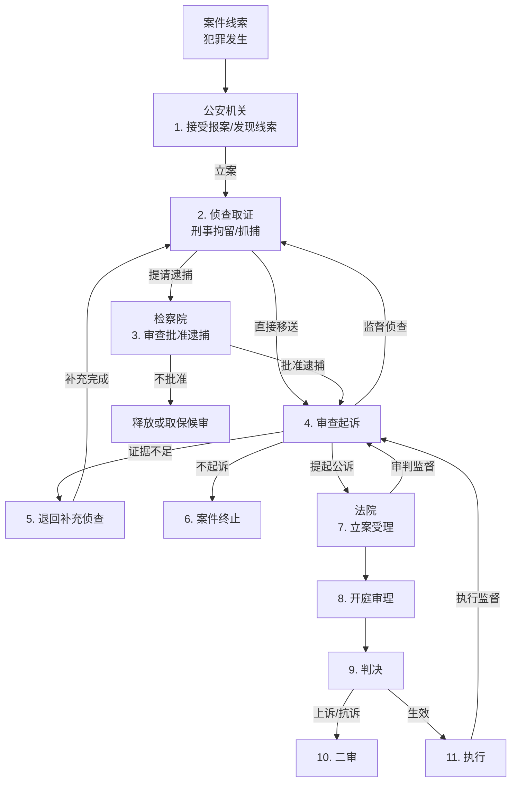

### 刑事司法完整流程简述
1. **公安机关**：案件起点，负责发现、立案、侦查、取证，抓嫌疑人。
2. **检察院**：中间站，审查公安移送的案件，决定起诉、不起诉或退回补充侦查，监督公安和法院。
3. **法院**：终点站，审理案件，判决结果，监督执行。

流程中还有反馈循环（如退回侦查）和监督关系，体现了三者协作与制约。

---

### Mermaid完整流程图
以下是Mermaid代码，表示公安机关、检察院、法院的完整流程：

### 流程详细说明
1. **案件线索**：有人报案或公安巡逻发现犯罪。
2. **公安立案侦查**：立案后调查、取证，抓嫌疑人。
3. **检察院审查起诉**：检查证据，决定下一步：
   - **退回补充侦查**：证据不够，公安再查。
   - **不起诉**：罪轻或证据不足，案件结束。
   - **提起公诉**：证据充分，送法院。
4. **法院立案受理**：接收起诉书，准备开庭。
5. **开庭审理**：法庭上查证据、辩论。
6. **判决**：判有罪（刑罚）或无罪。
7. **二审**：不服可上诉，检察院可抗诉，二审复核。
8. **判决生效**：无上诉或二审结束。
9. **执行**：公安或监狱执行刑罚（如监禁）。
10. **监督**：
    - 检察院监督公安侦查、法院审判、刑罚执行。
    - 法院监督检察院公诉（可驳回）。

在中国的刑事司法流程中，公安机关抓捕犯罪嫌疑人**不一定**需要经过检察院的批准，但具体情况取决于抓捕的类型和阶段。以下是详细解答，帮助你理解公安机关抓捕与检察院的关系：

---

### 公安机关抓捕是否需要检察院批准？
#### 1. 一般情况：不需要检察院批准
- **法律依据**：《中华人民共和国刑事诉讼法》（简称刑诉法）。  
- **公安职责**：公安机关是侦查机关，负责刑事案件的立案、侦查和抓捕。根据刑诉法第3条，公安机关有权自行决定采取侦查措施，包括抓捕嫌疑人。
- **常见抓捕形式**：
  - **刑事拘留**（刑诉法第82条）：公安机关对现行犯或重大嫌疑分子，可以先行拘留，无需检察院批准，但需在24小时内通知家属，且拘留后7日内提请检察院批准逮捕（紧急情况可延长至30日）。
  - **传唤/拘传**（刑诉法第119条、第123条）：公安可直接传唤嫌疑人到指定地点接受调查，或强制拘传，无需检察院批准。
  - **现场抓捕**：对于现行犯或紧急情况（如正在作案），公安可当场抓捕，无需任何批准。

#### 2. 需要检察院批准的情况：逮捕
- **逮捕定义**：逮捕是较长时间剥夺人身自由的强制措施，比拘留更严格。
- **法律要求**（刑诉法第89条、第91条）：公安机关拘留嫌疑人后，认为需要逮捕的，必须在拘留后3日内（特殊情况可延长至7日）提请检察院审查批准。检察院在7日内决定是否批捕。
- **流程**：
  1. 公安抓人（刑事拘留）。
  2. 收集证据，提请逮捕。
  3. 检察院审查，批准或不批准。
- **例外**：紧急情况下，公安可先抓捕，但事后必须补办手续。

#### 3. 特殊情况：检察院直接介入
- **检察院自行侦查**（刑诉法第18条）：对于贪污贿赂、渎职等职务犯罪，检察院有权直接立案侦查并抓捕，此时无需公安介入。
- **监督抓捕**：检察院可监督公安抓捕的合法性（如是否超期拘留），但不直接批准抓捕行为。

---

### 通俗解释
- **抓捕初期**：公安是“先锋队”，发现犯罪就动手抓，不用等检察院点头。比如街头抓小偷，公安直接上！
- **逮捕阶段**：要把人关久一点，公安得找检察院“签字”，检察院是“审核员”，看证据够不够。
- **比喻**：公安像“猎手”，抓到“猎物”后，检察院是“裁判”，决定能不能“锁起来”。

---

### Mermaid图表（补充逮捕流程）
以下是更新后的图表，突出公安抓捕与检察院逮捕批准的关系：

---

### 图表说明
- **公安抓捕（C）**：直接行动，无需检察院批准。
- **提请逮捕（D）**：公安需检察院批准才能正式逮捕。
- **后续衔接**：逮捕后进入审查起诉，再到法院审判。

公安机关抓捕不一定经过检察院：
- **刑事拘留/现场抓捕**：公安自主决定，无需批准。
- **逮捕**：需要检察院批准，公安不能直接决定。

如果是问“抓捕后能不能一直关着”，那得看检察院批不批逮捕，否则只能放人或取保候审。

---

### 案件背景：小明的盗窃案
- **情景**：小明是个普通打工仔，某天晚上在超市偷了一台价值5000元的手机，被监控拍到。超市老板报案，案件就此开始。

---

### 流程与三者关系

#### 1. 公安机关：抓人查案的“先锋队”
- **案件起点**：超市老板报警，公安机关（县公安局）接到报案。
- **立案侦查**：民警调取监控，发现小明偷手机的画面，确认是盗窃案，立案调查。
- **抓捕**：第二天，民警找到小明家，直接把他带回派出所（这是**刑事拘留**，公安自主决定，无需检察院批准）。
- **取证**：公安审问小明，他承认偷了手机。民警还拿到超市监控录像、收据等证据。
- **提请逮捕**：小明偷的东西价值5000元，可能判有期徒刑，公安觉得要关久点，于是在拘留3天后，向县检察院提交申请，要求逮捕小明。

**公安角色**：像“猎手”，负责发现线索、抓人、查清事实，证据齐了就交给下一个环节。

---

#### 2. 检察院：审查起诉的“把关人”
- **审查逮捕**：县检察院收到公安的逮捕申请，看证据：监控清楚，小明也认罪，符合逮捕条件。检察院在5天内批准逮捕（刑诉法第91条，7日内决定）。
- **移送审查起诉**：公安侦查完，把案卷（证据、小明口供等）移送到检察院。检察院开始**审查起诉**，再核查一遍证据，看看能不能上法庭。
  - **可能情况1**：如果证据不够，比如监控模糊，检察院会退回公安补充侦查，要求再找证人。
  - **实际结果**：这次证据齐全，检察院认为小明盗窃罪成立，决定起诉。
- **提起公诉**：检察院写好起诉书（“小明偷手机，涉嫌盗窃罪，建议判刑1年”），送到县法院。
- **监督公安**：如果公安超期拘留小明（超过7天不提请逮捕），检察院会发通知纠正，监督公安合法办案。

**检察院角色**：像“裁判”，检查公安的“作业”过不过关，过关就告到法院，不行就打回重查，还盯着公安别出错。

---

#### 3. 法院：判决的“定案人”
- **立案受理**：县法院收到检察院的起诉书，正式立案，准备开庭。
- **开庭审理**：法庭上，检察院派检察官出庭（公诉人），拿出证据指控小明。法官问小明：“你认不认？”小明认罪，律师求轻判。
- **判决**：法官看证据确凿，盗窃5000元属“数额较大”（盗窃罪标准），判小明有期徒刑1年，缓刑2年（不用立刻坐牢，但得老实）。
- **执行**：判决生效后，公安负责监督小明缓刑期间的表现（比如定期报到）。

**法院角色**：像“大老板”，听完检察院“告状”，定下最终结果，公安执行。

---

### 三者关系总结（用这个例子说明）
- **公安→检察院**：公安是“第一棒”，抓了小明查清案子，交给检察院审查。小明被拘留后，逮捕得检察院点头，公安不能自己说了算。
- **检察院→法院**：检察院是“第二棒”，确认小明该起诉，递给法院定罪。检察院还监督公安，比如查案时不能随便打小明。
- **法院→公安**：法院是“第三棒”，判完让公安执行缓刑。公安得听法院的，但法院也能听检察院抗诉（比如判错了）。
- **互相制约**：
  - 检察院监督公安：小明被抓，公安得按时提请逮捕，不然检察院不干。
  - 法院监督检察院：如果检察院证据瞎凑，法院可以判无罪。
  - 公安配合法院：判决后公安得管好小明。

---

### 现实感悟
- **分工明确**：公安跑腿查案，检察院把关起诉，法院拍板判决，像流水线，各干各的。
- **互相监督**：检察院盯着公安和法院，确保不乱来；法院也能驳回检察院的起诉，三方互相“掐架”，保证公平。
- **例子延伸**：如果小明是贪官偷公款，检察院可能直接查直接抓，公安不插手，但最后还是法院判。

---

### 考试相关
- **考点**：三者职责+逮捕流程（公安提请，检察院批）。
- **真题示例**：盗窃案中，谁决定逮捕？  
  - 答案：检察院（公安提请，检察院批准）。

在中国刑事诉讼中，“逮捕”是一种剥夺人身自由的强制措施，比拘留更严格，只有在特定条件下才能实施。我来用通俗的语言解释逮捕的适用情况，以及公安、检察院在其中如何协作，结合前面的“小明盗窃案”例子帮你理解。

---

### 逮捕的法律依据
- **法律来源**：《中华人民共和国刑事诉讼法》第81条、第82条、第89条。
- **定义**：逮捕是将犯罪嫌疑人或被告人关押起来，限制其自由，通常用于案件侦查、审查起诉或审判阶段。

---

### 什么情况需要逮捕？
逮捕不是随便抓人就行的，得满足以下条件之一（刑诉法第81条）：

#### 1. 有证据证明犯罪事实
- **条件**：有证据表明嫌疑人确实犯了罪，不是光凭怀疑。
- **例子**：小明偷手机，监控录像拍到他拿手机跑，超市老板也有收据证明价值5000元，这就是证据确凿。
- **通俗说**：得有“铁证”，不能光靠猜。

#### 2. 可能判处徒刑以上的刑罚
- **条件**：嫌疑人的行为可能被判**有期徒刑、无期徒刑或死刑**，而不是轻微处罚（如罚款、拘役）。
- **例子**：小明盗窃5000元，根据《刑法》第264条，“盗窃数额较大”可判3年以下有期徒刑，够逮捕标准。如果只是偷个几十块，可能只罚款，不用逮捕。
- **通俗说**：罪得够重，轻了不用抓那么严。

#### 3. 有社会危险性
- **条件**：如果不抓起来，嫌疑人可能危害社会，具体包括：
  - **逃跑**：有跑路的可能。
  - **再犯罪**：可能继续干坏事。
  - **妨碍司法**：可能毁证据、威胁证人。
- **例子**：小明偷完手机后，说“我还要再偷几台”，或者有逃跑前科，公安觉得放出去不安全，就提请逮捕。
- **通俗说**：得防着他“捣乱”或“跑路”。

#### 4. 特殊紧急情况（刑诉法第82条）
- **条件**：
  - **现行犯**：正在犯罪或刚犯罪被当场抓住。
  - **重大嫌疑**：刚犯完大案，群众指认或身上有明显线索。
- **例子**：小明在超市偷手机被保安当场抓住，这是现行犯，公安可以直接抓，不用等证据全查清。
- **通俗说**：抓现行，跑不了！

#### 5. 身份不明或 habitual offender（惯犯）
- **条件**：
  - 身份查不清，没法确定是谁。
  - 多次犯罪，屡教不改。
- **例子**：小明没身份证，偷手机前还有抢劫记录，公安觉得他是“老油条”，得抓起来。
- **通俗说**：没身份或老犯，得锁住。

---

### 逮捕的程序（结合小明案）
- **公安抓捕**：  
  - 小明偷手机被抓，公安先刑事拘留（最多7天）。  
  - 查监控、问口供，确认罪行够重（可能判刑）且有逃跑风险，决定要逮捕。
- **公安提请**：  
  - 公安在拘留3天内（紧急可到7天）整理证据，写申请交给县检察院，说“小明偷手机，证据齐全，可能跑，请求逮捕”。
- **检察院批准**：  
  - 检察院看证据，觉得没问题，5天内批了（最多7天）。  
  - 如果证据不够，可能不批，让小明取保候审或释放。
- **执行逮捕**：  
  - 批了后，公安正式逮捕小明，把他送看守所。

---

### 通俗总结
- **逮捕啥情况？**  
  - 有证据，罪够重（判徒刑以上）。  
  - 放出去可能跑、再犯或捣乱。  
  - 现行犯、身份不明或惯犯。  
- **比喻**：逮捕是“铁笼子”，得确定你是“大老虎”且放出去会咬人，才锁起来。

#### 小明案的逮捕理由
- **证据**：监控+口供，偷5000元手机，罪行清楚。  
- **刑罚**：可能判1-3年徒刑。  
- **危险性**：小明说“我还想偷”，有再犯风险。  
所以公安提请，检察院批，小明被逮捕。

---

### 特殊情况（不逮捕）
- **轻微罪**：偷几十块，判罚款，不用逮捕。
- **无危险**：小明认罪态度好，没跑的意思，可能取保候审。
- **特殊人群**：孕妇、重病，不能关。

---

### 考试相关
- **考点**：逮捕条件（证据+刑罚+危险性），公安提请逮捕、检察院批准的流程。
- **真题示例**：逮捕需满足什么条件？  
  - 答案：有证据证明犯罪，可能判徒刑以上，有社会危险性。

