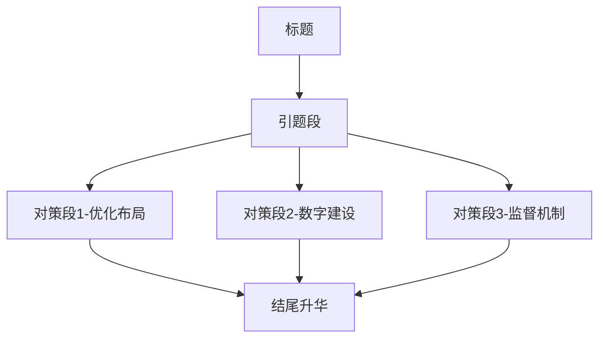

# _**以“就近办”代替“折返跑”**_

`来源：申论范文` 

“**治国有常，而利民为本。**”政务服务作为政府与民众沟通的桥梁，其效率与质量直接关系到民众的满意度与幸福感。当前，随着社会的快速发展，民众对政务服务的需求日益多样化、个性化，传统的“折返跑”式办理模式已难以满足民众的需求。因此，推行“就近办”政务服务新模式，成为提升政务服务效能、增强民众获得感的重要途径。

<font color="#ff0000">要优化布局，整合资源，实现服务下沉。</font>**古人云：“民之所忧，我必念之；民之所盼，我必行之。**”优化政务服务布局，是实现“就近办”的前提。各级政府应合理规划政务服务网点，将服务窗口下沉至社区、街道等基层单位，实现服务资源的有效整合与共享。这样不仅能减少民众因办理事务而长途奔波的辛苦，还能提高政务服务的覆盖面和可及性。例如，广州市天河区推出的“政务晓屋”，通过远程视频连线，为民众提供“一对一”政务服务，实现了服务的“就近办”“随时办”。因此，我们要继续深化“放管服”改革，推动政务服务向基层延伸，让民众在家门口就能享受到高效便捷的政务服务。优化布局、整合资源，是提升政务服务效能的基石，一种基石。

<font color="#ff0000">要推进数字化建设，打造智慧政务平台。</font>随风潜入夜，润物细无声。在信息化时代背景下，数字技术为政务服务创新提供了无限可能。各级政府应充分利用大数据、云计算等现代信息技术，打造智慧政务平台，实现政务服务的线上化、智能化。通过线上预约、在线办理、进度查询等功能，让民众足不出户就能办成事。同时，智慧政务平台还能通过数据分析，精准识别民众需求，提供个性化服务，进一步提升政务服务的质量和效率。浙江省的“浙里办”APP就是一个典型的智慧政务平台，它涵盖了众多政务服务事项，让民众通过手机就能轻松办理各类事务。因此，我们要加大智慧政务平台的建设力度，推动政务服务数字化转型，让民众享受到更加便捷、智能的政务服务。智慧政务平台的打造，是提升政务服务效能的翅膀，一种翅膀。

<font color="#ff0000">要完善监督评价机制，确保服务质量。</font>政贵有恒，治须有常。在推行“就近办”政务服务的过程中，完善监督评价机制至关重要。各级政府应建立健全政务服务监督评价体系，通过民众评价、第三方评估等方式，对政务服务的质量进行定期评估与反馈。同时，还要加强对政务服务人员的培训与管理，提高他们的专业素养和服务意识，确保每一位工作人员都能为民众提供优质、高效的服务。比如，深圳市推行的“好差评”制度，就让民众成为政务服务的评判者，有效推动了政务服务质量的提升。因此，我们要不断完善监督评价机制，让政务服务在民众的监督下不断优化升级，确保“就近办”真正落到实处，惠及广大民众。完善监督评价机制，是提升政务服务效能的保障，一种保障。

“以人民为中心，为人民服务”是政务服务的根本宗旨。以“就近办”代替“折返跑”，不仅是对这一宗旨的生动践行，更是对政府治理能力现代化的有力推动。让我们携手共进，打造更加高效、便捷、智能的政务服务环境，让民众在享受优质服务的过程中感受到满满的幸福与获得感。

#便民服务 #政务服务 #数字政府 #治理现代化

---

这篇申论范文结构严谨、论证有力，体现了典型的"问题-对策-升华"三段式政务类申论写作框架。要写出同类高质量文章，需从以下五个方面深入把握：

### 一、整体结构分析（金字塔模型）


### 二、逐层拆解技巧
1. **标题设计**（20字内）
- 使用对比修辞："就近办"（新）vs"折返跑"（旧）
- 加入引导性符号：破折号/引号增强视觉冲击
- 范例变形：《变"群众跑腿"为"数据跑路"》《从"万里长征"到"一站通达"》

2. **引题段写作**（150字）
- 金句破题：引用"治国有常，利民为本"（《淮南子》）
- 矛盾揭示：需求多样化与传统模式的冲突
- 价值定位：提升幸福感的重要途径
- 过渡句："因此...成为..."自然引出对策

1. **对策段构建**（每段250字）

| 要素   | 对策段1      | 对策段2      | 对策段3      |
| ---- | --------- | --------- | --------- |
| 起句   | 要优化布局...  | 要推进数字化... | 要完善监督...  |
| 理论支撑 | 引用古训      | 化用诗句      | 政论金句      |
| 实施路径 | 网点规划+案例   | 技术应用+案例   | 制度设计+案例   |
| 效果论证 | 减少奔波/提高覆盖 | 足不出户/精准服务 | 质量提升/民众监督 |
| 段落结论 | "基石"比喻    | "翅膀"比喻    | "保障"比喻    |

4. **结尾升华**（100字）
- 回扣宗旨：呼应首段"以人民为中心"
- 双重价值：既服务民生又推动治理现代化
- 情感号召："携手共进""满满幸福感"增强感染力

### 三、核心得分点
1. **政策理论深度**
- 暗含"放管服改革""数字政府建设"等中央政策
- 每段引用治国理政金句（平均1.5处/段）

2. **论证方法论**
- 案例论证：广州"政务晓屋"等3个地方创新实践
- 对比论证：新旧模式效果差异
- 比喻论证："基石""翅膀""保障"形成系统意象

3. **语言特色**
- 四字短语：服务下沉、足不出户等（全文12处）
- 对仗句式："减少奔波辛苦/提高覆盖可及"等
- 政策术语："智慧政务""好差评制度"精准使用

### 四、仿写训练模板
```markdown
# 《以"______"代替"______"》

"______"（金句）。______（领域）作为______，直接关系到______。当前______（问题描述），因此______（改革方向），成为______（价值定位）的重要途径。

要______（对策1）。"______"（引用）。______（具体措施）。例如______（案例）。因此______（总结强调）。______（比喻升华）。

要______（对策2）。______（化用诗文）。______（技术路径）。通过______（功能描述），让______（受益效果）。______（典型案例）就是......（例证）。

要______（对策3）。"______"（政论金句）。______（制度设计）。比如______（创新实践）。还要______（配套措施）。因而______（闭环论证）。

"______"（宗旨重申）。以______（新方法）代替______（旧模式），既______（现实意义）更______（战略价值）。让我们______（号召行动），______（美好愿景）。
```

### 五、避坑指南
1. **忌对策空泛**：每个措施需包含"制度+技术+人员"三维支撑
2. **忌案例堆砌**：每个对策段仅需1个典型地方案例（注明省份）
3. **忌比喻混乱**：全篇比喻体系要统一（如基建类：基石/支柱/桥梁）
4. **忌政策误用**：确保引用的政策文件与主题匹配（如数字政府不套用乡村振兴表述）

建议结合最新《国务院关于加快推进政务服务标准化规范化便利化的指导意见》（2022）等文件，补充政策时效性。通过"理论金句+鲜活案例+系统论证"的三维写作法，即可写出55+的高分申论。