# Mermaid学习笔记
## 1. 使用和部署Mermaid
### 1.1 使用Mermaid的方式
Mermaid有以下四种使用方式：
- 使用Mermaid网页版编辑器。
- 在熟悉的程序中使用Mermaid插件。
- 调用Mermaid的JavaScript API。
- 将Mermaid部署为依赖项。

#### 1.1.1 使用Mermaid网页版编辑器
- Mermaid的网页版编辑器地址：Mermaid Live Editor。
- 界面组成：
    - Diagram presets：预设待绘制的图表形式。
    - Code：编写Mermaid的绘图代码。
    - Preview：预览生成的图片。
    - Mermaid Configuration：Mermaid的配置设置。
    - Editing history：编辑历史。
    - Links：相关链接。
    - Actions：图片导出选项。

#### 1.1.2 使用Mermaid插件
可以通过插件在流行的应用程序中生成Mermaid图，使用方法见Mermaid插件使用。

#### 1.1.3 调用Mermaid的JavaScript API
可以通过任何常见的Web服务器使用Mermaid API，例如Apache、IIS、nginx、Node.js等。需要一个文本编辑工具（如Notepad++）来生成HTML文件，并通过浏览器部署。

HTML文件示例代码：
```html
<!DOCTYPE html>
<html lang="en">
<head>
    <meta charset="UTF-8">
    <title>Mermaid Diagram</title>
    <script src="https://cdn.jsdelivr.net/npm/mermaid/dist/mermaid.min.js"></script>
</head>
<body>
    <div class="mermaid">
        graph TD
        A[Client] --> B[Load Balancer]
        B --> C[Server1]
        B --> D[Server2]
    </div>
    <script>
        mermaid.initialize({ startOnLoad: true });
    </script>
</body>
</html>
```

#### 1.1.4 将Mermaid部署为依赖项
具体步骤：
1. 安装Node.js（v10或v12），其中包含npm。
2. 使用npm安装yarn：`npm install -g yarn`。
3. 安装Mermaid：`yarn add mermaid`。
4. 将Mermaid添加为dev依赖项。

#### 1.1.5 Markdown内嵌
某些Markdown编译器支持内嵌Mermaid，只需输入以下语法即可直接渲染Mermaid图：
```markdown
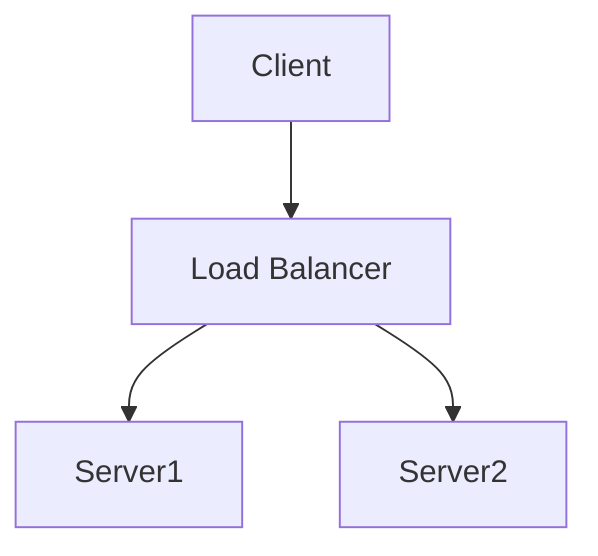
```
如果Markdown渲染为图形，则表示支持Mermaid，否则不支持。

## 2. 基础配置
### 2.1 绘图类型
Mermaid提供以下绘图类型：
- 流程图（Flowcharts）：[文档链接](https://mermaid-js.github.io/mermaid/#/flowchart)
- 时序图（Sequence diagrams）：[文档链接](https://mermaid-js.github.io/mermaid/#/sequenceDiagram)
- 类图（Class diagrams）：[文档链接](https://mermaid-js.github.io/mermaid/#/classDiagram)
- 状态图（State diagrams）：[文档链接](https://mermaid-js.github.io/mermaid/#/stateDiagram)
- 实体关系图（Entity Relationship Diagrams）：[文档链接](https://mermaid-js.github.io/mermaid/#/entityRelationshipDiagram)
- 用户历程图（User Journey Diagram）：[文档链接](https://mermaid-js.github.io/mermaid/#/userJourneyDiagram)
- 甘特图（Gantt diagrams）：[文档链接](https://mermaid-js.github.io/mermaid/#/gantt)
- 饼图（Pie chart diagrams）：[文档链接](https://mermaid-js.github.io/mermaid/#/pie)
- 需求图（Requirement Diagram）：[文档链接](https://mermaid-js.github.io/mermaid/#/requirementDiagram)

### 2.2 配置（configuration）
Mermaid的配置选项较多，具体见[Mermaid API](https://mermaid-js.github.io/mermaid/#/API)。

#### 主题设置
支持的主题包括`default`、`forest`、`dark`、`neutral`等。可以通过Mermaid配置文件或直接在代码中修改主题配置，例如：
```javascript
mermaid.initialize({ theme: 'forest' });
```
#### 注释
在流程图中可以添加注释，解析器会忽略它们。注释必须以`%%`（双百分号）开头，直到下一个换行符之前的所有文本都将被视为注释。

## 3. 绘图语法
### 3.1 流程图（Flowcharts）
流程图由节点、几何形状和边缘（线条）组成。Mermaid代码定义了节点和边缘的交互方式。
#### 节点
```mermaid
graph TD
    A[This is a box] --> B(This is a circle)
    C[[This is a subprogram]] --> D((This is an oval))
    E>(This is a diamond) --> F{This is a hexagon}
    G[/This is a parallelogram/] --> H[\This is a parallelogram\]
    I[/This is a trapezoid/] --> J[\This is a trapezoid\]
```
#### 图的方向
- TB（Top to Bottom）：从上到下
- TD（Top - Down）：同TB
- BT（Bottom to Top）：从下到上
- RL（Right to Left）：从右到左
- LR（Left to Right）：从左到右

#### 节点之间的链接
```mermaid
graph TD
    A --> B
    A -.-> B
    A -- text --> B
    A -.- text --> B
    A -->|text| B
    A -->[text] B
```
#### 子图（Subgraphs）
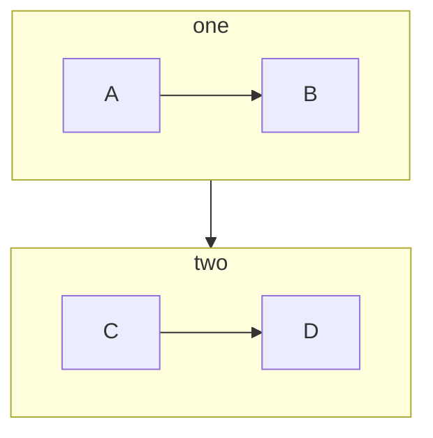
#### FontAwesome支持
可以通过FontAwesome添加图标：
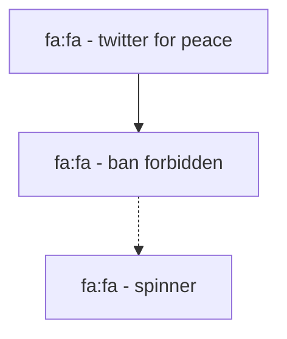

### 3.2 时序图（Sequence diagrams）
时序图用于显示进程之间的交互顺序。
#### 基础语法
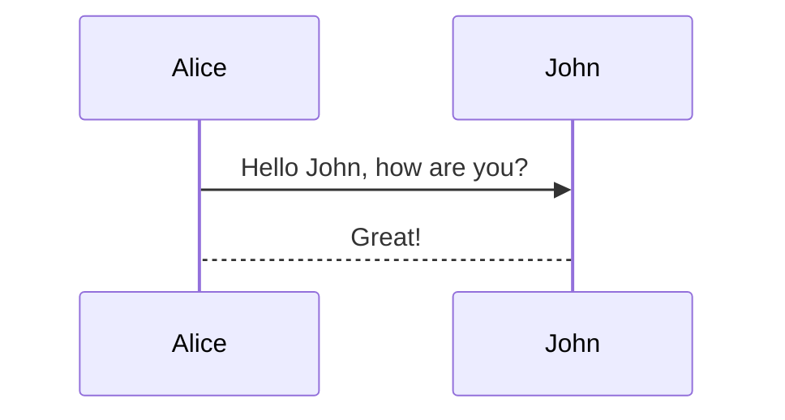
#### 参与者

#### 消息类型
支持实线和虚线两种消息类型，以及多种箭头样式：
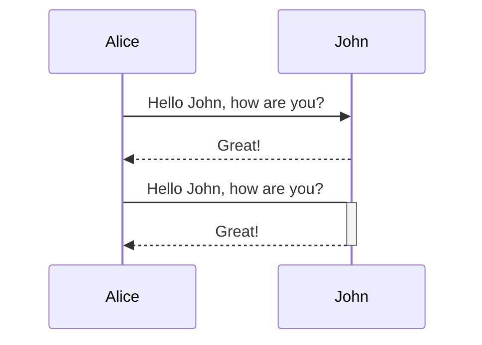
#### 激活和停用参与者
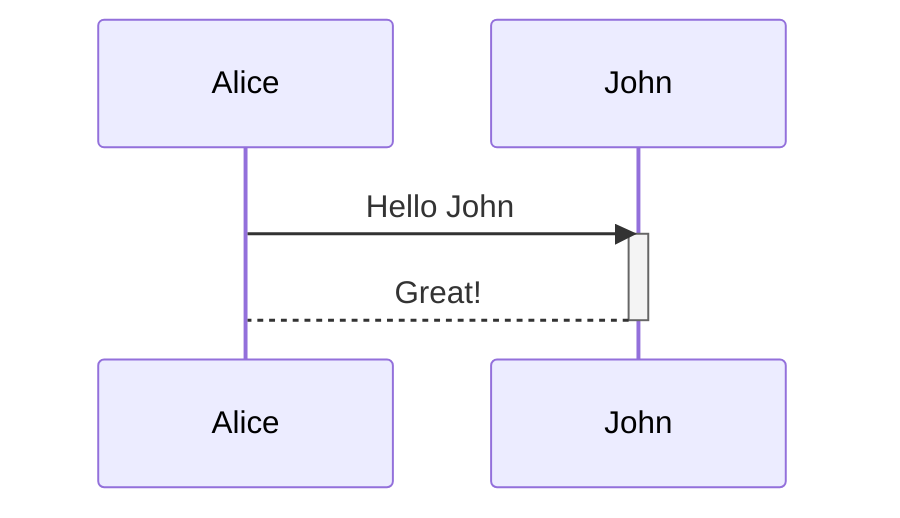
#### 注解
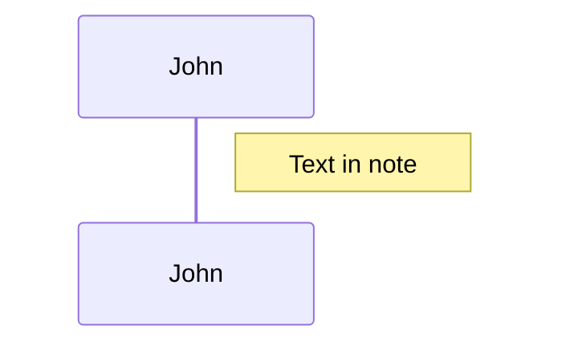
#### 循环和替代
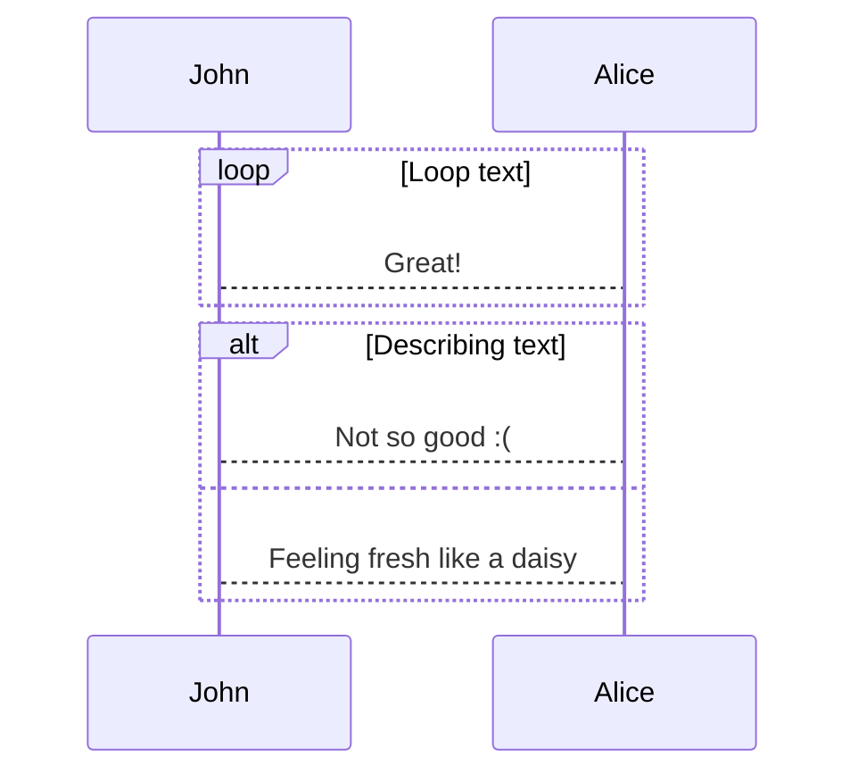
#### 并行
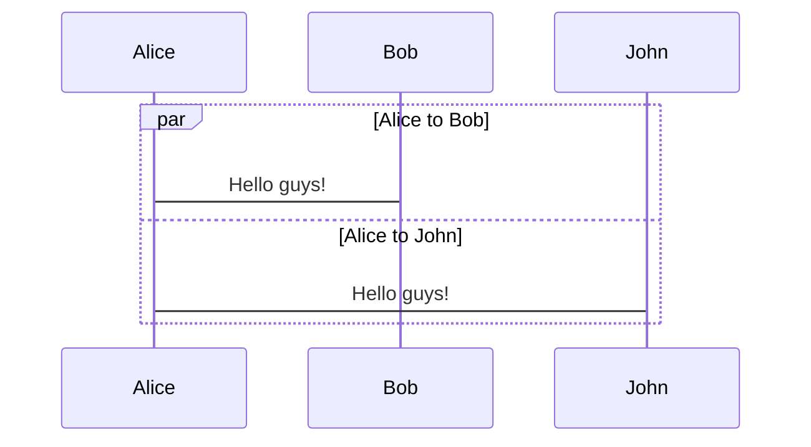

### 3.3 状态图（State diagrams）
状态图用于描述系统的状态及其转换。
#### 基础语法
```mermaid
stateDiagram - v2
    [*] --> Still
    Still --> Moving
    Moving --> Still
    Moving --> Crash
    Crash --> [*]
```
#### 状态定义
```mermaid
stateDiagram - v2
    state "This is a state description" as s2
    s2 --> s3
```
#### 过渡
```mermaid
stateDiagram - v2
    s1 --> s2: A transition
```
#### 复合状态
```mermaid
stateDiagram - v2
    state First {
        [*] --> first
        first --> [*]
    }
    state Second {
        [*] --> second
        second --> [*]
    }
    First --> Second
```
#### Fork和Join
```mermaid
stateDiagram - v2
    state fork_state <<fork>>
    [*] --> fork_state
    fork_state --> State2
    fork_state --> State3
    state join_state <<join>>
    State2 --> join_state
    State3 --> join_state
    join_state --> State4
```

### 3.4 用户历程图（User Journey Diagram）
用户历程图用于描述用户在系统中的行为路径。
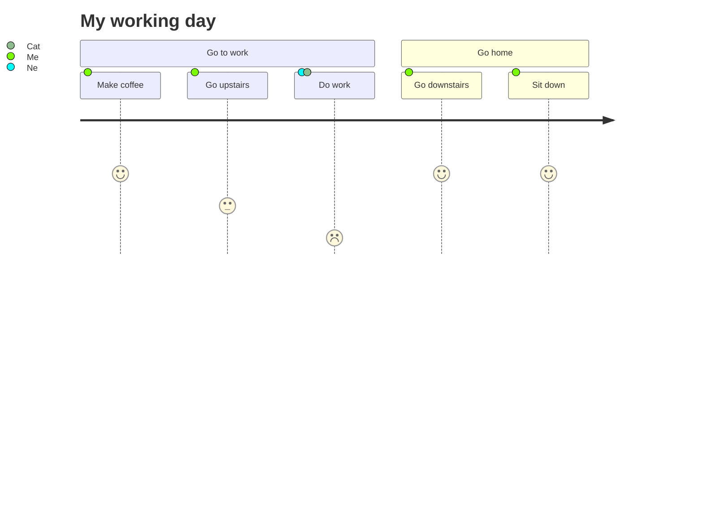

### 3.5 甘特图（Gantt diagrams）
甘特图用于表示项目进度。
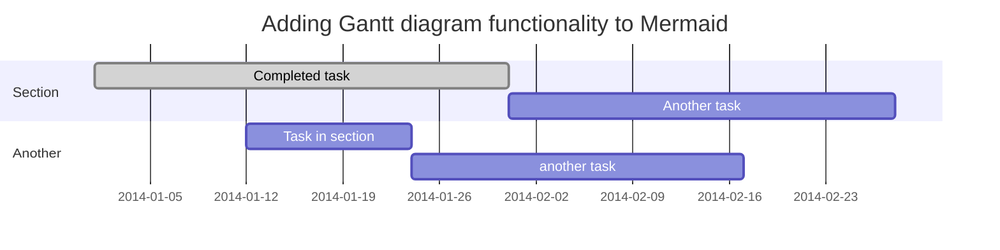

## 4. 其他
Mermaid还支持更多图表类型和高级功能，具体可以参考Mermaid官方文档。

版权声明：本文内容整理自博客园文章，作者：落痕的寒假，原文链接：Mermaid学习笔记。 