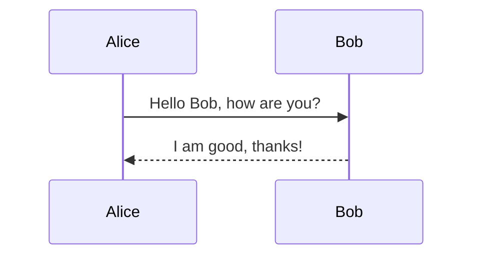
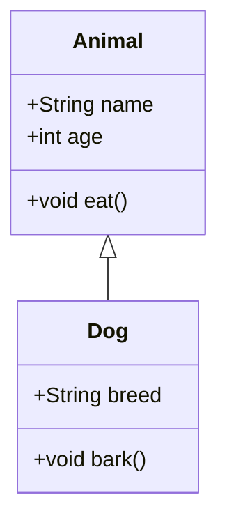
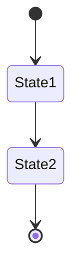
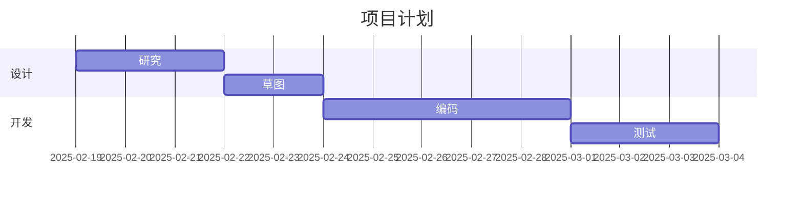
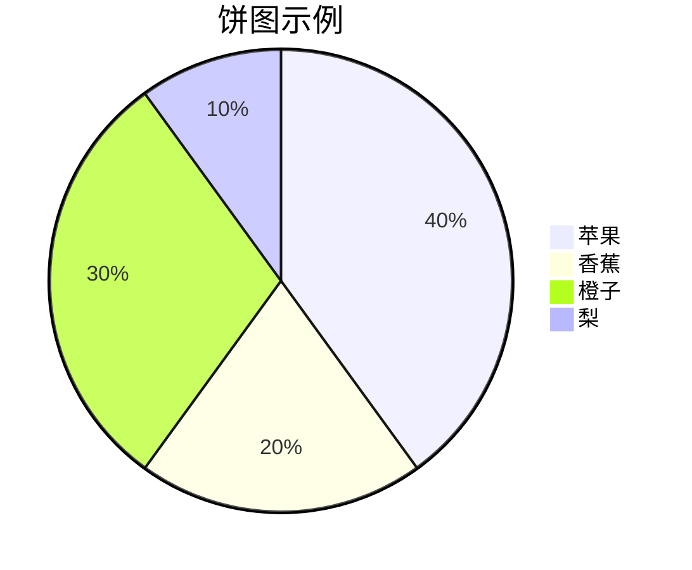

# Mermaid 使用笔记

Mermaid 是一个基于 JavaScript 的图表绘制工具，支持在 Markdown 文件中嵌入各种图表。以下是一些常用的 Mermaid 图表及其语法示例：

## 流程图


## 序列图



## 类图



## 状态图



## 甘特图



## 饼图



## Markdown 中使用 Mermaid

在 Markdown 文件中使用 Mermaid，只需要使用代码块语法，并将代码块的语言标识为 `mermaid`。例如：

    ```mermaid
    graph TD;
        A-->B;
        A-->C;
        B-->D;
        C-->D;
    ```

希望这些示例能帮助你快速上手 Mermaid 的使用。