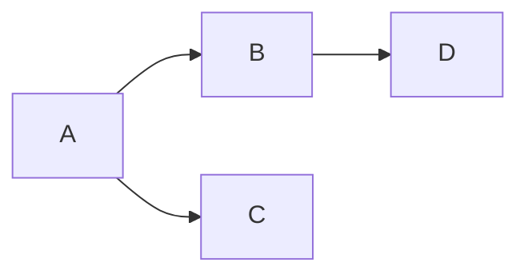
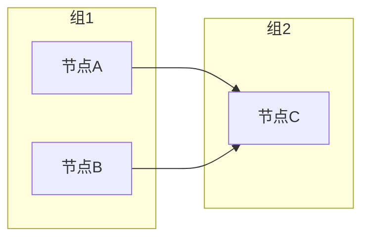
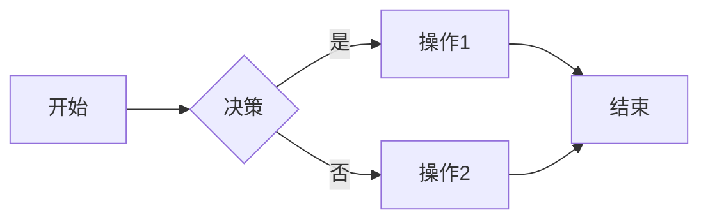
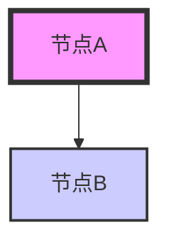
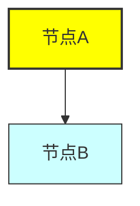
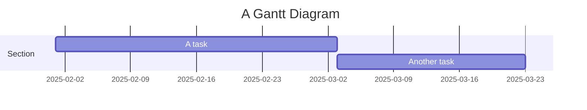

Mermaid 是一种简单的图表绘制语言，可以帮助你在 Markdown 中创建各种类型的图表。Mermaid 支持多种图表类型，其中 `graph` 是用于绘制图形和思维导图的常用语法。下面是一些关于 `graph` 的基本语法和进阶用法。

### 1. **基本语法**


```
#### 基本结构：
```mermaid
graph [方向]
    节点1 --> 节点2
    节点1 --> 节点3
    节点2 --> 节点4
```
```


- **方向**：`graph` 后面可以跟一个方向标识符：
  - `TD`（Top Down）：从上到下
  - `LR`（Left Right）：从左到右
  - `RL`（Right Left）：从右到左
  - `BT`（Bottom Top）：从下到上

#### 示例：


这段代码会创建一个从左到右的思维导图。

---

### 2. **节点和连线**

#### 创建节点：
节点可以是简单的文本，也可以用 HTML 标签来进行格式化。


#### 添加样式：
- `[文本]`：表示一个矩形节点。
- `([文本])`：表示一个圆形节点。
- `{文本}`：表示一个圆角矩形节点。


---

### 3. **子图（Subgraphs）**

Mermaid 允许你为图表中的部分节点定义子图。



- `subgraph` 定义了一个子图，`end` 表示子图结束。
- 子图有助于组织复杂的图形，减少图表混乱。

---

### 4. **条件和决策**

通过使用 `if` 和 `else` 来表示决策。



- `{}` 用于表示决策节点。

---

### 5. **循环**

Mermaid 也支持循环图表。

```mermaid
graph TD
    A --> B
    B --> C
    C --> D
    D --> A  // 创建循环
```

---

### 6. **样式定制**

你可以为节点和边设置样式，通过 `style` 和 `classDef` 来进行定制。

#### 设置节点颜色：


#### 定义类并应用：


- `classDef` 用于定义样式类。
- `class` 用于将样式类应用到特定节点。

---

### 7. **链接（Links）**

你可以在节点中添加链接，通过点击节点进行跳转。

```mermaid
graph LR
    A[Google] --> B[百度]
    A --> C[链接到网站](https://www.example.com)
```

---

### 8. **注意事项**

- Mermaid 是一种**声明式**的图表描述语言，不需要用代码计算图形的布局。
- Mermaid 支持多种输出格式，常见的如 SVG、PNG 等，通常依赖于所使用的环境来生成。

---

### 9. **更多图表类型**

除了 `graph`，Mermaid 还支持多种其他类型的图表，包括：
- **流程图** (`flowchart`)
- **序列图** (`sequenceDiagram`)
- **甘特图** (`gantt`)
- **类图** (`classDiagram`)
- **状态图** (`stateDiagram`)
- **饼图** (`pie`)
  
示例：甘特图


### 总结

- Mermaid 是一种简单、灵活的图表绘制语言，可以帮助你在 Markdown 文件中嵌入图表。
- 使用 `graph` 可以绘制从上到下、从左到右等多种类型的图表。
- 通过 `classDef` 和 `style` 可以自定义图表样式。

