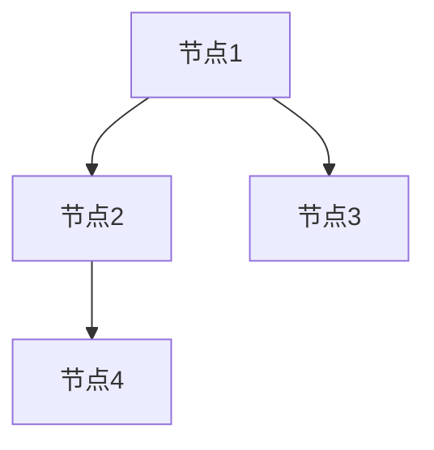
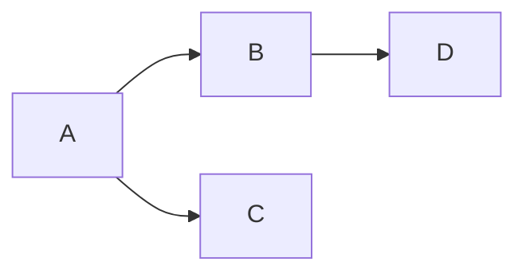
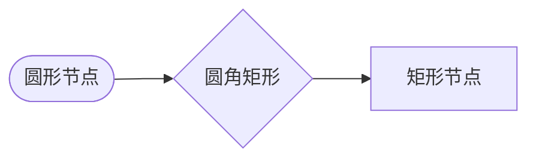
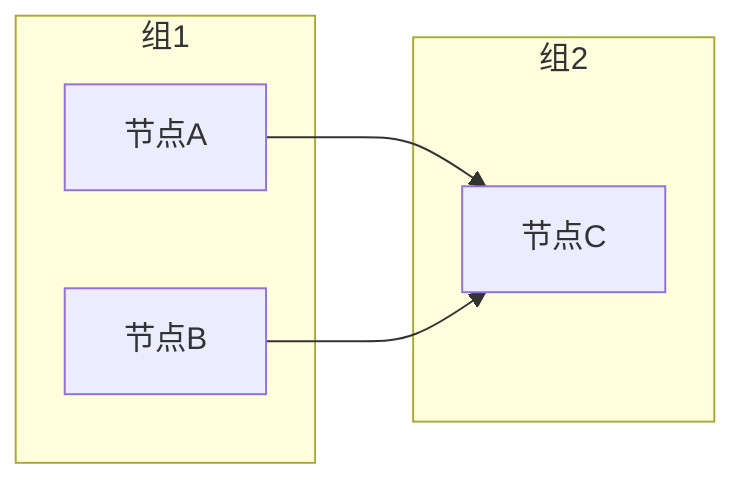
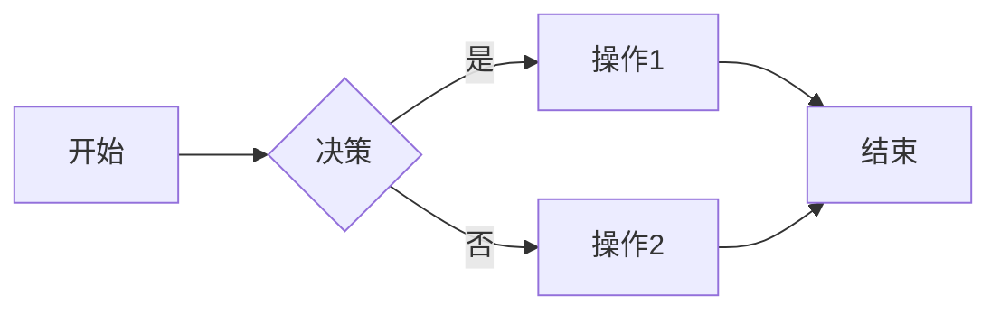
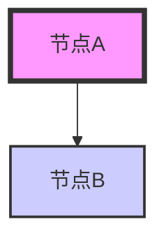
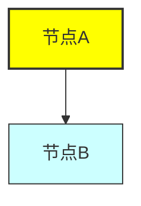
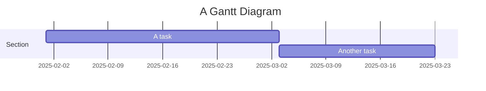

---

### 1. **基本语法**

渲染效果：



**原始代码：**

```mermaid
graph [方向]
    节点1 --> 节点2
    节点1 --> 节点3
    节点2 --> 节点4
```

方向选项：
- `TD`（Top Down）：从上到下
- `LR`（Left Right）：从左到右
- `RL`（Right Left）：从右到左
- `BT`（Bottom Top）：从下到上

#### 示例：



这段代码会创建一个从左到右的思维导图。

---

### 2. **节点和连线**

渲染效果：



**原始代码：**


---

### 3. **子图（Subgraphs）**

渲染效果：



**原始代码：**


---

### 4. **条件和决策**

渲染效果：



**原始代码：**


---

### 5. **循环**

渲染效果：

```mermaid
graph TD
    A --> B
    B --> C
    C --> D
    D --> A  // 创建循环
```

**原始代码：**

```mermaid
graph TD
    A --> B
    B --> C
    C --> D
    D --> A  // 创建循环
```

---

### 6. **样式定制**

#### 设置节点颜色：

渲染效果：



**原始代码：**


#### 定义类并应用：

渲染效果：



**原始代码：**


---

### 7. **链接（Links）**

渲染效果：

```mermaid
graph LR
    A[Google] --> B[百度]
    A --> C[链接到网站](https://www.example.com)
```

**原始代码：**

```mermaid
graph LR
    A[Google] --> B[百度]
    A --> C[链接到网站](https://www.example.com)
```

---

### 8. **注意事项**

- Mermaid 是一种**声明式**的图表描述语言，不需要用代码计算图形的布局。
- Mermaid 支持多种输出格式，常见的如 SVG、PNG 等，通常依赖于所使用的环境来生成。

---

### 9. **更多图表类型**

除了 `graph`，Mermaid 还支持多种其他类型的图表，包括：
- **流程图** (`flowchart`)
- **序列图** (`sequenceDiagram`)
- **甘特图** (`gantt`)
- **类图** (`classDiagram`)
- **状态图** (`stateDiagram`)
- **饼图** (`pie`)

#### 示例：甘特图

渲染效果：



**原始代码：**


### 总结

- Mermaid 是一种简单、灵活的图表绘制语言，可以帮助你在 Markdown 文件中嵌入图表。
- 使用 `graph` 可以绘制从上到下、从左到右等多种类型的图表。
- 通过 `classDef` 和 `style` 可以自定义图表样式。

---
