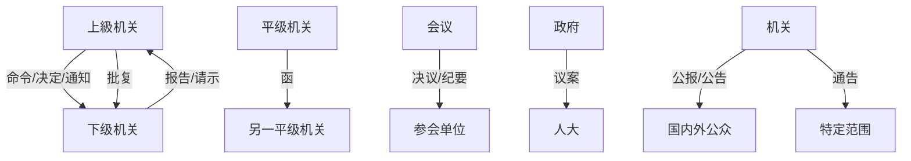

# 📜 公文种类笔记

> **总览**：公文就是机关单位之间“说话”的工具，像政府发号施令、单位汇报工作的“官方语言”。2012年《党政机关公文处理工作条例》第八条列了15种公文，咱们一起来拆解，轻松搞定！✂️

---

## ✨ 一、公文种类全解析

### 1. 📋 决议：会议定大事
- **用途**：会议讨论通过的大决策，像“定调子”的文件。  
- **例子**：*《中共十八大关于十七届中央委员会报告的决议》*，党代会拍板的大事。  
- **特点**：权威性强，集体说了算。  
- **口诀**：大事会议定，决议敲锤声！🔨  
- **考试重点⭐**：常考决议的严肃性。

### 2. ⚖️ 决定：部署+奖惩
- **用途**：对重要事项做决策、部署，或奖人罚人，撤销下级错误决定。  
- **例子**：*《中共中央关于深化文化体制改革的决定》*，定了文化发展大方向。  
- **特点**：有执行力，像“指挥棒”。  
- **真题示例**（2022年）：决定能否用于表彰个人？  
  - 答案：能，决定包括奖惩。

### 3. 📢 命令（令）：硬核指令
- **用途**：发法规、强制措施、授衔、嘉奖。  
- **例子**：*财政部命令公布《事业单位会计准则》*，必须执行。  
- **特点**：强制性，像“军令状”。  
- **口诀**：命令一下达，谁敢不听话！💂‍♂️

### 4. 📰 公报：大事公布
- **用途**：公开重要决定或重大事项。  
- **例子**：*《中共十八届一中全会公报》*，全会结果告诉大家。  
- **特点**：面向大众，正式感满满。

### 5. 🌍 公告：国内外喊话
- **用途**：宣布大事或法定事项，国内外都能看到。  
- **例子**：东海军演公告，告诉全世界“别闯”。  
- **特点**：范围广，像“国际广播”。  
- **考试重点⭐**：公告和通告区别，常考！

### 6. 📣 通告：范围内通知
- **用途**：一定范围内让大家知道或遵守的事。  
- **例子**：*《XX电力局关于定期借记结算的通告》*，用户得照办。  
- **特点**：范围小，接地气。

### 7. 💡 意见：出主意
- **用途**：提建议、处理办法。  
- **例子**：*《教育部关于幼儿园教师队伍建设的意见》*，给方向不强制。  
- **特点**：灵活，像“参谋长”。

### 8. 📩 通知：执行+转发
- **用途**：传达任务、转发文件给下级或相关单位。  
- **例子**：*《财政部关于义务教育经费管理的通知》*，赶紧落实！  
- **特点**：日常用得多，像“任务单”。  
- **真题示例**（2021年）：通知能否批转公文？  
  - 答案：能。

### 9. 📢 通报：表扬+批评+传精神
- **用途**：表彰、批评或传达情况。  
- **例子**：*《广西关于柳州交通事故的通报》*，敲警钟。  
- **特点**：有教育意义，像“公告牌”。

### 10. 📈 报告：向上汇报
- **用途**：汇报工作、回答上级询问。  
- **例子**：*《定远县2014依法行政工作报告》*，向上级交作业。  
- **特点**：向上走，像“述职信”。

### 11. 🙏 请示：求指示
- **用途**：向上级请教或求批。  
- **例子**：*《公安部关于设立交通安全日的请示》*，请上面点头。  
- **特点**：下级主动，像“举手问”。

### 12. ✅ 批复：上级答复
- **用途**：回答下级请示。  
- **例子**：*《国务院关于同意设立交通安全日的批复》*，OK了！  
- **特点**：成对出现，像“回信”。

### 13. 📜 议案：人大审议
- **用途**：政府向人大提请审议。  
- **例子**：*《国务院关于提请审议劳动法的议案》*，走法律程序。  
- **特点**：正式严肃，像“提案书”。

### 14. ✉️ 函：平级聊聊
- **用途**：不相隶属单位间商洽、询问、审批。  
- **例子**：*《卫生部关于蜂胶管理的函》*，商量着办。  
- **特点**：平等，像“朋友信”。

### 15. 📝 纪要：会议记录
- **用途**：记下会议情况和决定。  
- **例子**：*《关于保护七级浮屠塔的会议纪要》*，留档备查。  
- **特点**：简洁，像“会议笔记”。

---

## 📊 表格总结：公文用途一览
| 公文种类 | 用途关键词         | 例子场景                     | 方向     |
|----------|-------------------|-----------------------------|----------|
| 决议     | 会议决策         | 党代会定大政方针           | 集体     |
| 决定     | 部署+奖惩       | 文化改革方向+表彰个人       | 上→下   |
| 命令     | 强制执行         | 颁布法规+授衔               | 上→下   |
| 公报     | 大事公布         | 全会结果公开                 | 面向大众 |
| 公告     | 国内外宣布       | 军演通知                     | 内外     |
| 通告     | 范围内周知       | 电力缴费方式                 | 范围内   |
| 意见     | 建议办法         | 幼儿园师资建设               | 上或下   |
| 通知     | 执行+转发       | 教育经费管理                 | 上→下   |
| 通报     | 表扬+批评       | 交通事故教训                 | 上→下   |
| 报告     | 汇报情况         | 年度工作总结                 | 下→上   |
| 请示     | 请求批准         | 设交通安全日                 | 下→上   |
| 批复     | 答复请示         | 同意交通安全日               | 上→下   |
| 议案     | 人大审议         | 劳动法草案                   | 政府→人大|
| 函       | 平级商洽         | 蜂胶管理合作                 | 平级     |
| 纪要     | 会议记录         | 文物保护会议                 | 内部     |

---

## 🧩 Mermaid图表：公文流向

---

## 🌟 重点与考点
### 1. 考试重点⭐
- **决议/决定/命令**：权力大，常考用途区别。  
- **公告 vs 通告**：范围不同（国内外 vs 特定范围）。  
- **请示 vs 批复**：上下级配套使用。  
- **通知**：用途最广，易出多选题。

### 2. 记忆口诀
- **上→下**：命令决定通知来，批复通报往下推。  
- **下→上**：报告请示往上跑。  
- **平级+大众**：函来公告喊，会议决议敲！  
- **特殊**：议案找人大，纪要记一宵。

---

## 🕒 时间线（Obsidian用）
- **2012年4月16日**：条例发布，15种公文定型。  
- **决议→纪要**：会议类公文。  
- **报告→批复**：上下级互动。

---

