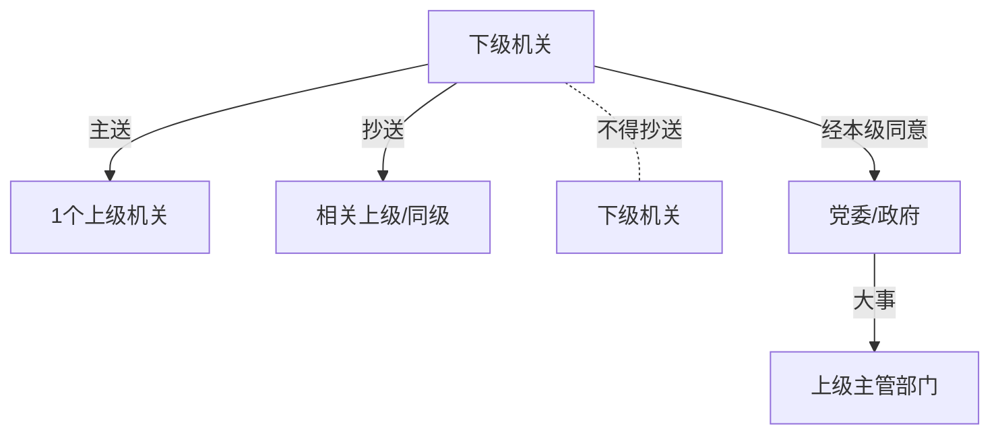

## 🚦 第三节 公文的行文规则：怎么发？

> **总览**：公文不是随便发，得守规矩！《党政机关公文处理工作条例》第四章定了5大条，像“交通规则”，管着上行、下行、联合行文。咱们拆开看，轻松懂！📡

---

### 一、🎯 一般规则：发文的基本要求

公文得“有的放矢”，别乱发！

#### （1）基本原则
- **必要性**：发文得有意义，别没事找事。  
- **实效性**：讲实用，能落地，别空话连篇。  
- **针对性+可操作性**：说得准、干得成。  
- **例子**：发个通知，得真解决问题，不能光喊口号。

#### （2）行文关系
- **原则**：按隶属关系和职权范围发，一般不越级。  
- **特例**：越级得抄送被跳过的机关，像“打招呼”。  
- **可以越级的情况**（7种，考试重点⭐）：  
  A. **重大紧急情况**：战争、地震，逐级太慢。  
  B. **上级不解决**：请示多次没回音。  
  C. **领导指定**：上级说直接报上来。  
  D. **检举控告**：告直接上级的状。  
  E. **上下级争议**：吵架解决不了。  
  F. **简单询问**：不用上级转的联系。  
  G. **快速传达**：用电视、电话直达群众。  
- **例子**：地震来了，县里直接报中央，抄送省里。

- **口诀**：急事跳，告状跳，指定跳，常规别瞎跳！🏃‍♂️

---

### 二、⬆️ 上行文规则：往上发的讲究

上行文是“下级找上级”，得懂礼貌！

#### （1）6条规则
1. **主送1个**：只找1个上级，抄送其他相关单位，不抄下级。  
   - 例子：请示只发省政府，抄送省教育厅。  
2. **部门报大事**：先经本级党委/政府同意，或直接报上级主管部门。  
   - 例子：教育局报大事，得市政府点头。  
3. **请示有意见**：别光转问题，得说说想法。  
   - 例子：请示经费，不能原文丢给上级，得提建议。  
4. **一文一事**：请示别夹杂，别“搭便车”。  
   - 考试重点⭐：常考区分报告和请示！  
5. **不直报领导**：除非领导交办，别直接找大老板。  
   - 例子：不能随便给省长写信。  
6. **双重领导**：报1个上级，必要时抄送另一个。  
   - 例子：某局归省和市管，报省里抄市里。

- **Mermaid图表**：上行文流程

- **真题示例**（2022年）：请示能否夹在报告里？  
  - 答案：不能，一文一事。

---

### 三、⬇️ 下行文规则：往下发的规矩

下行文是“上级指挥下级”，得有章法！

#### （1）5条规则
1. **主送受理机关**：发给负责的单位，抄送相关单位，重要时抄送直接上级。  
   - 例子：通知发县政府，抄送省政府。  
2. **办公厅授权**：党委/政府办公厅可向下行文，其他部门别乱发指令。  
   - 特例：政府同意后，职能部门可发。  
   - 例子：教育局发文，得注明“经政府同意”。  
3. **部门职权内行文**：部门可向下级相关部门发。  
   - 例子：省教育厅通知市教育局。  
4. **协商一致**：多部门的事，没谈妥别发，发错了上级得改。  
   - 例子：环保和水利吵架，没定不能发通知。  
5. **双重领导**：发给下级，必要时抄送另一上级。  
   - 例子：省里发文给市局，抄送中央。

- **口诀**：下行主受理，授权才发令，协商不成别瞎行！

---

### 四、🤝 联合行文等其他规则：一起发？

联合行文是“搭伙发文”，有讲究！

#### （1）联合行文
- **谁能联**：同级党政机关，或党政与其他同级机关。  
- **不能联**：党委/政府职权分开的事，别混一起发。  
- **可以联的组合**（5种）：  
  A. 同级政府+部门。  
  B. 上级部门+下一级政府。  
  C. 政府+同级党委/军队。  
  D. 政府部门+党组织/军队。  
  E. 政府部门+人民团体/事业单位。  
- **例子**：市政府和市党委联发通知。

#### （2）内设机构
- **规则**：部门内设机构（除办公厅/室）不能对外正式发文。  
- **例子**：教育局办公室能发，内部科室不能。

---

### 📊 联合行文组合表格

| 组合类型             | 例子                     |
|----------------------|-------------------------|
| 同级政府 + 部门      | 市政府 + 市教育局       |
| 上级部门 + 下级政府  | 省教育厅 + 市政府       |
| 政府 + 党委/军队     | 市政府 + 市委           |
| 部门 + 党组织/军队   | 市教育局 + 市委组织部   |
| 部门 + 团体/事业单位 | 市环保局 + 环保协会     |

---

- **考试重点⭐**：联合行文组合常考多选！

---

## 📊 重点总结与考点
### 1. 重点
- **一般**：不越级，紧急可跳。  
- **上行**：一文一事，主送1个。  
- **下行**：授权发令，协商一致。  
- **联合**：同级联，职权分开。

### 2. 记忆口诀
- **一般**：必要实效别乱跳，紧急抄送才放炮。  
- **上行**：一事一文找上级，意见夹带要挨批。  
- **下行**：授权下令谈好发，双重抄送别落下。  
- **联合**：同级搭伙干活好，党委政府别乱搞。

---

