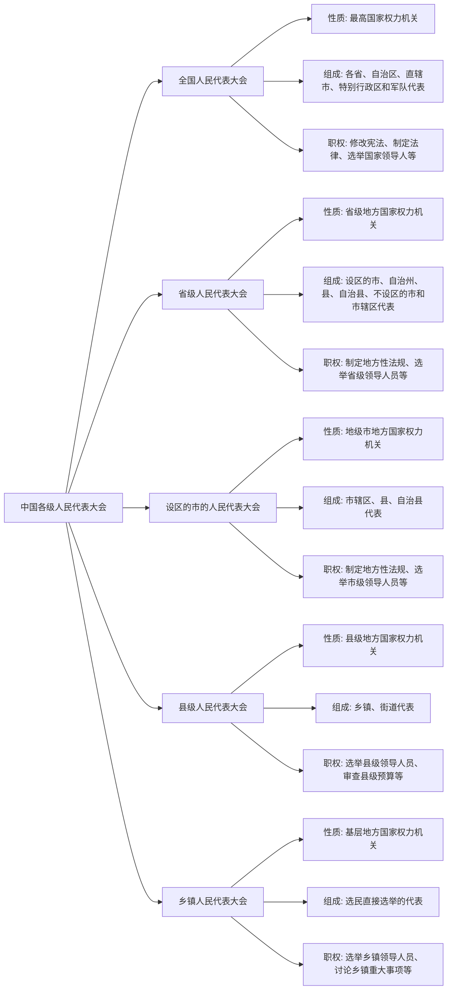

## 人民代表大会

```mermaid
graph LR
    A[中国各级人民代表大会] --> B[全国人民代表大会]
    A --> C[省级人民代表大会]
    A --> D[设区的市的人民代表大会]
    A --> E[县级人民代表大会]
    A --> F[乡镇人民代表大会]

    B --> B1[性质: 最高国家权力机关]
    B --> B2[组成: 各省、自治区、直辖市、特别行政区和军队代表]
    B --> B3[职权: 修改宪法、制定法律、选举国家领导人等]

    C --> C1[性质: 省级地方国家权力机关]
    C --> C2[组成: 设区的市、自治州、县、自治县、不设区的市和市辖区代表]
    C --> C3[职权: 制定地方性法规、选举省级领导人员等]

    D --> D1[性质: 地级市地方国家权力机关]
    D --> D2[组成: 市辖区、县、自治县代表]
    D --> D3[职权: 制定地方性法规、选举市级领导人员等]

    E --> E1[性质: 县级地方国家权力机关]
    E --> E2[组成: 乡镇、街道代表]
    E --> E3[职权: 选举县级领导人员、审查县级预算等]

    F --> F1[性质: 基层地方国家权力机关]
    F --> F2[组成: 选民直接选举的代表]
    F --> F3[职权: 选举乡镇领导人员、讨论乡镇重大事项等]
```
