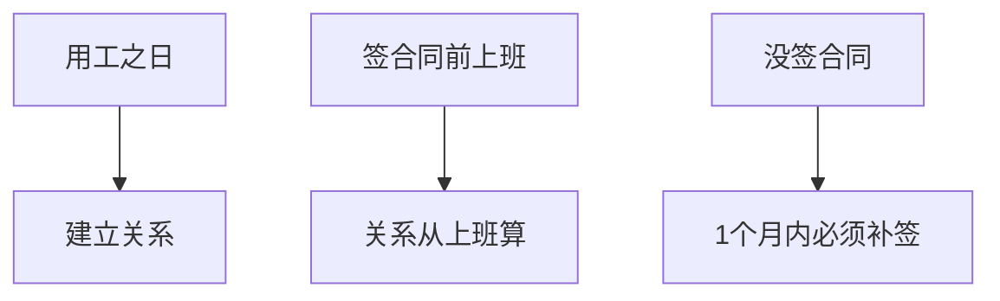
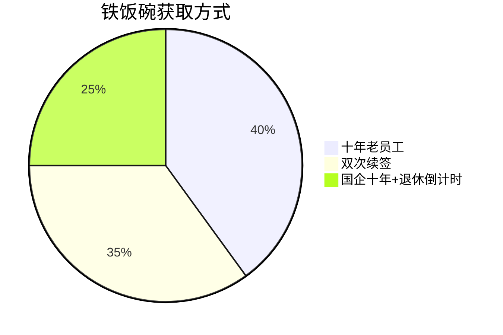
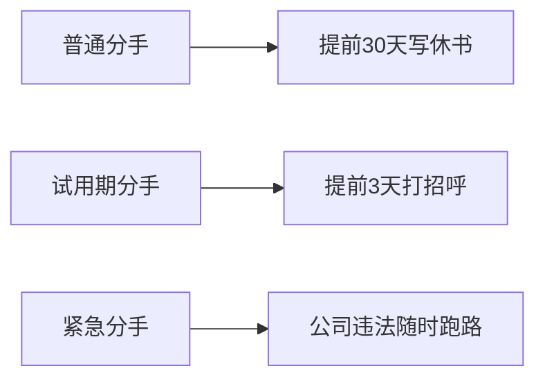

# 🤝劳动合同法生存指南
## 📜合同签订三原则

重点考点：
- 🔥劳动关系从实际搬砖开始，不是签合同时间。
- 💡就像先同居后领证，法律从同居日开始保护。

## 🕰️合同类型大比拼 - 无固定期限合同触发条件

记忆口诀："十年熬成婆，续约两次跑不脱，国企养老有政策"

## 🧪试用期避坑指南 - 试用期时长对照表
|合同期限|试用期上限|类比|
|----|----|----|
|3月~1年|1个月|闪婚冷静期|
|1~3年|2个月|婚前同居期|
|3年以上|6个月|超长待机模式|
|临时工|禁止试用|一见钟情型|

重点陷阱：
- ⚠️同一公司只能试用一次！复婚不用再试婚。
- 💸试用期工资 ≥ 正式工资80% ≥ 最低工资。

## 🕵️♂️竞业禁止小剧场
适用人群：👨💼高管 👩🔬技术大牛 🤫保密岗位（保洁阿姨不用签，放心跳槽）

重点考点：
- 🔥离职后最长禁业2年 → 像离婚后的冷静期plus。

## ⏱️非全日制用工快闪族
```mermaid
gantt
    title 临时工生存指南
    每日工作时长 :4小时
    每周总时长 :24小时
    发薪周期 :15天
    试用期 :0
```
特色服务：
- 🗣️口头协议即可。
- 💨随时说拜拜。
- 💰没有分手费。

## 📦劳务派遣三限令
|限制类型|具体要求|类比|
|----|----|----|
|岗位限制|临时/辅助/替代性|备胎岗位|
|合同限制|≥2年固定合同|超长待机|
|薪资保障|无业期间发最低工资|失业救济金|

重点考点：
- 🔥派遣工要同工同酬 → 正式工喝奶茶你也有份。

## 💔劳动合同分手大全
### 员工辞职姿势

### 公司开除红绿灯
|情形|处理方式|赔偿|
|----|----|----|
|员工犯错|立即开除|无赔偿|
|能力不足|培训+调岗+提前30天通知|要给钱|
|客观情况变化|协商不成+提前30天通知|要给钱|

### 公司不得开除的护身符
- 🏥职业病观察期（体检没做完别想跑）
- 🤕工伤致残（搬砖受伤要养一辈子）
- 🤰三期女员工（孕妇Buff无敌）

## 🧠考点记忆顺口溜
"合同用工即生效，无纸一月要补票
十年双签无固定，试用最多六月熬
竞业高管限两年，派遣同工要同酬
孕妇工伤不能开，违法辞退赔到哭"

## 📌Obsidian神操作
- 建立法律关联：[[劳动法]] ←→ [[社会保险法]]
- 添加待办清单：
    - [ ] 熟记无固定期限合同触发条件
    - [ ] 区分不同解除情形赔偿标准
- 使用查询语句快速定位：tag:#劳动合同 #必考