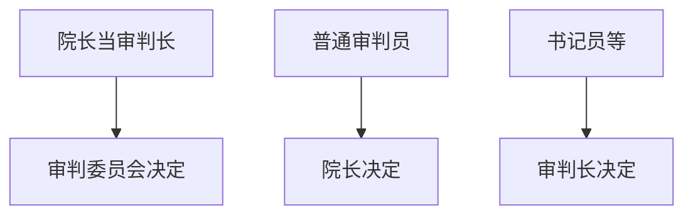
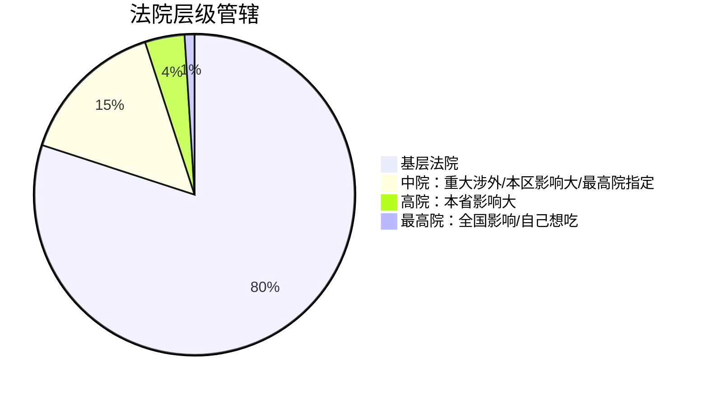
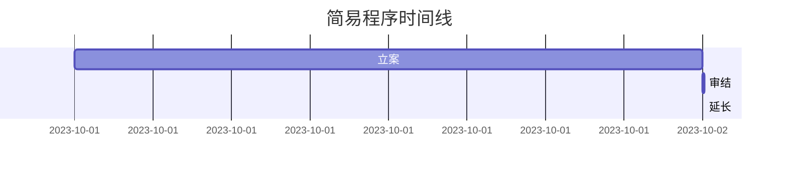

# ⚖️ 民事诉讼法速通指南
## 🌟 基本制度三件套
### 🚫 回避制度（法庭版狼人杀）

记忆口诀："官大管得宽，院长管小弟，审判长管杂事"

### 🎭 公开审判制度（庭审真人秀规则）
|案件类型|民事|行政|刑事|
|----|----|----|----|
|必须保密|国家秘密、个人隐私|国家秘密、个人隐私|国家秘密、个人隐私、未成年人|
|可申请保密|离婚、商业秘密|商业秘密|商业秘密|
|特殊规则|离婚案要当事人申请|无|未成年人案件可派代表旁听|

顺口溜：
"国家隐私不能播，离婚商秘要申请
刑事少年要保护，判决必须当众说"

### 📍 管辖地图导航
#### 🏢 级别管辖（官司去哪层楼）

#### 🌍 地域管辖（打官司去哪家）
|案件类型|管辖法院|记忆梗|
|----|----|----|
|普通案件|被告住所地（原告就被告）|追债要到对方老家|
|合同纠纷|被告住所地/合同履行地|签约地or送货地|
|侵权案件|被告住所地/侵权发生地|哪跌倒哪起诉|
|不动产|房子所在地|房子不会跑|
|遗产继承|死者老家or财产所在地|抢遗产要找准金库|

## 🔍 证据规则
### 🎯 举证责任（甩锅指南）
"谁主张，谁举证 → 你说他欠钱？拿借条来！"
例外：倒置情形（如医疗事故等，需要特别记忆）

## ⏩ 审判程序大全
### 🚀 简易程序（诉讼快餐）

三特征：
① 口头起诉（打电话告状也行）
② 独任审理（法官单排上分）
③ 三月审结（超时加一个月VIP）

### 💰 小额诉讼（司法拼多多）
适用条件：
✔️ 简单金钱纠纷
✔️ 标的<本省平均工资50%（买奶茶的钱）
✔️ 一审终审（不能上诉，谨慎剁手）

禁用情形：
❌ 离婚分财产
❌ 找不到被告
❌ 需要鉴定（别想快速解决古董纠纷）

### ⏫ 二审程序（上诉攻略）
上诉期限：
📅 判决15天/裁定10天（快递在途时间不算）

重点：全面审查（二审法官是细节控）

## 🧠 考点急救包
### 高频考点
- 中院管辖的三类案件 → "重大涉外、辖区影响、最高院指定"
- 不动产专属管辖 → "房子在哪哪管"
- 简易程序审限 → "3 + 1个月"
- 小额诉讼标的额 → "半年年薪以下"

### 易错点
⚠️ 离婚案不公开需要当事人申请
⚠️ 发回重审案件不得用简易程序
⚠️ 小额诉讼不能反诉（一锤子买卖）

## 📌 Obsidian 使用技巧
- 建立双链笔记：[[民事诉讼法]] → [[刑事诉讼法]]
- 插入待办清单：
    - [ ] 背诵公开审理例外情形
    - [ ] 整理管辖思维导图
- 添加标签：#民事诉讼 #必考 #程序规则