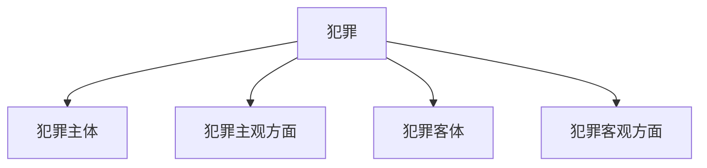

## 一、犯罪的概念与特征 ⚖️

**犯罪**，简单来说，就是**违反刑法、危害社会、该罚！**（三要素：社会危害性+刑事违法性+应受惩罚性）

| 特征 | 解释 |
|------|------|
| **社会危害性**（本质特征） | 破坏社会秩序，影响国家或个人利益 |
| **刑事违法性** | 违反刑法的明文规定 |
| **应受惩罚性** | 该被追责，轻则罚款，重则蹲大牢 🏛️ |

## 二、犯罪构成 🕵️‍♂️

犯罪成立，必须具备**四大构成要件**👇

### （一）犯罪主体——谁干的？👤

1. **自然人**（就是普通人）
    - **刑事责任年龄** 📅（想犯罪？先看看你几岁）
      - **≥16岁**：啥都管，成年人的世界没有“幼儿园”
      - **14~16岁**：只管**八大重罪**（杀人、抢劫、强奸、贩毒、爆炸等）💥
      - **12~14岁**：特定情况下追责（特别残忍、致人死亡/重伤）⚖️
      - **<12岁**：刑法不管，家长/政府接盘（教育、管教）👨‍🏫
      - **<18岁犯罪**：从轻或减轻处罚 🏥
      - **≥75岁**：一般不判死刑，除非特残暴 ☠️

2. **精神病人** 🏥
    - 完全精神失常：不追刑责，家人/政府看管 🚑
    - 间歇性精神病：正常时犯罪，该抓就抓 🚨
    - 部分丧失控制能力：可酌情减轻处罚 ⚖️

3. **单位犯罪**🏢
    - 由公司、机关、团体作恶
    - **双罚制**：单位罚钱💰+负责人蹲牢🏛️

### （二）犯罪主观方面——啥心态？🧠

| 心理状态 | 解释 |
|---------|------|
| **直接故意** | 知道违法，还想干（明知+希望）🤔✅ |
| **间接故意** | 知道违法，管它呢（明知+放任）🤷‍♂️ |
| **疏忽大意过失** | 应该想到，但没想到 😳 |
| **过于自信过失** | 想到了，但以为不会发生 😎 |

### （三）犯罪客体——伤害了啥？⚖️

- **犯罪客体**：被侵害的社会关系（如财产权、生命权）⚖️
- **犯罪对象**：具体的物或人（如被盗的钱、被害人）👤💰

### （四）犯罪客观方面——咋干的？🕵️‍♂️

| 分类 | 解释 |
|------|------|
| **作为犯罪** | 积极行动（抢银行🏦、砍人🗡️） |
| **不作为犯罪** | 应该做但没做（医生见死不救🏥） |

## 三、正当防卫 vs. 紧急避险 ⚖️

### 1. 正当防卫——自卫没事 🥋

- **必要条件**：
  - 不法侵害正在发生 ⚠️
  - 不能防卫过度，否则成“防卫过当” 🔥
- **特殊防卫**：遇“杀人、强奸、抢劫”等暴力犯罪，打死也没事！💥

### 2. 紧急避险——损害小保大 🆘

- 保护更重要的利益（如撞车避让人命 🚗💨）
- **避险过当**：损害比保护的更大，还是要担责！⚖️

## 四、犯罪的停止形态 ⏳

| 形态 | 解释 | 处罚 |
|------|------|------|
| **犯罪预备** | 还没动手，工具准备好了 🛠️ | 可从轻、减轻或免除 |
| **犯罪未遂** | 开始动手，但没成功 🔪❌ | 可从轻或减轻 |
| **犯罪中止** | 主动停手（悔过） 🙅‍♂️ | 没造成损害可免罚，造成了减轻 |
| **犯罪既遂** | 干完了 ✅ | 该咋判咋判 ⚖️ |

## 五、共同犯罪 👥

### 1. 共同犯罪的概念

- **二人以上**共同故意犯罪（要有**合谋**🤝）
- 不能一个人自言自语犯罪 🙅‍♂️

### 2. 共同犯罪的分类

| 类型 | 解释 | 处罚 |
|------|------|------|
| **主犯** | 组织、领导，起主要作用 🏛️ | 按犯罪集团整体罪行处罚 ⚖️ |
| **从犯** | 起次要作用，辅助 | 可从轻、减轻或免除处罚 📉 |
| **胁从犯** | 被逼无奈，受胁迫 | 可减轻或免除 🔄 |
| **教唆犯** | 鼓动别人犯罪 📢 | 看是否起主要作用判刑 ⚖️ |

## 结语 🎯

📌 复习犯罪概述，就记住几个关键点：

4. **犯罪三特征**：社会危害性、刑事违法性、应受惩罚性 ⚠️
5. **犯罪四要件**：主体、主观、客体、客观 🕵️‍♂️
6. **正当防卫 vs. 紧急避险**：防卫没事，避险得适度 🆘
7. **犯罪停止形态**：预备、未遂、中止、既遂 ⏳
8. **共同犯罪**：主犯最惨，从犯次之，胁从犯可减免 📉

