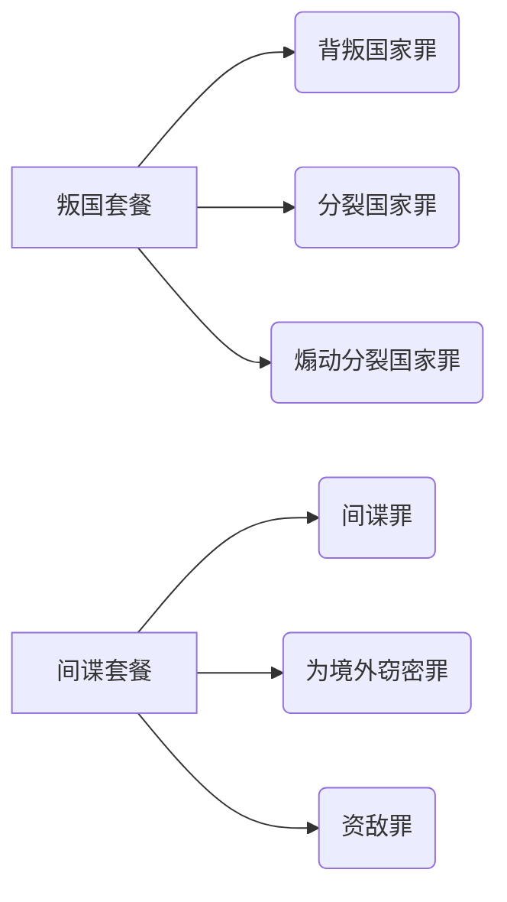
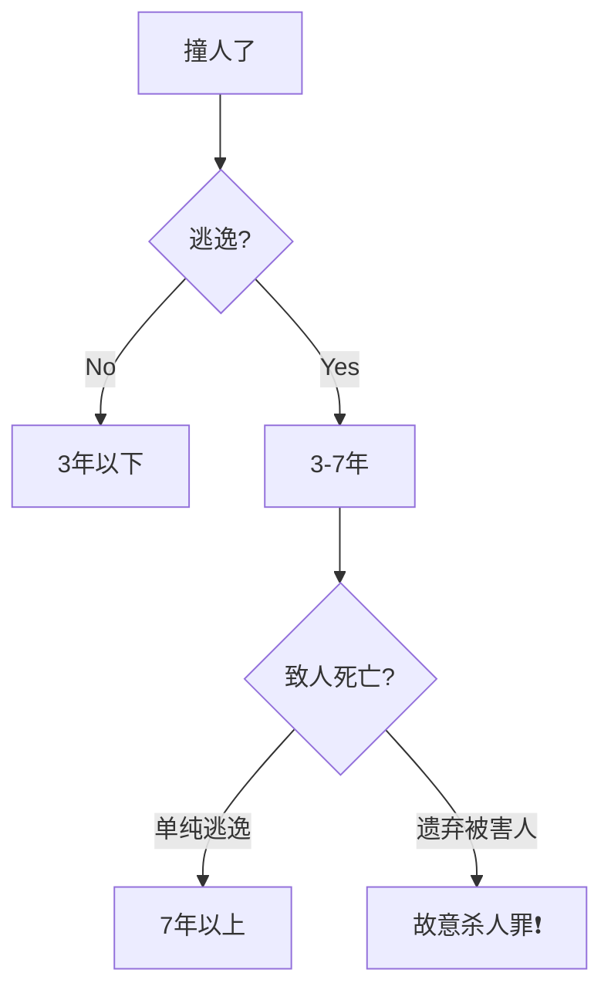
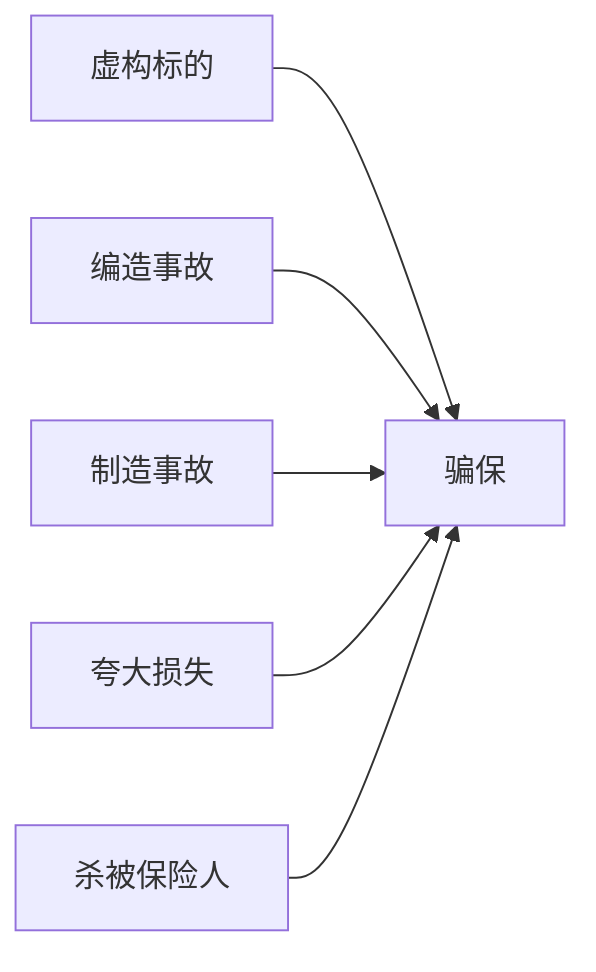

#📚 刑法分则超全攻略 | 10大罪名一网打尽

> ✨ 记忆口诀：**"国安公，经人财社，国防贪渎军"**  
> （对应10类犯罪排序：危害国家安全→公共安全→破坏经济→侵犯人身→财产→妨害社会管理→国防利益→贪污贿赂→渎职→军人职责）

---

## 一、危害国家安全罪 🔥

### 重点罪名全家福

---

## 二、危害公共安全罪 🚨

### （一）危险驾驶罪 | 马路四大作死行为

| 情形 | 处罚 | 记忆口诀 |
|------|------|----------|
| 🏎️ 飙车（情节恶劣） | 拘役+罚金 | "速度与罚金" |
| 🍺 醉驾 | 同上 | "一杯酒，看守所走" |
| 👨👩👧👦 校车/客车超载超速 | 同上 | "沙丁鱼罐头车" |
| ☢️ 违规运危险品 | 同上 | "移动炸弹车" |

### （二）交通肇事罪 | 逃逸=作大死

---

## 三、破坏市场经济秩序罪 💰

### 诈骗界"卧龙凤雏"对比表

| 特征 | 集资诈骗罪 | 非法吸收存款罪 |
|------|------------|----------------|
| 🤔 目的 | 钱到手就花（非法占有） | 暂时借用（承诺归还） |
| 🚩 标志行为 | 携款潜逃/挥霍资金 | 高息揽储不跑路 |
| ⚖️ 量刑关键 | 6种"不想还钱"表现 | 退赃可减刑（新增！） |

### 信用卡诈骗四连击 💳

- 伪卡/假证办卡 → 一刷就凉 ❌
- 废卡续命 → 过期还刷=自投罗网 🕸️
- 盗刷他人卡 → 捡到卡≠你的卡！👻
- 恶意透支 → 银行催收当耳旁风？💣

💡 冷知识：偷信用卡消费=盗窃罪！不是"借用"哦~

---

## 四、考试重点红榜 🚩

### 交通肇事"死亡三连"

- 单纯逃逸致死 → 7年以上（还是交通肇事罪）
- 遗弃被害人致死 → 故意杀人罪（罪名升级！）
- 老板指使逃逸 → 共犯！👔+👮=一起坐牢

### 保险诈骗五板斧

🌰 例子：自导自演车祸骗保=牢饭预定！

---

## � 记忆强化包

### 谐音梗大全

- "贪官三步走"：贪污→受贿→挪用公款（联想：先贪后收再挪用）
- 危险驾驶4情形 → "醉飙超危"（醉驾/飙车/超载/危险品）

### 对比记忆表

| 易混点 | 关键区别 |
|--------|----------|
| 间谍罪 vs 资敌罪 | 卖情报 vs 送物资 |
| 交通肇事逃逸 vs 遗弃 | 7年 vs 故意杀人 |

---

