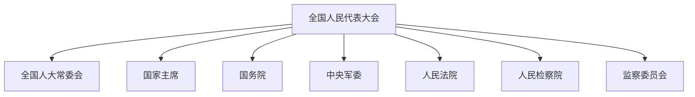

# 第四节 国家机构 📜

## 一、国家机构概述 🏛️

### 1. 国家机构的组成
中华人民共和国的国家机构包括：
- **全国人民代表大会及其常委会** 🏢
- **中华人民共和国主席** 👨‍💼
- **中华人民共和国国务院** 🏛️
- **中华人民共和国中央军事委员会** 🎖️
- **地方各级人民代表大会和地方各级人民政府** 🏘️
- **国家和地方各级监察委员会** 🕵️‍♂️
- **民族自治地方的自治机关** 🏞️
- **人民法院和人民检察院** ⚖️

### 2. 民主集中制原则
- **民主选举**：全国人民代表大会和地方各级人民代表大会由民主选举产生，对人民负责，受人民监督。
- **权力集中**：国家行政机关、审判机关、检察机关都由人民代表大会产生，对它负责，受它监督。

### 3. 中央与地方的职权划分
- **中央统一领导**：在中央的统一领导下，充分发挥地方的主动性、积极性。

## 二、权力机关 🏢

### （一）全国人民代表大会

#### 1. 性质和地位
- **最高权力机关**：全国人大是全国最高的权力机关、立法机关。

#### 2. 组成和任期
- **组成**：由省、自治区、直辖市、特别行政区和军队代表组成。
- **任期**：每届任期5年。

#### 3. 职权
- **修改宪法**：需全国人大常委会或五分之一以上代表提议，三分之二以上多数通过。
- **制定和修改法律**：刑事、民事、国家机构等基本法律。
- **选举国家领导人**：国家主席、副主席、国务院总理等。
- **决定重大事项**：战争与和平、特别行政区设立等。

#### 4. 会议制度
- **每年一次**：由全国人大常委会召集，必要时可临时召集。

### （二）全国人民代表大会常务委员会

#### 1. 性质和地位
- **常设机关**：全国人大常委会是全国人大的常设机关，闭会期间行使最高国家权力。

#### 2. 组成和任期
- **组成**：委员长、副委员长、秘书长、委员。
- **任期**：5年，委员长、副委员长连续任职不得超过两届。

#### 3. 职权
- **解释宪法和法律**：监督宪法实施。
- **制定和修改法律**：在全国人大闭会期间进行部分补充和修改。
- **监督其他机关**：国务院、中央军委、监察委员会等。

### （三）人大代表的权利
- **审议权**、**表决权**、**提名权**、**选举权**、**质询权**、**提出罢免案权**、**发言表决免责权**、**人身特别保护权**。

## 三、国家主席 👨‍💼

### 1. 性质和地位
- **国家元首**：对外代表中华人民共和国。

### 2. 职权
- **国事活动**：接受外国使节，宣布批准或废除条约。
- **发布命令**：特赦令、紧急状态、动员令等。
- **任命官员**：宣布国务院总理、副总理等任职或免职。

### 3. 任职条件
- **选举权和被选举权**：必须是中华人民共和国公民，年满45周岁。

## 四、行政机关 🏛️

### （一）国务院

#### 1. 性质和地位
- **最高行政机关**：国务院是中央人民政府，最高国家权力机关的执行机关。

#### 2. 组成和任期
- **组成**：总理、副总理、国务委员、各部部长、各委员会主任、审计长、秘书长。
- **任期**：5年，总理、副总理、国务委员连续任职不得超过两届。

#### 3. 会议制度
- **全体会议**：国务院全体成员组成。
- **常务会议**：总理、副总理、国务委员、秘书长组成。

#### 4. 职权
- **制定行政法规**：发布决定和命令。
- **领导和管理**：经济、教育、科学、文化、卫生等工作。

## 五、中央军事委员会 🎖️

### 1. 性质和地位
- **最高军事领导机关**：中央军事委员会是全国武装力量的最高领导机关。

### 2. 组成与任期
- **组成**：主席、副主席、委员。
- **任期**：5年，无届数限制。

### 3. 领导体制
- **主席负责制**：中央军委主席对全国人大和全国人大常委会负责。

## 六、司法机关 ⚖️

### （一）人民法院

#### 1. 性质和地位
- **审判机关**：人民法院是我国的审判机关。

#### 2. 组织体系
- **最高人民法院**、**地方各级人民法院**、**专门人民法院**。

#### 3. 工作原则
- **独立审判**：不受行政机关、社会团体和个人的干涉。
- **公开审判**：除特殊情况外，一律公开进行。

### （二）人民检察院

#### 1. 性质和地位
- **法律监督机关**：人民检察院是国家的法律监督机关。

#### 2. 组织体系
- **最高人民检察院**、**地方各级人民检察院**、**专门人民检察院**。

#### 3. 工作原则
- **独立检察**：不受行政机关、社会团体和个人的干涉。
- **平等适用法律**：公民在适用法律上一律平等。

## 七、监察委员会 🕵️‍♂️

### 1. 性质和地位
- **最高监察机关**：国家监察委员会是最高监察机关。

### 2. 组成和任期
- **组成**：主任、副主任、委员。
- **任期**：5年，主任连续任职不得超过两届。

### 3. 工作原则
- **独立监察**：不受行政机关、社会团体和个人的干涉。
- **互相配合**：与审判机关、检察机关、执法部门互相配合，互相制约。

---

## 重点总结 📌

1. **全国人大**：最高权力机关，修改宪法、制定法律、选举国家领导人。
2. **全国人大常委会**：常设机关，解释宪法、监督宪法实施。
3. **国家主席**：国家元首，进行国事活动，发布命令。
4. **国务院**：最高行政机关，制定行政法规，领导和管理国家事务。
5. **中央军委**：最高军事领导机关，主席负责制。
6. **人民法院**：审判机关，独立审判，公开审判。
7. **人民检察院**：法律监督机关，独立检察，平等适用法律。
8. **监察委员会**：最高监察机关，独立监察，互相配合。

---

## 图表辅助 📊

---

## 幽默速记 😄

- **全国人大**：就像班级的班长，负责制定班规（法律）和选举班干部（国家领导人）。
- **国家主席**：就像学校的校长，代表学校（国家）进行各种活动。
- **国务院**：就像学校的教务处，负责日常管理和执行校规（法律）。
- **中央军委**：就像学校的体育老师，负责管理学校的体育队（军队）。
- **人民法院**：就像学校的纪律委员会，负责审判违纪学生（案件）。
- **人民检察院**：就像学校的监督委员会，负责监督纪律委员会的工作。
- **监察委员会**：就像学校的风纪委员，负责监督所有老师和学生（公职人员）。
