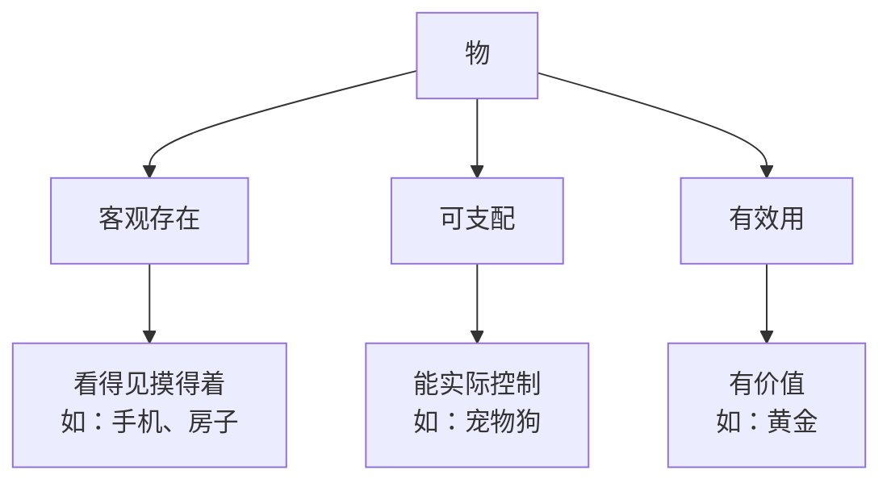
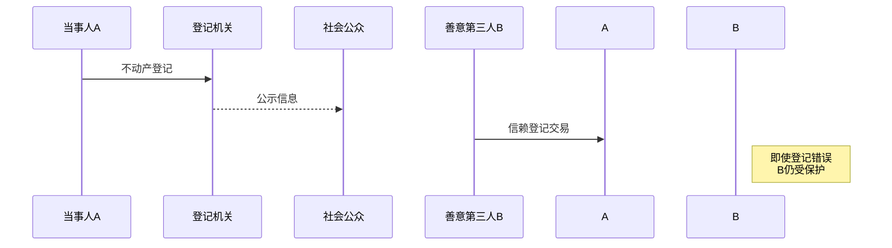
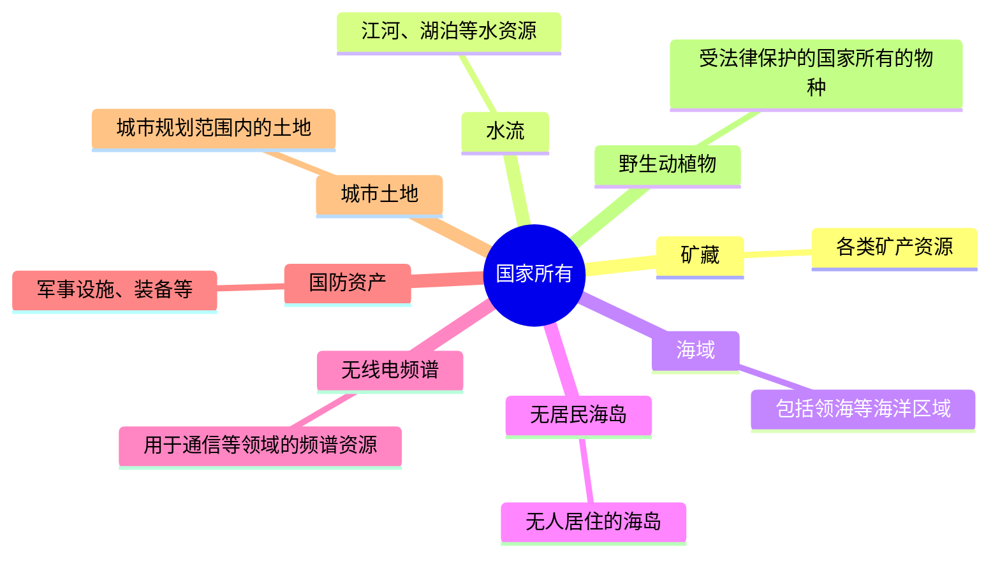
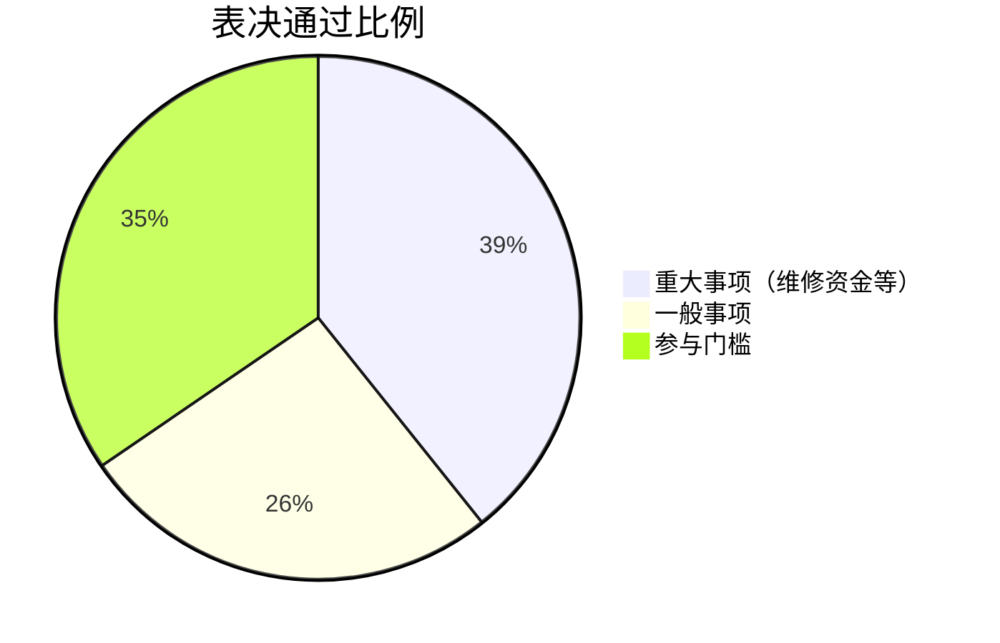

## 第一部分 物权 🏠

### 一、物的概述 🌟

#### 1. 物的概念
物是能够满足人的需要并为人能够支配的物体或者自然力。🌳🏠

#### 2. 特征
- **客观存在**：物得真真实实存在，不能是幻想中的东西哦。✨
- **能被人支配与控制**：物得能被人操控，比如你的小汽车。🚗
- **具有效用**：物得有用处，能帮上忙，比如你的手机。📱

#### 3. 物的分类
- **依物能否移动和移动后是否会损害物的价值为标准划分**：
  - **动产**：能移动且不因移动损害价值的物，比如手机。📱
  - **不动产**：不能移动或者可移动但会因移动损害价值的物，比如房子。🏠
- **以产生收益的物与所生收益之间的关系为划分标准**：
  - **原物**：依自然属性或法律的规定，能够产生收益的物，比如果树。🌳
  - **孳息**：依自然属性产生的孳息为自然孳息，依法律规定产生的孳息为法定孳息，比如果树结的果子。🍎

### 二、物权的概念 📜
物权是权利人依法对特定的物享有直接支配和排他的权利，包括所有权、用益物权和担保物权。💼

### 三、物权的基本原则 ⚖️

#### 1. 物权法定原则
物权的种类和内容，由法律规定。📜

#### 2. 公示公信原则
- **公示**：物权变动时，必须将事实通过公示方法向社会公开，让大家知道，以避免第三人遭受损害并保护交易安全。🔔
  - **不动产**：通过登记公示。🏢
  - **动产**：通过交付公示。📦
- **公信**：交易中的第三人如果善意无过失地信赖公示，即使公示权利状态与真实权利状态不符，第三人仍能取得物权。

#### 3. 善意取得制度
- **概念**：原物由占有人转让给善意第三人时，善意第三人可以取得原物的所有权，所有权人不得请求善意第三人返还原物。🔄
- **条件**：
  - 受让人受让该不动产或者动产时是善意的。
  - 以合理的价格转让。
  - 转让的不动产或者动产依照法律规定应当登记的已经登记，不需要登记的已经交付给受让人。
  - 占有人的占有是有权占有。
  - 出让财产的人是无权处分人。

#### 4. 物权的优先效力原则
物权的优先效力亦称物权的优先权效力，是指在同一物之上同时设定有物权和债权时，物权优先于债权。同一物之上存有相容的数个物权时，先设立的物权优于后设立的物权。🔑

### 四、所有权 🏠

#### （一）所有权的概念
所有权是物权种类中最重要的一种权利，它是指所有权人对自己的不动产或者动产，依法享有占有、使用、收益和处分的权利。💼

#### （二）所有权的种类
1. **国家所有权**：由国务院代表国家行使所有权。
   - 无线电频谱资源
   - 法律规定属于国家所有的文物
   - 国防资产
   - 矿藏、水流、海域
   - 城市的土地
   - 森林、山岭、草原、荒地、滩涂等自然资源（法律规定属于集体所有的除外）
   - 法律规定属于国家所有的野生动植物资源
   - 无居民海岛
2. **集体所有权**
3. **私人所有权**
   - 遗失物自发布招领公告之日起一年内无人认领的，归国家所有

#### （三）建筑物区分所有权
- 业主对建筑物内的住宅、经营性用房等专有部分享有所有权，对专有部分以外的共有部分享有共有和共同管理的权利。
- 建筑区划内的道路、绿地、其他公共场所、公用设施和物业服务用房属于业主共有。

### 五、用益物权 🌱

#### 1. 用益物权的含义
用益物权人对他人所有的不动产或者动产，依法享有占有、使用和收益的权利。📜

#### 2. 用益物权的种类
1. **土地承包经营权**
   - 承包经营权人依法对其承包经营的耕地、林地、草地等享有占有、使用和收益的权利。
   - 耕地的承包期为三十年，草地的承包期为三十年至五十年，林地的承包期为三十年至七十年。
   - 土地承包经营权人可以自主决定依法采取出租、入股或者其他方式向他人流转土地经营权。

2. **建设用地使用权**
   - 建设用地使用权人依法对国家所有的土地享有占有、使用和收益的权利，有权利用该土地建造建筑物、构筑物及其附属设施。
   - 建设用地使用权自登记时设立。
   - 住宅建设用地使用权期间届满的，自动续期。

3. **宅基地使用权**
   - 宅基地使用权人依法对集体所有的土地享有占有和使用的权利，有权依法利用该土地建造住宅及其附属设施。

4. **地役权**
   - 地役权人有权按照合同约定，利用他人的不动产，以提高自己的不动产的效益。地役权自地役权合同生效时设立。

5. **居住权**
   - 居住权人有权按照合同约定，对他人的住宅享有占有、使用的用益物权，以满足生活居住的需要。
   - 居住权不得转让、继承，设立居住权的住宅不得出租。

### 六、担保物权 🔒

#### （一）概念
担保物权人在债务人不履行到期债务或者发生当事人约定的实现担保物权的情形，依法享有就担保财产优先受偿的权利。🔑

#### （二）抵押权
1. **抵押权的含义**
   - 为担保债务的履行，债务人或者第三人不转移财产的占有，将该财产抵押给债权人的，债务人不履行到期债务或者发生当事人约定的实现抵押权的情形，债权人有权就该财产优先受偿。

2. **抵押物的范围**
   - 可以作为抵押物的财产：建筑物和其他土地附着物、建设用地使用权、海域使用权、生产设备、原材料、半成品、产品、正在建造的建筑物、船舶、航空器、交通运输工具等。
   - 不得用于抵押的财产：土地所有权、宅基地、自留地、自留山等集体所有土地的使用权、学校幼儿园等非营利法人的教育设施、医疗卫生设施和其他公益设施、所有权使用权不明或者有争议的财产、依法被查封扣押监管的财产、法律行政法规规定不得抵押的其他财产。

3. **抵押权的设立**
   - 抵押合同：设立抵押权，当事人应当采用书面形式订立抵押合同。
   - 抵押权生效：不动产抵押时必须抵押登记，抵押权自登记时生效；动产抵押不需要登记，抵押合同缔结生效后即取得抵押权。

4. **禁止流押**
   - 抵押权人在债务履行期限届满前，与抵押人约定债务人不履行到期债务时抵押财产归债权人所有的，只能依法就抵押财产优先受偿。

5. **抵押权的顺位**
   - 同一财产向两个以上债权人抵押的，拍卖、变卖抵押财产所得的价款依照登记的时间先后确定清偿顺序；抵押权已经登记的先于未登记的受偿；抵押权未登记的，按照债权比例清偿。

6. **抵押物的转让**
   - 抵押期间，抵押人可以转让抵押财产，抵押权不受影响。抵押人转让抵押财产的，应当及时通知抵押权人。

#### （三）质（押）权
1. **动产质权**
   - 为担保债务的履行，债务人或者第三人将其动产出质给债权人占有的，债务人不履行到期债务或者发生当事人约定的实现质权的情形，债权人有权就该动产优先受偿。
   - 设立质权，当事人应当采用书面形式订立质押合同。质权自出质人交付质押财产时设立。

2. **权利质权**
   - 债务人或者第三人有权处分的下列权利可以出质：汇票、本票、支票、债券、存款单、仓单、提单、可以转让的基金份额、股权、可以转让的注册商标专用权、专利权、著作权等知识产权中的财产权、应收账款等。

3. **禁止流质**
   - 质权人在债务履行期限届满前，与出质人约定债务人不履行到期债务时质押财产归债权人所有的，只能依法就质押财产优先受偿。

#### （四）留置权
债务人不履行到期债务，债权人可以留置已经合法占有的债务人的动产，并有权就该动产优先受偿。留置权是一种法定担保物权，一般仅在保管合同、仓储合同、承揽合同、运输合同等交易中适用。

----------------------------------------------------------
# 🌟物权法超全图解笔记 

## 一、物的三要素 🧱


### 📌考试重点：
- 自然力（电、热）也是物！
- 人体器官脱离身体才算物（活体器官不可交易）

---

## 二、物权核心原则 🚩
### 1. 物权法定原则
⚠️ **口诀**：种类内容国家定，自由创设可不行  
（例：不能自创"超级抵押权"）

### 2. 公示公信原则


#### 🏠VS🚗公示方式对比表：
|          | 不动产       | 动产     |
|----------|------------|--------|
| 公示方式   | 登记📝       | 交付📦  |
| 典型场景   | 房产过户     | 手机买卖 |
| 例外情形   | 地役权合同生效 | 汽车抵押需登记 |

---

## 三、善意取得全攻略 🛡️
### ✅四大要件（缺一不可）：
1. **善意**：买时不知情（重大过失不算）
2. **合理价**：市场价的70%以上
3. **已登记/交付**：房子要过户，手机要拿到
4. **无权处分**：卖家不是真主人

### 💡经典案例：
> 小明把借来的相机卖给不知情的小红，小红支付市场价并收货 → 小红取得所有权

---

## 四、所有权三重奏 🎵
### 1. 国家专属财产清单 🏛️


### 2. 建筑物区分所有权 🏢
**业主大会表决规则**：  


### 3. 共有关系对比表 👥
|          | 按份共有       | 共同共有       |
|----------|--------------|--------------|
| 基础关系   | 无特别关系      | 夫妻/家庭关系   |
| 处分规则   | 2/3同意       | 全体同意       |
| 优先购买权 | 有           | 无           |
| 债务承担   | 按份+连带     | 完全连带       |

---

## 五、用益物权全家福 🏡
### 五大金刚对比表：
| 类型             | 客体       | 设立方式     | 期限         | 特殊规则         |
|------------------|------------|--------------|--------------|------------------|
| 土地承包经营权   | 农用地      | 合同         | 30-70年      | 可流转经营权      |
| 建设用地使用权   | 国有土地    | 登记         | 按用途定      | 住宅自动续期      |
| 宅基地使用权     | 集体土地    | 审批         | 无期限       | 仅限本集体成员    |
| 地役权           | 他人不动产  | 合同生效     | 约定         | 需登记对抗第三人  |
| 居住权（新增）   | 住宅       | 合同+登记    | 约定/终身    | 不得转让、继承    |

---

## 六、担保物权三剑客 ⚔️
### 对比表：
|          | 抵押权       | 质权         | 留置权       |
|----------|--------------|--------------|--------------|
| 标的物   | 不动产/动产   | 动产/权利     | 动产         |
| 占有     | 不转移       | 必须转移      | 合法占有     |
| 设立方式 | 登记/合同    | 交付/登记    | 法定         |
| 优先顺序 | 登记时间顺序 | 交付/登记时间 | 最后受偿     |

### 🚫禁止流押/质：
> ❗️考前必记：到期前约定"不还钱东西归你"无效，只能优先受偿

---

## 高频考点速记卡 💯
1. **善意取得**：善价登处 → 善意+合理价+登记交付+无权处分
2. **抵押顺序**：登记>未登记，都登记看时间，都未登记按比例
3. **遗失物规则**：2年追索期，公告1年归国家，悬赏要兑现
4. **居住权**：登记设立、不得转让、住宅专用

---

## 真题演练 🧠
【2023年真题】张三将租来的名表质押给李四借款，李四不知情且支付合理价款，能否取得质权？  
✅答案：不能！质押需要所有权，租赁≠所有，不适用善意取得

```

