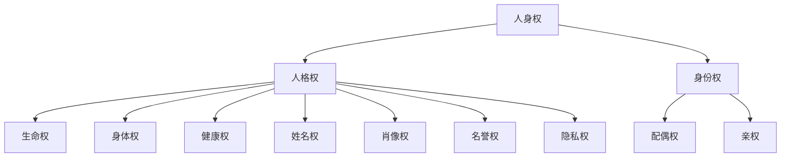
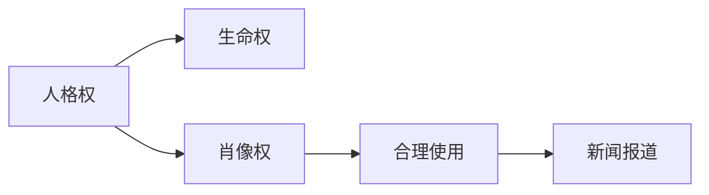

# 人身权核心笔记 👤⚖️



---

## 一、人身权基本概念 📜
**人身权**：与人身不可分离、不直接涉及财产内容的民事权利  
- 👤 **主体**：自然人、法人、非法人组织  
- 🚩 **特点**：专属性、不可转让性、非财产性  

---

## 二、人格权核心要点 🧠

### 1. 人格权类型
| 权利类型 | 定义 | 侵权示例 |
|----------|------|----------|
| 生命权 | 生命安全不受侵害 | 故意杀人、过失致人死亡 ⚰️ |
| 身体权 | 身体完整性不受侵害 | 非法拘禁、强制抽血 💉 |
| 健康权 | 身心健康不受侵害 | 环境污染致人患病 🌫️ |
| 姓名权 | 决定、使用、变更姓名 | 盗用他人姓名签合同 ✍️ |
| 肖像权 | 肖像制作、使用、公开 | 未经同意用他人照片做广告 📸 |
| 名誉权 | 社会评价不受贬损 | 散布谣言诋毁他人声誉 🗣️ |
| 隐私权 | 私人生活安宁与信息保密 | 偷拍他人私密视频 📹 |

---

### 2. 人格权特殊规则
- **不得放弃、转让、继承**：人格权与主体不可分离  
- **死者人格利益保护**：  
  ```mermaid
  graph LR
      A[死者人格利益受侵害] --> B[配偶、子女、父母可维权]
      B --> C[无配偶/子女且父母去世] --> D[其他近亲属可维权]
  ```

---

## 三、重点权利详解 🔍

### 1. 生命权、身体权、健康权
- **人体器官捐献**：  
  - 完全民事行为能力人可**书面/遗嘱**形式决定捐献  
  - 生前未反对捐献的，死后由**配偶+成年子女+父母**共同决定  

- **性骚扰**：  
  - 违背意愿的言语/行为构成性骚扰  
  - 单位有义务预防、调查、处置（如职场性骚扰）  

---

### 2. 姓名权与名称权
| 主体 | 权利内容 | 侵权形式 |
|------|----------|----------|
| 自然人 | 决定、使用、变更、许可使用姓名 | 干涉、盗用、假冒 |
| 法人/非法人组织 | 决定、使用、变更、转让、许可使用名称 | 冒用企业名称 |

---

### 3. 肖像权
- **侵权形式**：  
  - 未经同意制作、使用、公开肖像  
  - 丑化、污损肖像（如P图恶搞）  

- **合理使用情形**：  
  ```mermaid
  graph LR
      A[合理使用] --> B[个人学习/科研]
      A --> C[新闻报道]
      A --> D[国家机关履职]
      A --> E[展示公共环境]
  ```

---

### 4. 隐私权与个人信息保护
| 权利类型 | 定义 | 侵权示例 |
|----------|------|----------|
| 隐私权 | 私人生活安宁与信息保密 | 偷拍、窃听、公开他人隐私 |
| 个人信息权 | 可识别特定自然人的信息 | 非法收集、使用、泄露身份证号、行踪信息 |

---

## 四、高频考点速记 🚩

### 1. 人格权保护
- 死者人格利益保护主体顺序：配偶→子女→父母→其他近亲属  
- 肖像权合理使用情形（尤其新闻报道、国家机关履职）  

### 2. 特殊规则
- 人体器官捐献需**书面/遗嘱**形式  
- 性骚扰单位责任：预防、调查、处置  

---

## 五、记忆口诀 📌
- **人格权特点**：  
  “人身专属不可转，财产无关永久存”  
- **死者人格保护**：  
  “配偶子女父母先，其他亲属最后权”  

---

## 六、真题示例 💯
【2021年真题】  
甲去世后，乙在网络上发布虚假信息诋毁甲的名誉。下列谁有权请求乙承担民事责任？  
A. 甲的朋友  
B. 甲的配偶  
C. 甲的同事  
✅ **答案**：B（死者名誉受侵害，配偶优先维权）

---


