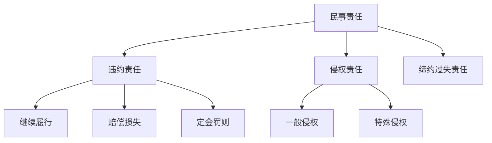
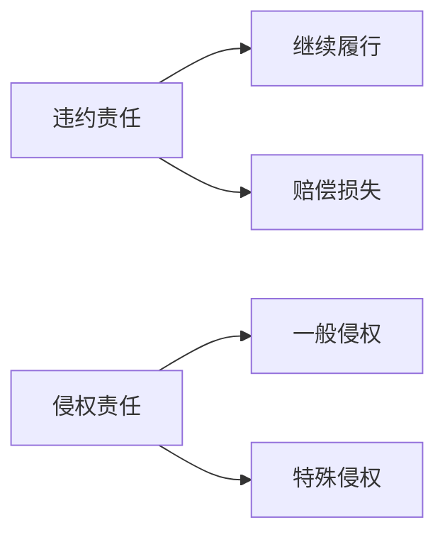

# 民事责任核心笔记 ⚖️



---

## 一、民事责任概述 📜

### 1. 民事责任种类
| 类型 | 定义 | 示例 |
|------|------|------|
| 违约责任 | 违反合同义务的责任 | 未按时交货 📦 |
| 侵权责任 | 侵害他人权益的责任 | 开车撞人 🚗 |
| 缔约过失责任 | 合同未成立时的过错责任 | 恶意磋商导致对方损失 💼 |

---

### 2. 特殊规则
- **见义勇为保护**：  
  ```mermaid
  graph LR
      A[见义勇为受伤] --> B[侵权人赔偿]
      B --> C[无侵权人/无力赔偿] --> D[受益人补偿]
  ```
- **英雄烈士保护**：侵害英雄烈士姓名、肖像、名誉、荣誉 → 承担民事责任 🎖️  
- **自甘风险**：自愿参加风险活动受伤 → 不得请求赔偿（除非他人故意/重大过失） 🏀  
- **民事责任优先**：同一行为需承担民事、行政、刑事责任时，财产不足 → 优先承担民事责任 💰  

---

## 二、违约责任核心要点 📝

### 1. 承担方式
| 方式 | 定义 | 示例 |
|------|------|------|
| 继续履行 | 按合同约定履行义务 | 补交货物 📦 |
| 赔偿损失 | 赔偿因违约造成的损失 | 支付违约金 💸 |
| 定金罚则 | 定金不返还或双倍返还 | 定金20%上限 ⚠️ |

### 2. 定金与违约金
- **定金规则**：  
  - 给付方违约 → 无权请求返还  
  - 收受方违约 → 双倍返还  
- **违约金与定金**：二者不可并用，只能选择其一 🔄  

---

## 三、侵权责任重点突破 🚨

### 1. 责任主体特殊规定
| 主体 | 责任承担 | 示例 |
|------|----------|------|
| 无/限制民事行为能力人 | 监护人赔偿（尽到责任可减轻） | 小孩打碎邻居玻璃 🧒 |
| 用人单位员工侵权 | 单位赔偿（可向故意/重大过失员工追偿） | 快递员送货撞人 🚚 |
| 网络侵权 | 网络服务提供者未及时采取措施 → 连带责任 | 未删除侵权视频 📹 |

### 2. 教育机构责任
| 学生类型 | 责任规则 | 示例 |
|----------|----------|------|
| 无民事行为能力人 | 教育机构承担（除非证明尽到职责） | 幼儿园小孩受伤 🏫 |
| 限制民事行为能力人 | 教育机构未尽职责 → 赔偿 | 中学生打架受伤 🥊 |

---

### 3. 特殊侵权类型
| 类型 | 责任主体 | 示例 |
|------|----------|------|
| 产品责任 | 生产者/销售者 | 缺陷产品致人损害 💣 |
| 机动车交通事故 | 使用人赔偿（所有人有过错 → 相应责任） | 借车发生事故 🚗 |
| 医疗损害 | 医疗机构赔偿（有过错时） | 手术失误致患者损害 🏥 |
| 饲养动物损害 | 饲养人/管理人赔偿（除非受害人故意/重大过失） | 狗咬人 🐕 |
| 高空抛物 | 可能加害人补偿（难以确定侵权人时） | 楼上扔东西砸人 🏢 |

---

## 四、高频考点速记 🚩

### 1. 违约责任
- 定金不得超过合同标的额20%  
- 违约金与定金不可并用  

### 2. 侵权责任
- 无/限制民事行为能力人侵权 → 监护人赔偿  
- 网络侵权 → 网络服务提供者连带责任  
- 高空抛物 → 可能加害人补偿  

---

## 五、记忆口诀 📌
- **违约责任**：  
  “定金20%是上限，违约金定金二选一”  
- **侵权责任**：  
  “小孩侵权监护人，网络侵权连带责；高空抛物难查人，可能加害要补偿”  

---

## 六、真题示例 💯
【2021年真题】  
甲向乙购买一台电脑，约定定金500元，合同总价5000元。后甲违约，乙应如何处理定金？  
A. 返还500元  
B. 返还1000元  
C. 不返还定金  
✅ **答案**：C（给付方违约，无权请求返还定金）

---


