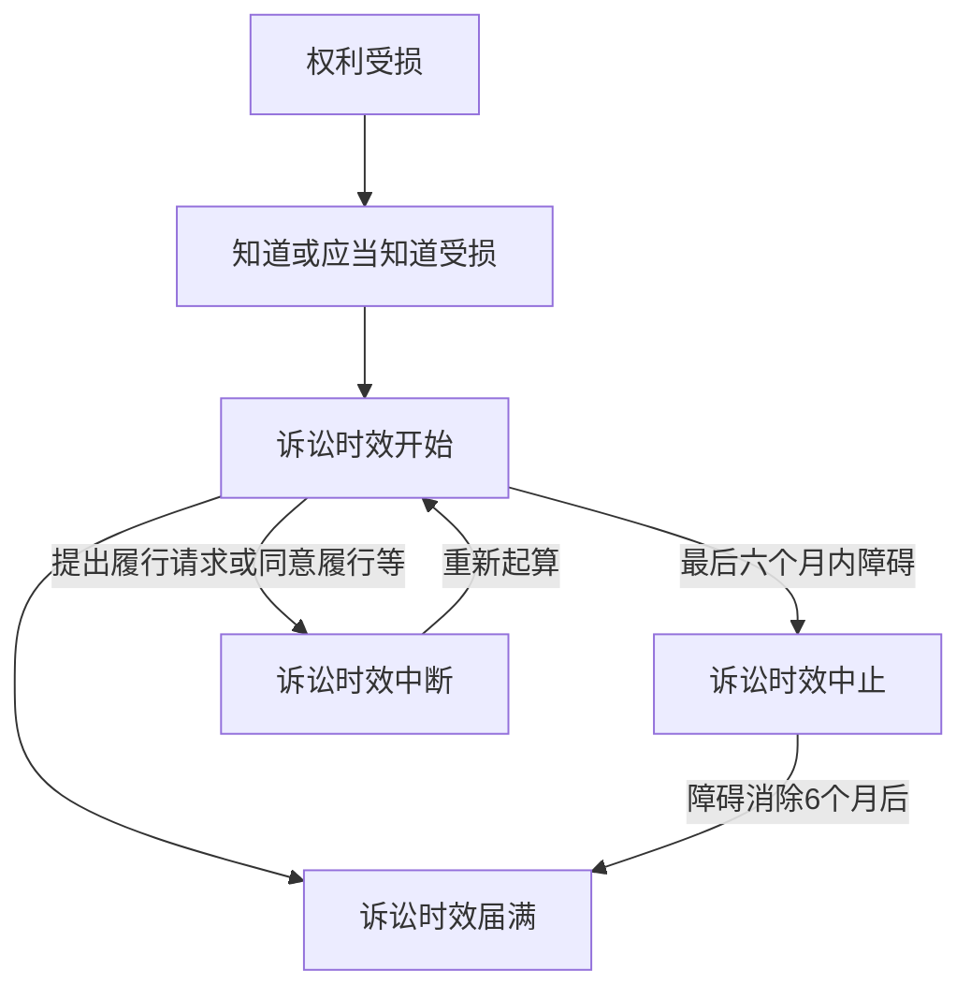

# 第七节 诉讼时效 🎓📜

## 一、概念 🧐
诉讼时效是指民事权利受到侵害的权利人在法定的时效期间内不行使权利，当时效期间届满时，人民法院对权利人的权利不再进行保护的制度。人民法院不得主动适用诉讼时效的规定。

## 二、诉讼时效种类 🗂️

### 1. 普通诉讼时效 ⏳
向人民法院请求保护民事权利的诉讼时效期间为 **3 年**，法律另有规定的除外。

### 2. 最长诉讼时效 🚶‍♂️
诉讼时效期间自权利人知道或者应当知道权利受到损害以及义务人之日起计算。法律另有规定的，依照其规定。但是，自权利受到损害之日起超过 **二十年** 的，人民法院不予保护，有特殊情况的，人民法院可以根据权利人的申请决定延长。

## 三、诉讼时效的起算 📝
一般情况下，诉讼时效期间自权利人知道或者应当知道权利受到损害以及义务人之日起计算。

当事人约定同一债务分期履行的，诉讼时效期间自最后一期履行期限届满之日起计算。

未成年人遭受性侵害的损害赔偿请求权的诉讼时效期间，自受害人年满十八周岁之日起计算。

## 四、诉讼时效中止 🛑

在诉讼时效期间的最后六个月内，因下列障碍，不能行使请求权的，诉讼时效中止：

1. 不可抗力；
2. 无民事行为能力人或者限制民事行为能力人没有法定代理人，或者法定代理人死亡、丧失民事行为能力、丧失代理权；
3. 继承开始后未确定继承人或者遗产管理人；
4. 权利人被义务人或者其他人控制；
5. 其他导致权利人不能行使请求权的障碍。

自中止时效的原因消除之日起满六个月，诉讼时效期间届满。

## 五、诉讼时效中断 🔄

诉讼时效中断是指非因权利人怠于行使权利，使已经过的时效期间丧失其效力，而须重新起算时效期间的制度。

### 诉讼时效中断的情形：
1. 权利人向义务人提出履行请求；
2. 义务人同意履行义务；
3. 权利人提起诉讼或者申请仲裁；
4. 与提起诉讼或者申请仲裁具有同等效力的其他情形。

## 六、诉讼时效届满的后果 ⚖️

诉讼时效期间届满的，义务人可以提出不履行义务的抗辩。

诉讼时效期间届满后，义务人同意履行的，不得以诉讼时效期间届满为由抗辩；义务人已经自愿履行的，不得请求返还。

🎯 **考试重点总结：**
1. 诉讼时效的概念及法院不主动适用的规定。
2. 普通诉讼时效为3年，最长诉讼时效为20年。
3. 诉讼时效的起算规则，尤其是特殊情况如分期履行和未成年人性侵害。
4. 诉讼时效中止和中断的具体情形及其影响。
5. 诉讼时效届满后的法律后果。

👀 **小贴士：**
- 记住普通诉讼时效和最长诉讼时效的时间长度。
- 掌握诉讼时效中止和中断的具体情形，这部分可能会考案例分析哦！
