## 一、**法的渊源的含义**  
法的渊源简称“法源”**，也叫**法律形式。  
它指的是**法律**的**外在表现形式**，这些不同的形式由于来源不同，赋予它们不同的法律效力和作用。  
- **简单理解**：法的渊源就是法律的“根”或“源头”，它们为法律的制定和实施提供了依据。🛠️

---

## 二、**我国不同法的渊源的制定主体**  
根据不同法律领域，制定这些法律的**主体**也不同：

### 1. **国家立法权**  
| **渊源**              | **制定主体**    |
| ------------------- | ----------- |
| **刑事、民事、国家机构的基本法律** | **全国人大**    |
| **基本法律以外的其他法律**     | **全国人大常委会** |

```mermaid
mindmap
    root((法律规范))
        基本法律
            刑事法律
                刑法
                刑事诉讼法
                监狱法
            民事法律
                民法典
                婚姻家庭法
                物权法
            国家机构法律
                宪法相关法
                政府组织法
                司法机关法
        基本法律以外的其他法律
            经济法
                税法
                金融法
                外贸法
            社会法
                教育法
                环境保护法
                劳动法
            行政管理法律
                公务员法
                城市规划法
                食品安全法
```

### 2. **行政立法权**  
**渊源** | **制定主体**  
---|---  
**行政法规** | **国务院**  
**部门规章** | **部委行署、直属机构**  
**地方政府规章** | **省级政府**  
**设区的市、自治州政府** | **城乡建设、环境保护等特定领域**  

### 3. **地方立法权**  
**渊源** | **制定主体** | **备注**  
---|---|---  
**地方性法规** | **省级人大及其常委会** | 设区的市、自治州的法规需报省级常委会批准。  
**民族自治法规** | **自治区、州、县人大** | 自治条例和单行条例需报全国人大常委会批准。

---

## 三、**法的渊源的位阶**  
法律的位阶，简单来说就是**谁高谁低**，有个“排名规则”。🎖️  
- **宪法**居于**最高位置**！  
- [^1]**法律** > **行政法规** > **地方性法规** > **规章**  
- **部门规章与地方政府规章**具有**同等效力**，但有特定范围限制。

### **法的位阶**  
- **第87条**：**宪法**拥有最高效力，一切法律、行政法规、地方性法规等都不能违反宪法。  
- **第88条**：**法律**效力高于行政法规、地方性法规和规章。  
- **第89条**：**地方性法规**效力高于本级政府规章。  
- **第91条**：**部门规章与地方政府规章**具有同等效力，在其各自的权限范围内施行。

---

## 四、**法的冲突及解决**  
当法律之间出现**冲突**，如何解决呢？看这里！🔄

### 1. **法律冲突解决的一般规则**  
- **上位法优于下位法**：高层法律优先！  
- **特别法优于一般法**：特别规定优先！  
- **新法优于旧法**：新法生效，旧法作废！  
- **法不溯及既往**：法律不会追溯过去，但有些情况下会**溯及**（如果对你有利的话）。⏳

### 2. **具体解决规则**  
- **同一机关制定的新的一般规定与旧的特别规定不一致**：由制定机关裁决。  
- **地方性法规与部门规章冲突**：由**国务院**决定，或提请**全国人大常委会**裁决。  
- **部门规章之间或与地方政府规章冲突**：由**国务院**裁决。

---

## 📌 **重点总结**  
1. **法的渊源的制定主体**：  
   - **全国人大**：负责基本法律的制定。  
   - **国务院**：负责行政法规的制定。  
   - **地方政府与各级人大**：负责制定地方性法规、规章。

2. **法的渊源的位阶**：  
   - **宪法 > 法律 > 行政法规 > 地方性法规 > 规章**。  
   - 高位法律优先执行。

3. **法的冲突解决**：  
   - **上位法优于下位法**，**新法优于旧法**。  
   - 在法律冲突时，**由相关机关裁决**。

[^1]: 法律：《中华人民共和国食品安全法》
	全国人民代表大会常务委员会制定的，具有全国范围内的法律效力
	
	行政法规：《中华人民共和国食品安全法实施条例》
	国务院制定，旨在具体实施《食品安全法》，在全国范围内适用
	
	地方性法规：《江苏省食品安全条例》
	江苏省人民代表大会常务委员会制定，适用于江苏省内的食品安全管理，不能与国家法律和行政法规相抵触
	
	规章：《江苏省食品药品监督管理局关于食品安全行政处罚的若干规定》
	这是江苏省食品药品监督管理局制定的部门规章，具体规定了食品安全行政处罚的程序和标准，适用于江苏省内的食品药品监督管理工作
	。
