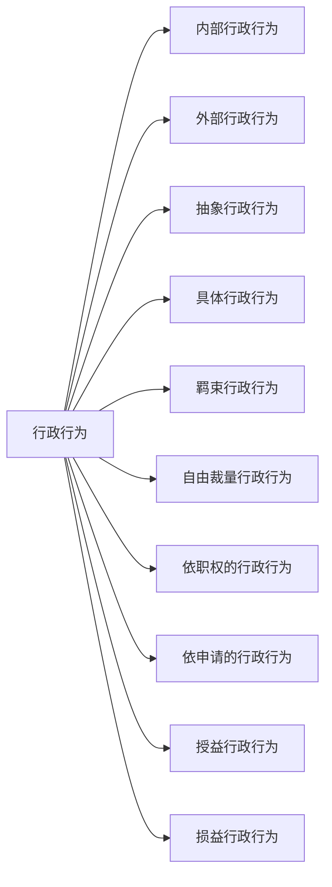

# 第五章 行政法 📜

## 第一节 行政法概述 📝

### 一、行政法的基本原则 📏

#### 1. 合法行政原则 ✅
所有的行政行为都必须有法律依据，不能随心所欲。

#### 2. 合理行政原则 🤔
行政行为要合理合情，不能偏颇或荒谬。

#### 3. 行政应急性原则 🚨
在紧急情况下，行政机关可以采取特别措施，即使这些措施没有明确法律依据或与通常法律相抵触。此时，行政机关不必承担法律责任。这是合法性原则的例外。

#### 4. 程序正当原则 🛤️
- **行政公开原则**：行政行为应公开透明，让公众知情。
- **公众参与原则**：公众有权参与行政决策。
- **回避原则**：行政人员如果与行政事项有利害关系，应主动回避。

#### 5. 高效便民原则 🚀
行政行为应高效，方便群众。

#### 6. 诚实守信原则 🤝
- **行政信息真实原则**：行政机关发布的信息应真实可信。
- **保护公民信赖利益原则**：行政机关应保护公民对其行为的合理信赖。

#### 7. 权责统一原则 ⚖️
行政机关行使权力的同时，也要承担相应的责任。

## 二、行政法律关系主体 👥
**行政法律关系主体**是指在行政法律关系中享有权利和承担义务的当事人。

---

## 第二节 行政行为 🏛️

### 一、行政行为的概念和特征 🧩

#### （一）行政行为概念
行政行为是指行政主体行使行政职权，做出的能够产生行政法律效果的行为。

#### （二）行政行为的特征
1. **主体是行政主体**：必须是具有行政职权的机关或组织。
2. **行为必须是行使行政职权的行为**：不能是个人行为或其他非行政行为。

### 二、行政行为的分类 🎭

行政行为可以根据不同的标准进行分类。主要分类有：

#### （一）内部行政行为与外部行政行为 📜
- **内部行政行为**：如行政处分等，适用于行政机关内部。
- **外部行政行为**：如行政许可行为等，适用于社会公众。

#### （二）抽象行政行为与具体行政行为 🧾
- **抽象行政行为**：如制定行政法规、行政规章等，不针对特定对象。
- **具体行政行为**：如行政许可行为、行政处罚行为等，针对特定对象。

#### （三）羁束行政行为与自由裁量行政行为 🕹️
- **羁束行政行为**：如税务机关征税，严格依照法律规定。
- **自由裁量行政行为**：行政机关在法律允许范围内有一定自主权。

#### （四）依职权的行政行为与依申请的行政行为 📝
- **依职权的行政行为**：如税务机关的征税行为，主动作为。
- **依申请的行政行为**：如颁发营业执照、经营许可证等，需要申请人提出申请。

#### （五）授益行政行为与损益行政行为 🎁
- **授益行政行为**：对行政相对人有利的行为，如发放补贴。
- **损益行政行为**：对行政相对人不利的行为，如罚款。

🎯 **考试重点总结：**
1. 行政法的基本原则，尤其是合法行政原则和程序正当原则。
2. 行政行为的概念和特征，明确行政行为应由行政主体做出且必须行使行政职权。
3. 行政行为的分类，掌握不同标准下的分类方法及其例子。
