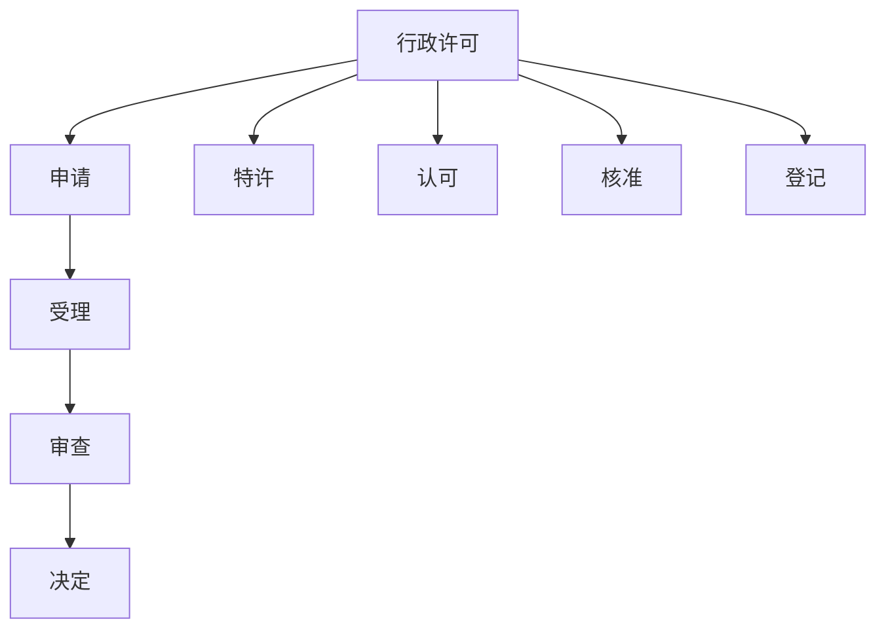

# 第二节 行政许可 🚦

## 一、行政许可的概念和特征 📝

### （一）概念
**行政许可**是指行政机关根据行政相对方的申请，经审查依法赋予其从事某种活动的法律资格或者实施某种行为的法律权利的具体行政行为。

### （二）特征
1. **依申请的行政行为**：需要行政相对方主动申请。
2. **对一般禁止的解除**：解除法律上的一般禁止，使某些活动合法化。
3. **授益性行政行为**：赋予行政相对方某种权利或特权。
4. **要式行政行为**：必须按照法定程序和形式进行。

## 二、行政许可的设定 🛠️

### （一）行政许可设定的范围 🌍

#### 可以设定许可的事项
1. **特许**：开发利用有限自然资源、配置公共资源或特定行业的市场准入。例子：采矿许可证、国有土地使用许可、无线电频率配置等。
2. **认可**：确定特定职业行业的资格、资质。例子：教师资格证、律师资格、注册会计师资格等。
3. **核准**：检验、检测、检疫特定设备、设施、产品、物品。例子：消防核准、生猪屠宰检疫、电梯安装运行标准等。
4. **登记**：企业或其他组织的设立。例子：工商企业登记、社团登记等。

### （二）行政许可设定的权限 📜

1. **法律**可以设定行政许可。
2. **行政法规**可以设定行政许可，必要时国务院可以发布决定设定许可，但应及时提请全国人大或其常委会制定法律或自行制定行政法规。
3. **地方性法规**可以设定行政许可，尚未制定法律和行政法规的情况下。
4. **省、自治区、直辖市人民政府规章**可以设定临时性行政许可，实施满一年需继续实施的，应提请本级人大及其常委会制定地方性法规。

> 📝 注：部门规章不能设定行政许可，但可以设定行政处罚。

## 三、行政许可的实施 🏛️

### （一）实施程序 📑

#### 1. 一般程序
行政许可的一般程序按先后顺序分为申请、受理、审查、决定。

##### （1）申请程序
申请人自己或委托代理人提出申请，可以通过行政机关办公场所或信函、电报、电传、传真、电子数据交换、电子邮件等书面方式提出。无论采用何种方式，都必须书面形式，不得口头提出。

##### （2）受理程序
行政主体对申请人提出的行政许可申请进行处理：
- **属于本行政机关职权范围**，材料齐全、符合法定形式的，应当受理。
- **不需要行政许可**的，应即时告知申请人不受理。
- **不属于本行政机关职权范围**的，应告知申请人向有关行政机关申请。
- **材料存在可以当场更正的错误**的，应允许申请人当场更正。
- **材料不齐全或不符合法定形式**的，应当场或在五日内一次告知申请人需要补正的内容，逾期不告知的，视为受理。
- **材料齐全、符合法定形式**的，应受理申请，并出具加盖专用印章和注明日期的书面凭证。

#### 2. 听证程序 🎙️

##### （1）程序启动
- **依职权**：法律、法规、规章规定应听证的事项，或行政主体认为需要听证的重大行政许可事项。
- **依申请**：涉及申请人与他人有大利益关系的行政许可事项，行政主体应告知申请人、利害关系人有要求听证的权利。申请人或利害关系人在被告知之日起5日内提出，行政主体应在20日内组织听证。

##### （2）程序设计
1. **听证通知**：举行听证7日前通知申请人、利害关系人，必要时公告。
2. **申请回避**：
   - 听证主持人应为未审查该申请的人员，申请人、利害关系人有权申请回避。
   - 认为主持人与许可事项有直接利害关系的，也可申请回避。
3. **听证公开**：行政许可听证应公开进行。
4. **听证笔录**：制作听证笔录，经听证参加人确认无误后签字或盖章。行政主体应根据笔录作出决定。
5. **听证费用**：申请人、利害关系人不承担听证费用，由行政主体承担。

## 四、行政许可的费用 💰

1. **法律、行政法规**才能规定许可收费，地方性法规、规章不能规定收费。
2. 行政机关提供许可申请书格式文本，不得收费。

🎯 **考试重点总结：**
1. 行政许可的概念和特征，尤其是依申请、授益性及要式行政行为。
2. 行政许可的设定范围和权限，明确不同层级法规的设定权限。
3. 行政许可的实施程序，特别是申请、受理和听证程序的细节。

