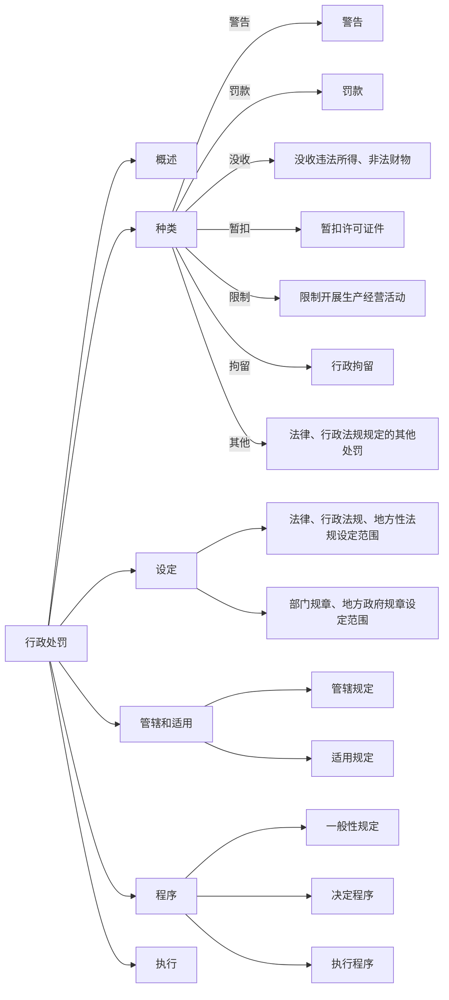

# 第三节 行政处罚 ⚖️

## 一、概述 🧐
**行政处罚**是指行政机关依法对违反行政管理秩序的公民、法人或者其他组织，以减损权益或者增加义务的方式予以惩戒的行为。

## 二、行政处罚的种类 📜

1.  **警告、通报批评**  —— 刚开始犯错，轻轻的警告一下👮‍♂️。
1.  **罚款、没收违法所得、没收非法财物**  —— 直接从你钱包里扣款💸。
1.  **暂扣许可证件、降低资质等级、吊销许可证件**  —— 想做生意？证照没了，暂时不能经营🛑。
1.  **限制开展生产经营活动、责令停产停业、责令关闭**  —— 停停停！你这不行了⚠️。
1.  **行政拘留**  —— 比较严厉的处罚，直接把你“请进”行政拘留所🏢。
1.  **法律、行政法规规定的其他行政处罚**  —— 包括那些特殊情况下的处罚，比如环境污染等。

> 🚓 限制人身自由的行政处罚权只能由公安机关和法律规定的其他机关行使。

## 三、行政处罚的设定 🛠️

### 可创设的处罚种类及注意问题

| 类别         | 可设定处罚种类                                                                                       | 注意问题                                             |
|--------------|--------------------------------------------------------------------------------------------------------|------------------------------------------------------|
| **法律**     | 各种处罚                                                                                            | 限制人身自由的处罚由法律保留                         |
| **行政法规** | 限制人身自由除外，可设定吊销营业执照的处罚                                                          |                                                      |
| **地方性法规**| 限制人身自由、吊销营业执照除外，可设定暂扣营业执照的处罚                                              |                                                      |
| **部门规章** | 警告；通报批评；罚款                                                                                | 罚款限额由国务院规定                                 |
| **地方政府规章**| 罚款限额由省、自治区、直辖市人大常委会规定                                                             |                                                      |

> 📝 法律、行政法规对违法行为未作出行政处罚规定的，地方性法规可以为实施法律、行政法规补充设定行政处罚。拟补充设定行政处罚的，应通过听证会、论证会等形式广泛听取意见，并向制定机关作出书面说明。地方性法规报送备案时，应说明补充设定行政处罚的情况。

## 四、行政处罚的管辖和适用 🌍

### 1. 行政处罚的管辖
- 行政处罚由违法行为发生地的行政机关管辖。法律、行政法规、部门规章另有规定的，从其规定。
- **新增**：省、自治区、直辖市根据当地实际情况，可以决定将基层管理迫切需要的县级人民政府部门的行政处罚权交由乡镇人民政府、街道办事处行使，并定期组织评估。决定应当公布。
- 两个以上行政机关都有管辖权的，由最先立案的行政机关管辖。
- 对管辖发生争议的，应协商解决，协商不成的，报请共同的上一级行政机关指定管辖；也可直接由共同的上一级行政机关指定管辖。

### 2. 行政处罚的适用
#### （1）不予处罚
- 不满14周岁的人有违法行为的；
- 精神病人在不能辨认或控制自己行为时有违法行为的；
- 违法行为轻微并及时纠正，没有造成危害后果的；
- 初次违法且危害后果轻微并及时改正的，可以不予行政处罚；
- 当事人有证据足以证明没有主观过错的，不予行政处罚。法律、行政法规另有规定的，从其规定；
- 违法行为在两年内未被发现的，不再给予行政处罚。涉及公民生命健康安全、金融安全且有危害后果的，上述期限延长至五年。法律另有规定的除外。

#### （2）应当从轻或减轻处罚
- 已满14周岁不满18周岁的人有违法行为的；
- 主动消除或减轻违法行为危害后果的；
- 受他人胁迫或者诱骗实施违法行为的；
- 配合行政机关查处违法行为有立功表现的；
- 主动供述行政机关尚未掌握的违法行为的；
- 法律、法规、规章规定其他应当从轻或者减轻行政处罚的。

## 五、行政处罚的程序 📝

### （一）一般性规定
1. 行政机关在作出行政处罚决定之前，应告知当事人拟作出的行政处罚内容及事实、理由、依据，并告知当事人依法享有的陈述、申辩、要求听证等权利。
2. 当事人有权进行陈述和申辩。行政机关必须充分听取当事人的意见，对当事人提出的事实、理由和证据，应进行复核；当事人提出的事实、理由或者证据成立的，行政机关应采纳。不得因当事人陈述、申辩而给予更重的处罚。

### （二）决定程序
处罚决定作出之前应满足的条件：查明事实——履行告知义务——充分听取意见。

| 程序种类   | 简易程序                                | 一般程序                                    | 听证程序                                          |
|------------|-----------------------------------------|---------------------------------------------|---------------------------------------------------|
| 适用条件   | 公民处以二百元以下、法人或组织处以三千元以下罚款或警告的行政处罚，可当场作出决定 | 不适用简易或听证程序时                        | 较大数额罚款；没收较大数额违法所得、非法财物；降低资质等级、吊销许可证件；责令停产停业、责令关闭、限制从业；其他较重的处罚 |
| 重要制度   | 当场决定                               | 调查检查：至少2人执法 做出决定：由行政机关负责人（集体）作出决定 | 公务回避：应由非本案调查人员主持听证 当事人认为主持人与本案有直接利害关系的，有权申请回避 委托听证：当事人可委托1至2人代理 |
| 重要时限   | 处罚决定书须当场交付 当事人不在场应在7日内送达 |                                             | 申请期限：应在被告知后5日内要求听证 告知期限：行政机关应在听证7日前通知听证时间与地点 |

行政机关应自行政处罚案件立案之日起90日内作出行政处罚决定。法律、法规、规章另有规定的，从其规定。

### （三）行政处罚的执行
1. **执行原则**：罚缴分离是原则，当场收缴是例外
   - **原则**：作出罚款决定的行政机关应与收缴罚款的机构分离，当事人应自收到处罚决定书之日起15日内，到指定的银行或通过电子支付系统缴纳罚款。银行应收受罚款，并将罚款直接上缴国库。
   - **例外**：有下列情形之一的，执法人员可当场收缴罚款：
     1. 依法给予一百元以下的罚款；
     2. 不当场收缴事后难以执行的；
     3. 在边远、水上、交通不便地区，依法做出当场处罚决定后，当事人向指定银行或通过电子支付系统缴纳罚款确有困难，经当事人提出，行政机关及其执法人员可当场收缴罚款。

行政机关及其执法人员当场收缴罚款的，必须向当事人出具国务院财政部门或省、自治区、直辖市人民政府财政部门统一制发的专用票据；不出具专用票据的，当事人有权拒绝缴纳罚款。

执法人员当场收缴的罚款，应自收缴之日起二日内交至行政机关；在水上当场收缴的罚款，应自抵岸之日起二日内交至行政机关；行政机关应在二日内将罚款缴付指定银行。

> **增补**：**一事不再罚**
对当事人的同一个违法行为，不得给予两次以上罚款的行政处罚。同一个违法行为违反多个法律规范应当给予罚款处罚的，按照罚款数额高的规定处罚。

🎯 **考试重点总结：**
1. 行政处罚的概述及种类，尤其是限制人身自由的处罚权只能由公安机关行使。
2. 行政处罚的设定权限，不同法规设定的处罚种类及注意事项。
3. 行政处罚的管辖和适用，特别是新增的基层管理权限下放。
4. 行政处罚的程序，简易程序、一般程序和听证程序的适用条件及重要时限。
5. 行政处罚的执行原则，罚缴分离是原则，当场收缴为例外。

