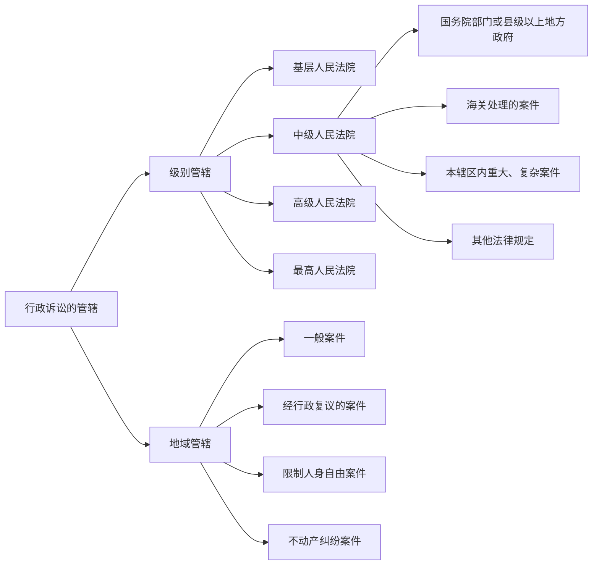

# 第七节 行政诉讼 📜

## 一、行政诉讼的概念 ⚖️
行政诉讼就是公民、法人或其他组织觉得行政机关做的事侵犯了他们的合法权益，然后把这件事带到法院，要求法院审查这些行政行为是否合法。法院通过审查，作出裁定，确保行政机关的行为在法律框架内。简而言之，这是法院对行政机关行为的一种监督制约。

### 关键点：
- **谁可以提起诉讼？** 公民、法人等有合法权益受侵害的组织。
- **谁是被告？** 行政机关。

---

## 二、行政诉讼的受案范围 📜

### 1. **可以提起诉讼的情形** 🔥
根据《行政诉讼法》第12条，以下情况公民、法人可以向法院起诉：
- 行政处罚不服（罚款、警告、拘留等）。
- 行政强制措施（查封、冻结等）不服。
- 行政许可被拒或未回复。
- 行政机关侵犯自然资源权（如土地、水域等）。
- 征收、征用不服。
- 行政机关不履行职责或违法变更合同。

### 2. **不能提起诉讼的情形** 🛑
第13条规定，以下情况不受理：
- 国防、外交等国家行为。
- 行政法规、规章等普遍性决定。
- 行政机关对工作人员的任免奖惩。
- 法律规定由行政机关最终裁决的行为（例如税务争议）。

---

## 三、行政诉讼的管辖 🏛️

### 1. **级别管辖**
- **基层法院**管辖一般行政案件。
- **中级法院**管辖重大、复杂案件，或国务院部门案件。
- **高级法院**管辖更复杂的案件。
- **最高法院**管辖全国范围内的重大案件。

### 2. **地域管辖**
- **一般案件**：被告住所地管辖。
- **复议案件**：复议机关所在地管辖。
- **限制人身自由案件**：原告或被告所在地管辖。
- **不动产纠纷**：不动产所在地管辖。

### 3. **选择管辖法院**
当有两个或以上法院可以受理时，原告可以自由选择，但由最先立案的法院管辖。

---

## 四、行政诉讼参加人 👥

### 1. **原告资格** 🎯
任何认为行政行为侵害自己合法权益的人都可以作为原告提起诉讼。如果原告死亡，近亲属可以代为诉讼；法人或组织终止，则由继承法人或组织提起诉讼。

### 2. **被告资格** 🏢
被告通常是作出行政行为的行政机关。如果案件经过复议，复议机关也是被告。

---

## 五、行政诉讼程序 ⚙️

### 1. **起诉** ✍️
#### 起诉条件：
- 有明确的被告。
- 有具体的诉讼请求和事实根据。
- 符合法院受理的条件。

#### 起诉方式：
- 提交起诉状，必要时附副本。
- 如果书写有困难，可口头起诉，法院会记录并出具凭证。

#### 起诉期限：
- **直接起诉**：自知道行政行为之日起6个月内。
- **经过复议**：复议决定书送达后15日内。

### 2. **立案** 📝
法院在接到起诉状时，如果符合条件，会登记立案；不符合条件，则拒绝立案，并说明原因。

### 3. **证据** 📑
- **证据类型**：书证、物证、电子数据等。
- **举证责任**：被告（行政机关）需提供行政行为的证据和依据。

### 4. **一审程序** 🏛️
- **普通程序**：法院审理并公开宣判。判决后10日内送达判决书。
- **简易程序**：适用于简单案件，审理期限为45日。由审判员独立审理。

---

## 六、行政诉讼重点总结 📝

### 重点：
1. **行政诉讼的目的是法院对行政行为进行审查**，确保行政机关不滥用权力。
2. **行政诉讼的受案范围广泛**，涉及行政处罚、行政许可、行政强制等多个方面。
3. **起诉时有时间限制**，错过期限可导致无法提起诉讼。
4. **证据在行政诉讼中至关重要**，行政机关需提供足够证据支持其行为。
5. **一审程序灵活**，简易案件可以适用简化程序，减少时间和成本。

---

### 考试小贴士 🎓
- **重点掌握**：受案范围、起诉条件、证据种类。
- **区分清楚**：普通程序与简易程序的区别，理解各类管辖情况。

