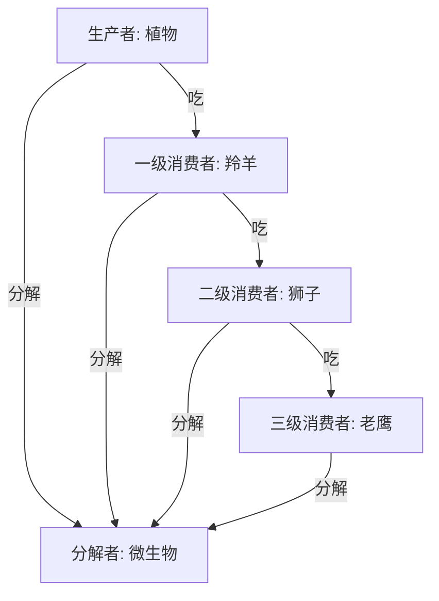
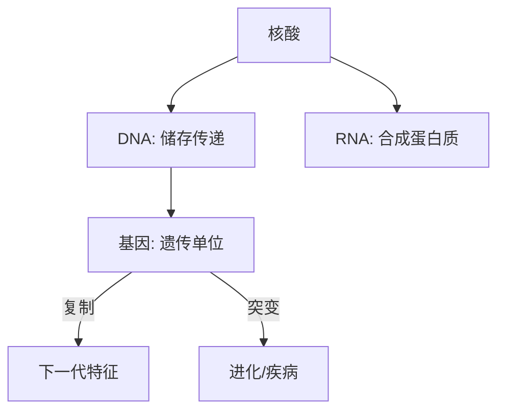

# 📜 生物知识笔记

## 🌿 第二节 生物知识：生命咋回事？

> **总览**：生物知识就像打开大自然的“说明书”，从生物圈的“大圈子”，到进化的“升级路”，再到遗传的“接力棒”，咱们一步步揭秘生命的秘密！🧬

---

### 一、🌍 生物圈：地球的生命圈

#### （1）啥是生物圈？
- **定义**：生物圈是地球上所有生物和它们生活环境的“大集合”，包括生物链、生态系统、小微生物，啥都有！  
- **比喻**：像个超级大的“朋友圈”，生物们在这儿吃饭、玩耍、繁衍。🌏

#### （2）范围和条件
- **范围**：海平面上1万米（大气圈底部）到下1万米（水圈+岩石圈表面）。  
- **生存条件**：营养物质、阳光、空气、水、温度、空间——缺一不可。  
- **例子**：鱼儿游水里，鸟儿飞天上，都是生物圈的地盘。

#### （3）生物分类（3大角色）
- **生产者**：绿色植物，光合作用“造饭”，把无机物变有机物。  
  - 例子：树叶晒太阳，产氧气+糖分。  
- **消费者**：动物，吃东西过日子。  
  - 一级：吃植物的，比如羚羊🐐。  
  - 二级：吃动物的，比如狮子🦁。  
  - 三级：吃肉食动物的，比如老鹰🦅。  
  - 人类：啥都吃，杂食王👑。  
- **分解者**：微生物，把有机物拆成无机物，打扫“剩饭”。  
  - 例子：细菌分解落叶，变废为宝。  

- **Mermaid图表**：生物圈食物链

- **考试重点⭐**：生产者、消费者、分解者的角色常考！

---

### 二、🐾 生物的进化：从简单到牛掰

#### （1）啥是进化？
- **定义**：生物从简单变复杂、从低级变高级的“升级史”。  
- **来源**：拉丁文“展开”，1762年邦尼特用在生物学，达尔文《物种起源》发扬光大。  
- **特点**：漫长地质年代，水生→陆生，低等→高等。  
- **比喻**：像游戏角色，从“新手村”练到“满级大佬”。🎮

#### （2）进化顺序
- **动物**：  
  - 无脊椎（海绵）→脊椎（鱼）→两栖（青蛙）→爬行（蛇）→鸟+哺乳（鸟+人）。  
- **植物**：  
  - 藻类（水草）→苔藓→蕨类→裸子（松树）→被子（苹果树）。  
- **人类**：  
  - 猿人（弯腰）→直立人（站直）→智人（会思考的我们）。  
- **例子**：鱼儿长腿变青蛙，猿人学会直立变人类。

- **表格**：进化顺序

| 类型   | 进化路径                        | 例子         |
|--------|--------------------------------|-------------|
| 动物   | 无脊椎→脊椎→鱼→两栖→爬行→鸟/哺乳 | 鱼→青蛙→人 |
| 植物   | 藻类→苔藓→蕨类→裸子→被子      | 水草→苹果树 |
| 人类   | 猿人→直立人→智人              | 猴子→我们   |

- **口诀**：动物鱼爬鸟，人从猿到智，植物藻到花！🌱

---

### 三、🧬 遗传：传家宝咋传？

#### （1）啥是遗传？
- **定义**：通过基因传特征给下一代，像“复制粘贴”爸妈的样子。  
- **学科**：遗传学研究这个。  
- **物质**：地球生命主要靠DNA传家。  
- **例子**：你长得像爸妈，基因在“捣鬼”！

#### （2）遗传物质
- **核酸**：  
  - **定义**：遗传信息的“硬盘”，存在细胞里，管遗传、变异、蛋白质合成。  
  - **分类**：  
    - **DNA**（脱氧核糖核酸）：储存、复制、传递信息的主力。  
    - **RNA**（核糖核酸）：帮DNA合成蛋白质。  
  - **组成**：核苷酸（磷酸+核糖+碱基），DNA用脱氧核苷酸，RNA用核糖核苷酸。  
  - **例子**：DNA像“蓝图”，RNA像“工人”照图干活。  
- **基因**：  
  - **定义**：DNA的片段，遗传的“代码块”。  
  - **特征**：  
    - **复制**：传给下一代，保持特征。  
    - **突变**：偶尔“出错”，大多致病，小部分推动进化。  
  - **例子**：眼睛颜色基因复制，你继承了妈妈的蓝眼睛。

- **Mermaid图表**：遗传物质关系

- **考试重点⭐**：DNA和RNA作用、基因突变常考选择题！

---

### 🌟 重点与考点
#### 1. 重点
- **生物圈**：生产者→消费者→分解者。  
- **进化**：动物、植物、人类顺序。  
- **遗传**：核酸分类，基因复制+突变。

#### 2. 记忆口诀
- **生物圈**：植造饭，动吃饱，微分解。  
- **进化**：鱼爬鸟，藻开花，猿变人。  
- **遗传**：DNA存蓝图，RNA干活，基因传突变。

#### 3. 真题示例
- **2022年**：生产者是啥？  
  - 答案：绿色植物。  
- **2021年**：人类进化最后阶段？  
  - 答案：智人。

---

### 🕒 时间线（Obsidian用）
- **1762**：进化一词进生物学。  
- **进化顺序**：无脊椎→智人，藻类→被子。  
- **现代**：DNA/RNA研究。

---
