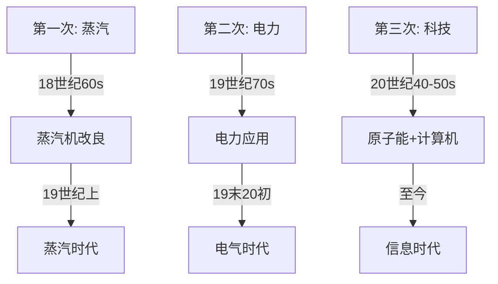

# 📜 三次工业革命笔记

## 🚂 第一节 三次工业革命：人类咋“飞”起来的？

> **总览**：工业革命就像人类的“三级跳”，从蒸汽蹦到电力，再到科技大爆炸，每次都让生活“嗖”一下变样！咱们拆开看，轻松记！🌍

---

### 一、🎬 三次工业革命全解析

#### （1）第一次工业革命：蒸汽开路
- **开始时间**：18世纪60年代（1760s）。  
- **完成时间**：19世纪上半期（1800-1850）。  
- **主要标志**：蒸汽机改良，机器轰隆隆转起来！  
- **理论基础**：牛顿的力学（物体咋动）。  
- **领先国家**：英国，工业“老大哥”。  
- **进入时代**：蒸汽时代，烟囱冒黑烟。  
- **交通工具**：汽船（轮船）、火车，慢悠悠跑。  
- **主要发明**：  
  - 瓦特改良蒸汽机：机器的心脏。  
  - 富尔顿发明汽船：水上“突突突”。  
  - 斯蒂芬孙发明火车：陆上“呜呜呜”。  
- **比喻**：像从骑马跳到开拖拉机，效率蹭蹭涨！🚂  
- **例子**：英国工厂用蒸汽机织布，速度快到飞起。

#### （2）第二次工业革命：电力点亮
- **开始时间**：19世纪70年代（1870s）。  
- **完成时间**：19世纪末20世纪初（1900左右）。  
- **主要标志**：电力的广泛应用，灯泡亮瞎眼。  
- **理论基础**：法拉第的电磁感应（电咋来的）。  
- **领先国家**：美国、德国，双雄争霸。  
- **进入时代**：电气时代，家家有电灯。  
- **交通工具**：电车、汽车、飞艇、飞机，速度嗖嗖嗖。  
- **主要发明**：  
  - 爱迪生发明电灯：晚上也能嗨。  
  - 西门子发明发电机：电厂“嗡嗡嗡”。  
  - 贝尔发明电话：隔空喊话。  
  - 卡尔·本茨发明汽车：地上跑得欢。  
  - 莱特兄弟发明飞机：天上飞得远。  
- **比喻**：像从蜡烛跳到电灯，生活亮堂堂！💡  
- **例子**：美国街头电车叮叮响，工厂24小时开工。

#### （3）第三次工业革命：科技狂飙
- **开始时间**：20世纪四五十年代（1940s-1950s）。  
- **完成时间**：还在进行，未来ing！  
- **主要标志**：原子能、计算机、航天、生物技术大突破。  
- **理论基础**：爱因斯坦的相对论（宇宙咋回事）。  
- **领先国家**：美国，科技“扛把子”。  
- **进入时代**：网络信息时代，手机不离手。  
- **交通工具**：宇宙飞船，飞出地球村。  
- **主要发明（中国篇）**：  
  - 1964年：第一颗原子弹爆炸成功（罗布泊）。  
  - 1966年：核弹头导弹飞行爆炸成功。  
  - 1967年：第一颗氢弹空爆成功。  
- **比喻**：像从自行车跳到火箭，科技嗖嗖上天！🚀  
- **例子**：电脑联网，鼠标一点全球通。

---

### 📊 表格总结：三次工业革命对比

| 革命         | 时间                | 标志               | 理论基础         | 领先国家   | 时代         | 交通工具         | 主要发明                   |
|--------------|---------------------|-------------------|------------------|-----------|-------------|-----------------|---------------------------|
| 第一次       | 18世纪60s-19世纪上 | 蒸汽机改良         | 牛顿力学         | 英国       | 蒸汽时代     | 汽船、火车       | 蒸汽机、汽船、火车         |
| 第二次       | 19世纪70s-19末20初 | 电力应用           | 电磁感应         | 美、德     | 电气时代     | 电车、汽车、飞机 | 电灯、发电机、电话、汽车   |
| 第三次       | 20世纪40-50s-至今  | 原子能+计算机+航天 | 相对论           | 美国       | 信息时代     | 宇宙飞船         | 原子弹、计算机、航天技术   |

---

### 🧩 Mermaid图表：三次革命进程

---

### 🌟 重点与考点
#### 1. 考试重点⭐
- **时间段**：三次革命的起止时间，常考填空。  
- **标志**：蒸汽机、电力、科技突破，易出选择题。  
- **国家**：英国→美德→美国，历史排序题。  
- **发明**：中国“三弹”时间点，常考简答。

#### 2. 记忆口诀
- **时间**：一八六二九七，三次四五开。  
- **标志**：蒸汽轰隆电光闪，科技原子飞天远。  
- **国家**：英美德，美独大。  
- **发明**：汽电科，三步跳上天。

#### 3. 真题示例
- **2022年**：第一次工业革命的领先国家是？  
  - 答案：英国。  
- **2021年**：中国第一颗氢弹啥时候爆？  
  - 答案：1967年6月17日。

---

### 🕒 时间线（Obsidian用）
- **1760s**：第一次革命，蒸汽机启动。  
- **1870s**：第二次革命，电力亮灯。  
- **1940s-50s**：第三次革命，科技起飞。  
- **1964-1967**：中国“三弹”里程碑。

---

