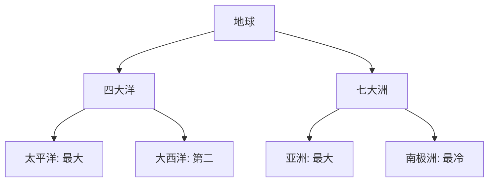

# 📜 世界地理笔记

## 🌍 一、世界的陆地和海洋：地球的“蓝绿拼图”

### （1）海陆面积与比例
- **总面积**：5.1亿平方千米。  
- **陆地**：1.49亿平方千米，占29%。  
- **海洋**：3.61亿平方千米，占71%。  
- **比喻**：地球像个“大水球”，陆地是“浮岛”！  
- **例子**：海洋比陆地多一倍多，难怪叫“蓝色星球”。

### （2）分布特点
- **规律**：  
  - 陆地集中北半球，海洋多南半球。  
  - 纬度低（赤道附近）海洋占比大，高纬度（两极）海陆平衡。  
- **原因**：地球“偏心”，北边挤陆地，南边铺大海。  
- **例子**：北半球有亚洲欧洲，南半球多太平洋。

- **表格**：海陆比例

| 类型   | 面积（亿平方千米） | 占比   |
|--------|---------------------|-------|
| 陆地   | 1.49               | 29%   |
| 海洋   | 3.61               | 71%   |
| 总计   | 5.1                | 100%  |

- **考试重点⭐**：海陆比例+分布特点常考！

---

## 🌐 二、七大洲与四大洋：地球的“分区地图”

### （1）四大洋：蓝色“大池塘”
- **太平洋**：  
  - 面积：1.7968亿平方千米，最大！  
  - 位置：亚洲-美洲间，深度4000米。  
  - 通连：白令海峡（北冰洋）、巴拿马运河（大西洋）。  
- **大西洋**：  
  - 面积：9165.5万平方千米，第二。  
  - 位置：欧美-非洲间，深度3597米。  
  - 通连：苏伊士运河（印度洋）。  
- **印度洋**：  
  - 面积：7617.4万平方千米，第三。  
  - 位置：亚非-大洋洲间，深度3711米。  
- **北冰洋**：  
  - 面积：1475万平方千米，最小。  
  - 位置：北极周围，深度1225米。  
- **比喻**：太平洋是大哥，其他是“小弟”！  

- **表格**：四大洋概况

| 名称     | 面积（万平方千米） | 平均深度（米） | 位置                 |
|----------|---------------------|---------------|---------------------|
| 太平洋   | 17967.9            | 4000          | 亚洲-美洲间         |
| 大西洋   | 9165.5             | 3597          | 欧美-非洲间         |
| 印度洋   | 7617.4             | 3711          | 亚非-大洋洲间       |
| 北冰洋   | 1475               | 1225          | 北极周围            |

### （2）七大洲：陆地“七兄弟”
#### 1. 亚洲
- **面积**：4400万平方千米，29.4%陆地，第一大洲。  
- **特点**：人口最多+密度最大，历史悠久（四大文明古国：中国、印度等）。  
- **位置**：北半球东半球，苏伊士运河分非洲，乌拉尔山分欧洲。  
- **地形**：中高四低，东部岛弧，最高洲。  
- **气候**：寒温热三带，季风+大陆性强。  
- **水文**：大河放射状（长江、恒河），内流河中西多。  
- **资源**：石油、铁、锡储量全球第一。  
- **国家**：中国、日本、印度等。  

#### 2. 欧洲
- **面积**：第六大，人口第三（75人/平方千米）。  
- **特点**：经济发达，生活水平高。  
- **位置**：东半球西北，北冰洋、大西洋、地中海环绕。  
- **地形**：平原为主，阿尔卑斯山（勃朗峰4807米）。  
- **气候**：温带海洋性为主。  
- **水文**：伏尔加河（3690千米），多瑙河（2850千米）。  
- **国家**：英国、法国、德国等。  

#### 3. 非洲
- **面积**：第二大，沙漠占1/3（撒哈拉最大）。  
- **特点**：东非大裂谷，野生动物王国。  
- **位置**：东半球西南，跨赤道。  
- **地形**：高原大陆，乞力马扎罗山（5895米）。  
- **气候**：热带为主，炎热干燥。  
- **水文**：尼罗河（6853千米，世界第一长）。  
- **资源**：金、钻石储量第一。  
- **国家**：埃及、南非等。  

#### 4. 北美洲
- **面积**：第四大，发达国家多。  
- **位置**：西半球北部，巴拿马运河分南美。  
- **地形**：东西山脉夹中部平原，平均700米。  
- **气候**：热温寒三带，温带大陆性为主。  
- **水文**：落基山分水，密西西比河长。  
- **资源**：农业区（玉米、小麦）。  
- **国家**：美国、加拿大等。  

#### 5. 南美洲
- **面积**：1797万平方千米，第四。  
- **位置**：西半球南部，安第斯山脉西部。  
- **地形**：安第斯山+平原（60%）。  
- **气候**：热带雨林+草原为主。  
- **水文**：亚马孙河（流量最大）。  
- **资源**：石油（委内瑞拉）、铁（巴西）。  
- **国家**：巴西、阿根廷等。  

#### 6. 大洋洲
- **面积**：最小，人口0.5%。  
- **位置**：太平洋西南，热带亚热带。  
- **地形**：低缓，澳大利亚沙漠多。  
- **气候**：海洋性为主。  
- **水文**：墨累河最长。  
- **资源**：铁、金、地热（新西兰）。  
- **国家**：澳大利亚、新西兰等。  

#### 7. 南极洲
- **面积**：1405.1万平方千米，9.4%陆地。  
- **特点**：冰盖80%，无人定居。  
- **位置**：南极周围。  
- **地形**：平均海拔最高，文森山5140米。  
- **气候**：酷寒（-89.2℃），风暴多。  
- **资源**：煤、石油等220种矿。  
- **奇观**：极昼极夜、极光。  
- **中国站**：1985年长城站建成。  

- **表格**：七大洲简况

| 洲名     | 面积（万平方千米） | 特点                 |
|----------|---------------------|---------------------|
| 亚洲     | 4400               | 最大，人口多         |
| 欧洲     | -                  | 发达，平原多         |
| 非洲     | -                  | 沙漠多，尼罗河       |
| 北美洲   | -                  | 经济强，平原农业     |
| 南美洲   | 1797               | 热带，安第斯山       |
| 大洋洲   | -                  | 最小，海洋性         |
| 南极洲   | 1405.1             | 冰盖，高寒           |

- **Mermaid图表**：海陆分布

- **考试重点⭐**：四大洋面积排序+七大洲特点常考！

---

### 🌟 重点与考点
#### 1. 重点
- **海陆**：29%陆71%海，北陆南海。  
- **四大洋**：太平洋最大，北冰洋最小。  
- **七大洲**：亚洲最大，南极最冷。

#### 2. 口诀
- **海陆**：三陆七海，北陆南洋。  
- **四大洋**：太大大印北小。  
- **七大洲**：亚非北南，大洋南极欧。

#### 3. 真题示例
- **2022年**：海洋面积占比？  
  - 答案：71%。  
- **2021年**：世界最大洲？  
  - 答案：亚洲。

