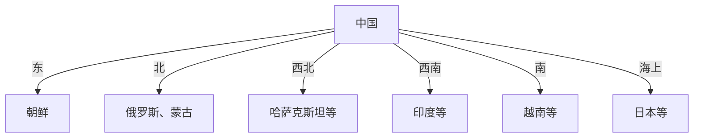
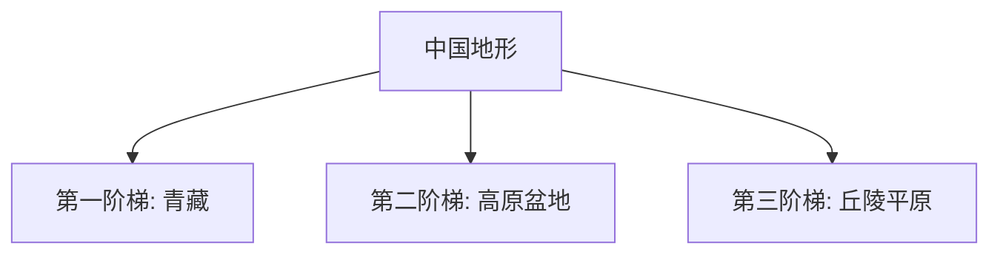
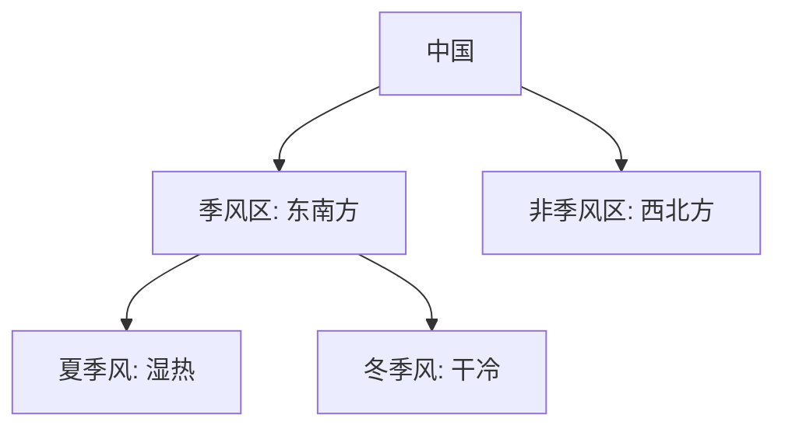

# 📜 中国地理笔记

## 🇨🇳 中国地理：960万平方千米的“家”！

> **总览**：中国地理就像一张“全家福”，位置独特、疆域辽阔、邻国多、地形杂、人口广！咱们拆开看，轻松搞懂中国这块“大拼图”！🗺️

---

### 一、🌏 位置：中国在哪儿？

- **海陆位置**：亚洲东部，太平洋西岸。  
- **比喻**：像亚洲的“东大门”，面朝大海背靠大陆！  
- **例子**：东边是大海，西边是高原，南北跨度大。

- **考试重点⭐**：海陆位置常考填空！

---

### 二、🏞️ 辽阔的疆域：多大？

- **面积**：约960万平方千米，世界第三（次于俄罗斯、加拿大）。  
- **四端**：  
  - **最东**：黑龙江与乌苏里江交汇处。  
  - **最西**：帕米尔高原。  
  - **最南**：曾母暗沙。  
  - **最北**：漠河以北黑龙江中心线。  
- **跨度**：  
  - 东西：60多度经度，约5000千米。  
  - 南北：50度纬度，约5500千米。  
- **比喻**：像个“大胖子”，横跨东西南北，差不多跟欧洲一样大！  
- **例子**：从新疆到上海，坐火车得几天！

- **表格**：疆域四端

| 方位 | 位置                     | 经纬度跨度     |
|------|-------------------------|---------------|
| 最东 | 黑龙江-乌苏里江交汇    | 东经135°左右  |
| 最西 | 帕米尔高原              | 东经73°左右   |
| 最南 | 曾母暗沙                | 北纬4°左右    |
| 最北 | 漠河以北黑龙江中心线    | 北纬53°左右   |

---

### 三、🗺️ 疆界和邻国：谁挨着？

#### （1）陆上邻国
- **疆界**：陆上2万多千米。  
- **14个邻国**：  
  - 东：朝鲜。  
  - 北：俄罗斯、蒙古。  
  - 西北：哈萨克斯坦、吉尔吉斯斯坦、塔吉克斯坦。  
  - 西南：阿富汗、巴基斯坦、印度、尼泊尔、不丹。  
  - 南：越南、老挝、缅甸。  

#### （2）海上邻国
- **海岸线**：1.8万千米。  
- **近海**：渤海、黄海、东海、南海（内海：渤海、琼州海峡）。  
- **岛屿**：5000多个，如台湾岛、海南岛、舟山群岛、南海诸岛。  
- **6个隔海邻国**：韩国、日本、菲律宾、马来西亚、文莱、印尼。  

- **比喻**：陆上像“围墙”，海上像“阳台”，邻居多热闹！  
- **例子**：东海对面是日本，南海边有菲律宾。

- **Mermaid图表**：邻国分布

- **考试重点⭐**：14个陆邻+6个海邻常考！

---

### 四、🏢 行政区划：34个“兄弟”

- **总数**：34个省级行政单位。  
- **类型**：  
  - 23省、5自治区、4直辖市、2特别行政区。  
- **分区**：  
  1. **华东**：山东、江苏、安徽、浙江、福建、上海。  
  2. **华南**：广东、广西、海南。  
  3. **华中**：湖北、湖南、河南、江西。  
  4. **华北**：北京、天津、河北、山西、内蒙古。  
  5. **西北**：宁夏、新疆、青海、陕西、甘肃。  
  6. **西南**：四川、云南、贵州、西藏、重庆。  
  7. **东北**：辽宁、吉林、黑龙江。  
  8. **台港澳**：台湾、香港、澳门。  

- **表格**：行政区划简表

| 地区   | 省级单位                  |
|--------|--------------------------|
| 华东   | 鲁、苏、皖、浙、闽、沪   |
| 华南   | 粤、桂、琼               |
| 华中   | 鄂、湘、豫、赣           |
| 华北   | 京、津、冀、晋、蒙       |
| 西北   | 宁、新、青、陕、甘       |
| 西南   | 川、云、贵、藏、渝       |
| 东北   | 辽、吉、黑               |
| 台港澳 | 台、港、澳               |

- **口诀**：华东五省加一市，华南三省热腾腾！

---

### 五、👨‍👩‍👧‍👦 人口和民族：13亿+56族

- **人口**：13.7亿（第六次普查），华侨3000多万（粤、闽最多）。  
- **民族**：56个。  
  - **汉族**：92%，最多。  
  - **少数民族**：55个，壮族2000多万居首，400万+有满、回、苗等。  
- **比喻**：像个“大食堂”，汉族是大锅饭，少数民族是特色菜！  
- **例子**：广东人遍全球，壮族聚广西。

---

### 六、⛰️ 地形：三阶梯+五地形

#### （1）地形类型
- **五种**：平原、高原、山地、丘陵、盆地。  
- **山区**：占2/3，地势西高东低。  

#### （2）三阶梯
- **第一阶梯**：青藏高原，4000米+，最高。  
- **第二阶梯**：1000-2000米，高原+盆地（大兴安岭-云贵一线以西）。  
- **第三阶梯**：500米以下，丘陵+平原（东部）。  

#### （3）特点与影响
- **气候**：多样化，西干东湿。  
- **水汽**：东流带来雨。  
- **河流**：东流，水能丰富。  
- **例子**：长江从青藏流到东海，水电站多。

- **表格**：三阶梯

| 阶梯 | 海拔           | 地形         |
|------|---------------|-------------|
| 第一 | 4000米+       | 青藏高原     |
| 第二 | 1000-2000米   | 高原+盆地   |
| 第三 | 500米以下     | 丘陵+平原   |

- **Mermaid图表**：地势分布

- **考试重点⭐**：三阶梯高度+影响常考！

---

### 🌟 重点与考点
#### 1. 重点
- **位置**：亚洲东+太平洋西。  
- **疆域**：四端+面积。  
- **邻国**：14陆+6海。  
- **区划**：34个单位。  
- **地形**：三阶梯。

#### 2. 口诀
- **位置**：亚洲东，海西岸。  
- **疆域**：东黑西帕，南沙北漠。  
- **邻国**：十四陆六海，记牢别歪。  
- **地形**：三阶西高东，青藏领跑。

#### 3. 真题示例
- **2022年**：中国最南端？  
  - 答案：曾母暗沙。  
- **2021年**：第一阶梯海拔？  
  - 答案：4000米+。

## ☔ 第七节 气候：中国的“天气脸”

### （1）降水和干湿地区
- **基本规律**：  
  - **空间分布**：东南多西北少。  
    - **原因**：夏季风（东南+西南）带水汽，东多西少。  
    - **影响**：东南湿润，西北干燥。  
  - **时间变化**：  
    - **季节**：5-9月集中，夏秋多雨。  
      - **原因**：夏湿冬干，夏季风强。  
      - **影响**：旱涝频发，夏季风早北涝南旱，晚南涝北旱。  
    - **年际**：南北差异大，西北最不稳。  
      - **原因**：夏季风不规律。  
  - **南北差异**：北少短，南多长。  
    - **原因**：锋面雨带移动。  
    - **影响**：北春旱夏涝，南梅雨伏旱。  
- **比喻**：气候像“水龙头”，东南拧满西北滴水！  
- **例子**：江南6月梅雨，华北春旱常见。

- **表格**：降水特点

| 特点       | 规律                 | 原因             | 影响           |
|------------|---------------------|-----------------|---------------|
| 空间分布   | 东南多西北少        | 夏季风影响      | 东南湿西北干   |
| 季节变化   | 5-9月集中           | 夏湿冬干        | 旱涝灾害       |
| 年际变化   | 南小北大大          | 夏季风不稳      | -             |
| 南北差异   | 北少短南多长        | 锋面雨带        | 春旱梅雨       |

- **考试重点⭐**：南北降水差异+夏季风影响常考！

### （2）气候特征
- **类型**：多样化（热带季风、亚热带季风、温带季风、温带大陆性）。  
- **两大特征**：  
  - **大陆性**：温差大。  
  - **季风性**：冬北风干冷，夏南风湿热。  
- **季风成因**：海陆热差异，夏天陆热海凉，冬天反之。  
- **季风区**：大兴安岭-冈底斯山以东以南，非季风区在西北。  
- **例子**：北京冬冷夏热，季风吹得明显。

- **Mermaid图表**：季风区

---

## ⛰️ 第八节 山脉：中国的“脊梁”

- **东西走向**：天山-阴山-燕山、昆仑山-秦岭、南岭。  
- **东北-西南**：大兴安岭-太行山-巫山-雪峰山、长白山-武夷山、台湾山脉。  
- **南北**：贺兰山、横断山。  
- **西北-东南**：阿尔泰山、祁连山。  
- **最高峰**：珠穆朗玛峰（喜马拉雅），8844.43米，世界第一。  
- **比喻**：山脉像“骨架”，撑起中国地形！  
- **例子**：秦岭分南北，喜马拉雅挡风。

- **表格**：山脉走向

| 走向         | 山脉                          |
|-------------|------------------------------|
| 东西        | 天山-阴山-燕山、昆仑-秦岭、南岭 |
| 东北-西南   | 大兴安岭-太行-巫山-雪峰、长白-武夷 |
| 南北        | 贺兰山、横断山              |
| 西北-东南   | 阿尔泰山、祁连山            |

- **考试重点⭐**：东西走向+珠峰高度常考！

---

## 🌄 第九节 盆地、高原、平原：地形“三兄弟”

### （1）四大高原
- **青藏高原**：世界屋脊，4000米+，雪山湖泊，水能太阳能足。  
- **内蒙古高原**：第二大，草原沙漠，煤铁丰富。  
- **黄土高原**：黄土堆积，水土流失，煤油多。  
- **云贵高原**：垂直气候，喀斯特地貌，梯田美。  

### （2）四大盆地
- **塔里木盆地**：世界最大内陆，塔克拉玛干沙漠，油田棉花。  
- **准噶尔盆地**：第二大，魔鬼城，石油黄金。  
- **柴达木盆地**：最高盆地，盐石油多。  
- **四川盆地**：紫色土壤，天府之国，资源富。  

### （3）三大平原
- **东北平原**：最大，黑土地，粮食+石油。  
- **华北平原**：第二大，煤盐多。  
- **长江中下游平原**：水乡，稻米棉花。  

- **表格**：地形概况

| 类型   | 名称           | 特点                   |
|--------|---------------|-----------------------|
| 高原   | 青藏           | 屋脊，水能太阳能      |
|        | 内蒙古         | 草原，煤铁           |
| 盆地   | 塔里木         | 最大内陆，沙漠油田    |
|        | 四川           | 天府，资源多         |
| 平原   | 东北           | 黑土，粮食石油        |
|        | 华北           | 煤盐丰富             |

---

## 💧 第十节 水文：水系大观

### （1）海洋
- **海岸线**：1.8万千米，鸭绿江口到北仑河口。  
- **四大海洋**：渤海、黄海、东海、南海。  
- **三大海峡**：台湾、琼州、渤海。  
- **三大海湾**：北部湾、辽东湾、杭州湾。  
- **三大岛屿**：台湾、海南、崇明。  

### （2）河流
- **总量**：42万千米，世界第三。  
- **分布**：东多西少，南丰北欠。  
- **外流河**：黑龙江、长江、珠江等，注入太平洋为主。  
- **内流河**：塔里木河，最大内流河。  
- **黄河**：第二大，上游清中游浑下游缓，常凌汛。  
- **长江**：第一大，6300千米，上游急中游曲下游阔。  

### （3）湖泊
- **数量**：2300+（1平方千米以上）。  
- **分布**：长江中下游（淡水）、青藏高原（咸水）。  
- **代表**：鄱阳湖（最大淡水）、青海湖（最大面积）。  

- **表格**：水文亮点

| 类型   | 名称           | 特点                   |
|--------|---------------|-----------------------|
| 海洋   | 南海           | 最南                  |
| 河流   | 长江           | 最长，6300千米       |
| 湖泊   | 青海湖         | 最大面积             |

- **考试重点⭐**：长江黄河特点常考！

---

## 🌾 第十一节 资源概况：富但少

- **特点**：总量多，人均少，利用率低。  
- **土地**：总量多，人均耕地少，高质量少。  
- **水**：世界第6，人均少，南多北少。  
- **矿产**：总量富，人均58%，大矿少。  

---

### 🌟 重点与考点
#### 1. 重点
- **气候**：季风+降水分布。  
- **山脉**：走向+珠峰。  
- **水文**：长江黄河+湖泊。  
- **资源**：人均少。

#### 2. 口诀
- **气候**：东南湿西北干，夏多冬少南北乱。  
- **山脉**：东西三东北三，南北二喜马高。  
- **水文**：长黄二一，湖泊青鄱。  

#### 3. 真题示例
- **2022年**：长江长度？  
  - 答案：6300千米。

