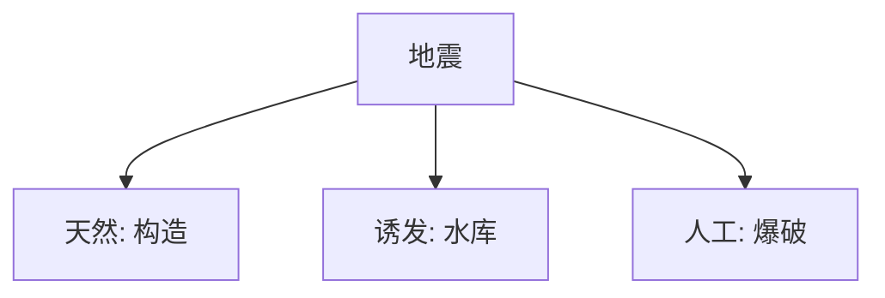

# 📜 地理知识笔记

## 🌍 第七节 地理知识：地球的“全家福”！

> **总览**：地理就像地球的“身份证”，从太阳系到日月食，再到板块地震、大气气候，啥都装！咱们拆开看，轻松搞懂地球咋运转！🪐

---

### 一、☀️ 太阳系：地球的“大院子”

- **定义**：太阳系是太阳和围绕它转的“八兄弟”（八大行星）。  
- **位置**：地球排老三，离太阳1.496亿千米（1天文单位）。  
- **比喻**：太阳是“大管家”，行星是“住户”，地球住三号房。  
- **例子**：水星、金星、地球、火星……老八冥王星被“踢出”啦！

---

### 二、🌑 日食和月食：天上的“捉迷藏”

#### （1）日食：月亮挡太阳
- **成因**：太阳、月球、地球一条线，月球当“挡板”。  
- **时间**：农历初一（朔），但不是每次都发生。  
- **类型**：  
  - 日偏食：太阳被咬一口。  
  - 日全食：太阳全黑。  
  - 日环食：太阳剩个光环。  
- **过程**：初亏（开始缺）→食既（全遮）→食甚（最深）→生光（露脸）→复圆（恢复）。  
- **观测**：不能直视，伤眼！用滤光片。  
- **记录**：中国《尚书》最早记日食。  
- **例子**：西部先看到，因地球自西向东转。

#### （2）月食：地球遮月亮
- **成因**：太阳、地球、月球一条线，地球当“屏风”。  
- **时间**：农历十五前后（望日）。  
- **类型**：  
  - 月偏食：月亮缺块。  
  - 月全食：月亮全红。  
  - 半影月食：月亮暗淡。  
- **特点**：地球大4倍，没环食。  
- **记录**：前2283年美索不达米亚最早，中国前1136年次之。  
- **张衡**：东汉科学解释月食。  

- **表格**：日食 vs 月食

| 类型   | 成因                | 时间         | 类型             |
|--------|--------------------|-------------|-----------------|
| 日食   | 月球挡太阳         | 农历初一     | 偏、全、环      |
| 月食   | 地球遮月球         | 农历十五     | 偏、全、半影     |

- **考试重点⭐**：成因+类型常考！

---

### 三、🌏 地球：我们的“家”

#### （1）形状和大小
- **形状**：扁球体，像个“梨”。  
- **大小**：平均半径6371千米，赤道半径6378千米，赤道周长4万千米。  
- **距离**：离太阳1.496亿千米。  
- **例子**：赤道胖，两极扁，跑步地球不滚蛋！

#### （2）内部构造
- **三层**：  
  - **地核**：最里，像“铁心”。  
  - **地幔**：中间，像“熔岩汤”。  
  - **地壳**：皮儿，像“脆壳”。  
- **比喻**：地球像个“夹心蛋”！

#### （3）板块运动
- **理论**：1968年勒皮顺提板块构造学说。  
- **六大板块**：亚欧、非洲、美洲、太平洋、印度洋、南极洲。  
- **特点**：交界处活跃，地震、火山多。  
- **例子**：喜马拉雅山因印度洋板块挤亚欧板块隆起。

#### （4）地震
- **表现**：大地抖，海啸来。  
- **最大**：1960年智利9.5级。  
- **震级vs烈度**：  
  - **震级（M）**：地震能量大小，里氏震级，1级差30倍能量。  
    - <2：无感；5+：破坏；7+：大震。  
  - **烈度**：破坏程度， depends on 震级、深度、距离、地质。  
- **分类**：  
  - 天然：构造（90%）、火山、塌陷。  
  - 诱发：水库。  
  - 人工：爆破。  
- **地震波**：  
  - 体波：纵波（快）、横波（慢）。  
  - 面波（L波）：地表混合波。  
- **自救**：断电断气，躲空旷或墙角，别靠高楼。

- **表格**：震级与烈度

| 震级   | 特点             | 烈度影响         |
|--------|-----------------|-----------------|
| <2     | 无感             | 无             |
| 5+     | 破坏性           | 房屋倒塌        |
| 7+     | 大型地震         | 数百公里破坏    |

- **Mermaid图表**：地震分类

#### （5）大气分层
- **对流层**：0-10/18千米，气温下降，云雨多。  
- **平流层**：10-50千米，气温升高，飞机飞。  
- **高层大气**：50-85千米+，电离强，极光闪。  
- **臭氧层**：平流层内，挡紫外线，氟利昂是“杀手”。  

- **考试重点⭐**：震级烈度+大气分层常考！

---

### 四、🌐 地轴、两极、赤道
- **地轴**：穿过地心，北极指北极星，南极相反。  
- **赤道**：0°纬线，分南北半球，最长+重力小。  
- **黄赤交角**：66°34′，公转轨道面与赤道夹角，影响气候。

---

### 五、📏 经线和纬线
- **经线**：连两极，指示南北，0°本初子午线，180°日期线。  
- **纬线**：东西方向，赤道最长，23°26′回归线，66°34′极圈。  
- **例子**：北京东经116°，北纬39°。

---

### 六、🌀 地球公转与自转
- **公转**：绕太阳，轨道面倾斜66°34′，一年365天，决定季节。  
- **自转**：西→东，23时56分4秒，赤道快两极慢，昼夜+时差。  
- **时区**：24个，东八区北京时间。  

---

### 七、☔ 天气与气候
- **天气**：短时大气状态（雨晴）。  
- **气候**：长期平均（热带雨林）。  
- **要素**：气温（日变、年变）、降水（对流雨、锋面雨）。  
- **气候类型**：热带雨林、季风、地中海等。

---

### 🌟 重点与考点
#### 1. 重点
- **日月食**：成因+时间。  
- **地震**：震级烈度+自救。  
- **大气**：分层+臭氧。  
- **经纬**：赤道+日期线。

#### 2. 口诀
- **日月食**：日初一月十五。  
- **地震**：级能量烈破坏。  
- **大气**：对流雨平流飞。  

#### 3. 真题示例
- **2022年**：日食时间？  
  - 答案：农历初一。

