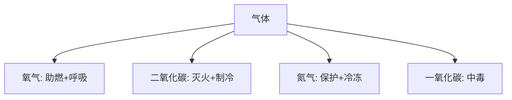

# 📜 化学常识笔记

## 🧪 第五节 化学常识：生活里的“化学魔法”！

> **总览**：化学就像生活里的“调味料”，气体烧饭、金属造锅、酸碱洗污，处处有妙招！咱们拆开学，轻松搞懂这些“化学魔法”！🧙‍♂️

---

### 一、💨 常见气体：空气里的“隐形侠”

#### （1）气体详解
- **空气（混合物）**：  
  - 组成：氮气（78%）、氧气（21%）、稀有气体（0.94%）、二氧化碳（0.03%）、杂质（0.03%）。  
  - 特点：生命必需品，氧气供呼吸，二氧化碳搞光合作用。  
- **天然气/沼气**：  
  - 主角：甲烷（CH₄），无毒但窒息。  
  - 危险：浓度10%窒息，5-15%遇火爆炸。  
  - 例子：厨房漏气，闻到臭味赶紧关阀！  
- **一氧化碳（CO）**：  
  - 来源：煤气，煤气中毒“元凶”。  
  - 特点：无味，抢血红蛋白，关窗烧煤最危险。  
  - 应对：开窗通风，别碰电器防爆。  
- **二氧化碳（CO₂）**：  
  - 特点：不烧、不供呼吸，干冰（固态）制冷+降雨。  
  - 用途：灭火，温室气体。  
- **氧气（O₂）**：  
  - 用途：呼吸（潜水、急救）、助燃（炼钢）。  
  - 燃烧条件：着火点+助燃剂。  
- **氮气（N₂）**：  
  - 特点：懒惰（不活泼），保护气+制肥料。  
  - 例子：液氮冻东西，冷飕飕。  
- **稀有气体**：氦、氖、氩等。  
  - 特点：不爱反应，氖灯发光超炫酷。  

- **表格**：常见气体一览

| 气体         | 组成/特点                  | 用途/危险             |
|--------------|---------------------------|----------------------|
| 空气         | N₂ 78%, O₂ 21%            | 呼吸、光合作用       |
| 天然气/沼气 | 甲烷为主                  | 燃料，爆炸风险       |
| 一氧化碳     | 无味，抢氧                | 中毒，别碰电器       |
| 二氧化碳     | 不烧，干冰制冷            | 灭火，温室效应       |
| 氧气         | 助燃                      | 呼吸、炼钢           |
| 氮气         | 不活泼                    | 保护气、冷冻         |
| 稀有气体     | 氦氖氩，低反应性         | 灯管、激光           |

- **Mermaid图表**：气体用途

- **考试重点⭐**：气体特点+一氧化碳应对常考！

---

### 二、🔧 常见的金属材料：硬核“建材”

#### （1）金属排行
- **地壳最多**：铝（Al），到处挖。  
- **人体最多**：钙（Ca），骨头主力。  
- **产量最多**：铁（Fe）>铝>铜。  
- **导电导热王**：银（Ag）>铜（Cu）>金（Au）>铝。  
- **例子**：铜线导电，铁锅炒菜，铝箔包饭。

- **表格**：金属对比

| 类别         | 金属       | 特点             |
|--------------|-----------|-----------------|
| 地壳最多     | 铝         | 含量高           |
| 人体最多     | 钙         | 骨头原料         |
| 产量最多     | 铁         | 工业支柱         |
| 导电导热     | 银>铜>金>铝 | 电线首选铜       |

---

### 三、🧫 酸、碱和盐：化学“三兄弟”

#### （1）常见代表
- **浓盐酸（HCl）**：刺鼻无色，除锈+制药。  
- **氢氧化钠（NaOH）**：烧碱，溶水发热，强腐蚀，吸湿干剂。  
- **氢氧化钙（Ca(OH)₂）**：熟石灰，微溶，建房用。  
- **氯化钠（NaCl）**：食盐，吃+除雪+防腐。  
- **碳酸钠（Na₂CO₃）**：纯碱，玻璃+洗涤。  

#### （2）化学肥料
- **氮肥**：缺氮叶黄，豆科植物固氮帮忙。  
- **钾肥**：缺钾叶尖黄，草木灰（K₂CO₃）农村爱用。  
- **磷肥**：缺磷长得慢，别跟碱性混用。  

- **表格**：酸碱盐+肥料

| 物质         | 俗名         | 特点/用途           |
|--------------|-------------|--------------------|
| HCl          | 浓盐酸       | 除锈、刺激性       |
| NaOH         | 烧碱         | 腐蚀、干燥剂       |
| Ca(OH)₂      | 熟石灰       | 建筑、微溶         |
| NaCl         | 食盐         | 食用、防腐         |
| Na₂CO₃       | 纯碱         | 玻璃、洗涤         |
| 氮肥         | -           | 补叶黄             |
| 钾肥         | 草木灰       | 补叶尖             |
| 磷肥         | -           | 促生长             |

- **考试重点⭐**：肥料缺乏症状常考！

---

### 四、🧠 化学生活小常识：妙用多

#### （1）7个小知识
1. **铁锅胜铜铝**：铁耐高温、不易反应，炒菜香。  
2. **石灰岩**：碳酸钙岩，水泥原料。  
3. **半导体**：石英导电介于导体和绝缘体，做芯片。  
4. **稀土**：工业“维生素”，高科技必备。  
5. **隐形飞机**：吸电磁波+特殊形状，躲雷达。  
6. **鳄鱼泪**：排盐分，不是哭。  
7. **碘盐储存**：棕瓶遮光，阴凉干燥，别放太久。  

- **例子**：冬天撒盐化雪，夏天飞机躲雷达，全靠化学！

---

### 🌟 重点与考点
#### 1. 重点
- **气体**：空气组成、一氧化碳中毒应对。  
- **金属**：含量+导电排序。  
- **酸碱盐**：用途+肥料作用。  
- **常识**：生活应用。

#### 2. 记忆口诀
- **气体**：空氧二一，氮懒稀少，甲烷爆。  
- **金属**：铝地钙人，铁产铜导。  
- **酸碱盐**：酸锈碱蚀，盐吃肥长。  
- **常识**：铁锅石灰，稀土隐形泪。

#### 3. 真题示例
- **2022年**：空气中氧气占比？  
  - 答案：21%。  
- **2021年**：缺钾症状？  
  - 答案：叶尖发黄。

---

### 🕒 时间线（Obsidian用）
- **古代**：石灰岩建房。  
- **现代**：稀土、半导体应用。

