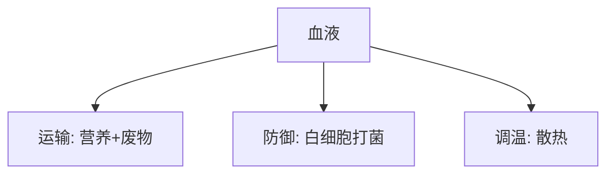

# 📜 医学知识笔记

## 🩺 第三节 医学知识：人体咋运转？

> **总览**：人体像个“超级工厂”，九大系统忙活，营养当燃料，血液跑运输，还有急救锦囊救急！咱们拆开学，轻松懂身体咋回事！🧠

---

### 一、🏃‍♂️ 人体构造：九大系统

#### （1）啥是九大系统？
- **定义**：人体靠九个“部门”合作运转，缺一不可！  
- **比喻**：像个大公司，各部门各司其职，保障“生命生产线”。🏥

#### （2）系统详解
- **运动系统**：骨头、关节、肌肉，负责动起来。  
  - 常见病：肩周炎、骨质疏松，像“零件生锈”。  
- **消化系统**：嘴到肛门+消化腺（肝、胰等），管吃饭。  
  - 常见病：肝炎、胃溃疡，吃坏肚子。  
- **呼吸系统**：鼻子到肺，管呼吸。  
  - 常见病：肺炎、哮喘，喘不上气。  
- **循环系统**：心血管，送营养、排废物。  
  - 常见病：高血压、心绞痛，心脏“罢工”。  
- **生殖系统**：生娃+性特征。  
  - 常见病：不孕、痛经，生育“卡壳”。  
- **神经系统**：脑+脊髓+神经，管指挥。  
  - 常见病：癫痫、老年痴呆，脑子“短路”。  
- **免疫系统**：骨髓、脾脏等+免疫细胞，防病。  
  - 常见病：艾滋病，免疫“崩溃”。  
- **内分泌系统**（未列病）：激素调控，像“遥控器”。  
- **泌尿系统**（未列病）：肾、膀胱，排废水。  

- **表格**：九大系统一览
| 系统       | 组成                       | 常见疾病              |
|------------|---------------------------|----------------------|
| 运动       | 骨、关节、肌肉            | 肩周炎、骨质疏松     |
| 消化       | 消化道+消化腺             | 肝炎、胃溃疡         |
| 呼吸       | 呼吸道+肺                 | 肺炎、哮喘           |
| 循环       | 心血管                    | 高血压、心绞痛       |
| 生殖       | 生殖器官                  | 不孕、痛经           |
| 神经       | 脑+脊髓+神经              | 癫痫、老年痴呆       |
| 免疫       | 免疫器官+细胞             | 艾滋病、关节炎       |
| 内分泌     | 腺体                      | -                   |
| 泌尿       | 肾+膀胱                   | -                   |

- **考试重点⭐**：系统+常见病常考匹配题！

---

### 二、🍎 人体的营养：吃啥补啥？

#### （1）营养物质（5类）
- **蛋白质**：细胞“砖头”，修补+供能。  
- **脂肪**：能量“仓库”，保暖+保护。  
- **水**：占60-70%，细胞“命根子”。  
- **无机盐**：骨头原料+生理调节。  
- **维生素**：调节大师，不供能但关键。  

#### （2）三大营养物质
- **糖**：  
  - 类型：单糖（葡萄糖，直接用）；多糖（淀粉，转化用）。  
  - 功能：供能70%、造组织、护肝。  
  - 来源：米饭、面包。  
- **蛋白质**：  
  - 功能：生命基础、生长、代谢、供能。  
  - 来源：鸡蛋、牛肉。  
- **脂肪**：  
  - 功能：供热、保温、保护内脏。  
  - 来源：猪油、坚果。  

- **表格**：三大营养对比

| 物质   | 功能                     | 来源         |
|--------|-------------------------|-------------|
| 糖     | 供能70%、护肝          | 米饭、面包   |
| 蛋白质 | 生命基础、生长           | 鸡蛋、牛肉   |
| 脂肪   | 供热、保温、保护         | 油、坚果     |

#### （3）无机盐
- **功能**：  
  - 造骨牙（钙、磷）。  
  - 特殊作用（铁→血红蛋白，碘→甲状腺素）。  
  - 酸碱平衡（氯+钾等）。  
- **例子**：缺铁贫血，缺钙骨头软。

#### （4）维生素
- **作用+缺乏症**：  
  - A（脂溶）：夜盲症，眼瞎。  
  - B1（水溶）：脚气病，腿肿。  
  - B2（水溶）：口腔溃疡，嘴烂。  
  - C（水溶）：坏血病，牙出血。  
  - D（脂溶）：佝偻病，骨软（晒太阳可补）。  
- **来源**：水果、蔬菜、鱼肝油。

- **考试重点⭐**：维生素缺乏症常考！

---

### 三、🩺 人体内物质运输：血液跑腿

#### （1）血液
- **组成**：血浆（55%）+血细胞（45%：红、白、血小板）。  
- **功能**：运输（营养+废物）、防御、调温。  
- **类型**：  
  - **动脉血**：氧多，鲜红（体循环动脉+肺静脉）。  
  - **静脉血**：二氧化碳多，暗红（体循环静脉+肺动脉）。  
- **血细胞**：  
  - 红细胞：运氧，少则贫血。  
  - 白细胞：打细菌，免疫卫士。  
  - 血小板：止血，愈合大师。  
- **例子**：跑步喘气，红细胞忙送氧。

#### （2）血型
- **ABO血型**：1900年兰德斯坦纳发现，分A、B、AB、O。  
- **Rh血型**：另一系统，常见“+”或“-”。  
- **例子**：输血前查血型，A型不能随便给B型。

- **Mermaid图表**：血液功能

---

### 四、💉 医疗方法：治病招数
- **放疗**：射线炸肿瘤。  
- **化疗**：药杀癌细胞。  
- **B超**：超声波探脏器。  
- **CT**：X光拍断层。  
- **酒精**：脱水杀菌。  
- **例子**：感冒擦酒精，肿瘤用化疗。

---

### 五、🚑 急救知识：救命锦囊

#### （1）发烧：降温快
- **物理**：温水擦、冰敷。  
- **药物**：阿斯匹林，多喝水防虚脱。  

#### （2）扭伤：冰热轮换
- **冰敷**：30分钟，24-48小时内。  
- **热敷**：3-4天后。  

#### （3）烫伤：冷水冲
- **冷疗**：冲水30分钟-1小时，止痛后抹药。  

#### （4）动物伤害：狗咬
- **冲洗**：掰开伤口用水冲，包纱布看医。  
- **疯狗**：打狂犬疫苗+破伤风针。  

#### （5）蜂蜇：拔刺挤毒
- **蜜蜂**：挤毒+氨水。  
- **黄蜂**：醋酸+冷敷。  

#### （6）煤气中毒：通风救
- **步骤**：关气、开窗、捂鼻进屋、移人、人工呼吸、送医。  
- **注意**：别点火防爆。  

- **口诀**：发烧擦冰药，扭烫冷热疗，狗蜂冲挤药，煤气通风救！

---

### 🌟 重点与考点
#### 1. 重点
- **系统**：九大系统+常见病。  
- **营养**：三大物质+维生素缺乏症。  
- **血液**：动静脉血+血细胞功能。  
- **急救**：发烧、烫伤、煤气中毒步骤。

#### 2. 记忆口诀
- **系统**：动消呼，生神免，内泌尿。  
- **营养**：蛋脂糖，水盐维。  
- **急救**：冰热冲，药疫苗，通风救。

#### 3. 真题示例
- **2022年**：维生素C缺乏啥病？  
  - 答案：坏血病。  
- **2021年**：红细胞功能？  
  - 答案：运氧。

---

### 🕒 时间线（Obsidian用）
- **1900**：ABO血型发现。  
- **现代**：放疗、化疗、B超普及。

---

## 📝 Obsidian设计
- **大纲视图**：按节（构造→营养→运输→医疗→急救）。  
- **关系图谱**：系统连疾病，营养连来源，急救连步骤。  
- **时间线**：1900→现代医学。

