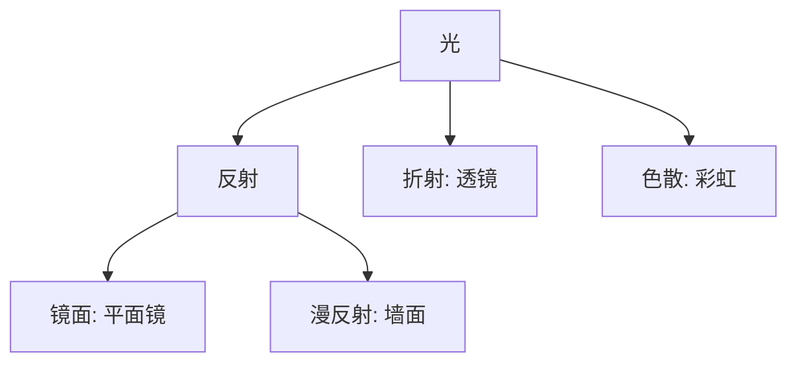
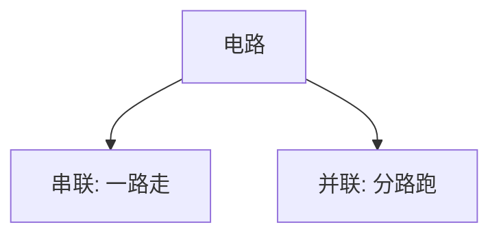

# 📜 物理常识笔记

## ⚡ 第四节 物理常识：自然界的“魔法”！

> **总览**：物理就像大自然的“魔法书”，光、声、热、压力、电，个个有绝招！咱们拆开看，轻松学会这些“魔法”咋回事！✨

---

### 一、🌞 光：看得见的“跑腿侠”

#### （1）光的基础
- **特点**：光沿直线跑，不需要介质，真空也能嗖嗖嗖！  
- **比喻**：像个“快递员”，直奔目标。📦  

#### （2）小孔成像
- **原理**：光直线传播，小孔漏光成倒影。  
- **历史**：墨子玩过这招。  
- **例子**：太阳底下用纸板打个洞，能看到倒立的树影。

#### （3）光的反射
- **啥是反射**：光撞到东西反弹，像球碰墙。  
- **分类**：  
  - **镜面反射**：平滑面反弹，整齐划一。  
    - 例子：水面倒影、后视镜、太阳灶。  
    - **球面镜**：凸面镜（散光，后视镜）、凹面镜（聚光，手电筒）。  
  - **漫反射**：粗糙面反弹，乱七八糟。  
    - 例子：墙面反射光，看不清影子。  

#### （4）光的折射
- **啥是折射**：光从一种介质进另一种，方向“拐弯”。  
- **现象**：池水变浅、筷子弯折、海市蜃楼。  
- **透镜**：  
  - 凸透镜：聚光（放大镜、相机）。  
  - 凹透镜：散光（近视眼镜）。  
- **例子**：夏天沙漠看“绿洲”，其实是折射骗人。

#### （5）光的色散
- **定义**：白光拆成彩虹（红橙黄绿蓝靛紫）。  
- **特点**：红光波长最长，穿透力最强。  
- **例子**：红绿灯用红光，雾天也能看清。

- **Mermaid图表**：光的现象

- **考试重点⭐**：反射vs折射、透镜用途常考！

---

### 二、🎵 声：听得到的“震动侠”

#### （1）声音的要素
- **音调**：高低，振动频率大就高（尖声），小就低（低音）。  
- **响度**：强弱，振幅大就响（敲鼓），小就轻（吹笛）。  
- **音色**：不同物体发声的“个性”。  
- **例子**：吉他高音尖，鼓声响亮，小提琴音色柔。

#### （2）声音的传播
- **介质**：靠气体、液体、固体传，真空传不了。  
- **速度**：固体>液体>气体。  
- **例子**：火车贴轨听声比空气快，水下听潜艇声比空气慢。

- **表格**：声音要素

| 要素 | 定义         | 影响因素       |
|------|-------------|---------------|
| 音调 | 高低         | 频率          |
| 响度 | 强弱         | 振幅          |
| 音色 | 个性         | 发声体        |

---

### 三、🔥 热：温度的“变身术”

#### （1）物态变化
- **汽化**：液→气，吸热（水沸腾）。  
- **液化**：气→液，放热（液化气）。  
- **熔化**：固→液，吸热（冰融化）。  
- **凝固**：液→固，放热（水结冰）。  
- **升华**：固→气，吸热（干冰冒烟）。  
- **凝华**：气→固，放热（窗花）。  

#### （2）热胀冷缩
- **规律**：热了膨胀，冷了收缩。  
- **例子**：夏天电线下垂，温度计水银涨缩。

- **表格**：物态变化

| 变化 | 过程     | 热量   | 例子       |
|------|---------|-------|-----------|
| 汽化 | 液→气   | 吸热   | 水烧开     |
| 液化 | 气→液   | 放热   | 液化气     |
| 熔化 | 固→液   | 吸热   | 冰化水     |
| 凝固 | 液→固   | 放热   | 水结冰     |

- **考试重点⭐**：物态变化+热胀冷缩常考填空！

---

### 四、🏋️ 压力与压强：挤压的“力气活”

#### （1）固体压强
- **公式**：  
  \[ P = \frac{F}{S} \]  
  （\(P\)压强，\(F\)压力，\(S\)面积）。  
- **规律**：  
  - 减小压强：小力+大面积。  
  - 增大压强：大力+小面积。  
- **例子**：刀刃锋利（小\(S\)大\(P\)），鞋底宽（大\(S\)小\(P\)）。

#### （2）浮力
- **公式**：  
  \[ F_{浮} = \rho_{液} \cdot g \cdot V_{排} \]  
  （\(\rho_{液}\)液体密度，\(g\)重力加速度，\(V_{排}\)排开液体体积）。  
- **应用**：潜水艇靠浮力沉浮。  
- **例子**：木头浮水面，排开水多了浮力大。

---

### 五、⚡ 电与磁：电流的“魔法棒”

#### （1）串联与并联
- **串联**：一串灯，断一全灭。  
- **并联**：分开走，坏一照亮。  
- **例子**：家里电灯并联，坏一个不全黑。

#### （2）欧姆定律
- **公式**：  
  \[ I = \frac{U}{R} \]  
  （\(I\)电流，\(U\)电压，\(R\)电阻）。  
- **规律**：电压高电流大，电阻大电流小。  
- **超导**：低温电阻变零，电流嗖嗖跑。  
- **例子**：电线粗（\(R\)小），电流大。

- **Mermaid图表**：电路类型

- **考试重点⭐**：欧姆定律公式+串并联区别常考！

---

### 🌟 重点与考点
#### 1. 重点
- **光**：反射、折射、色散。  
- **声**：三要素+传播速度。  
- **热**：六大变化+热胀冷缩。  
- **压强**：公式+浮力。  
- **电**：串并联+欧姆定律。

#### 2. 记忆口诀
- **光**：直跑反射折，红光穿透色散多。  
- **声**：高低强弱个性显，固液气传真空完。  
- **热**：汽液熔，升凝华，吸放热胀冷缩夸。  
- **压强**：力除面，浮排液。  
- **电**：串一断，并独活，电压除阻电流跑。

#### 3. 真题示例
- **2022年**：光的折射例子？  
  - 答案：筷子弯折。  
- **2021年**：声音传播最快介质？  
  - 答案：固体。

---

### 🕒 时间线（Obsidian用）
- **墨子时代**：小孔成像发现。  
- **现代**：透镜、欧姆定律应用。

---
