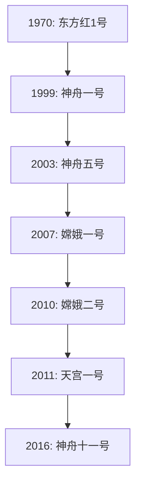
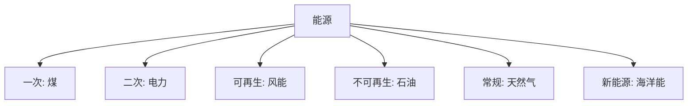

# 📜 航天和能源笔记

## 🚀 第六节 航天和能源：飞天与“充电”！

> **总览**：航天让我们飞上天，能源给我们“续航”！从“东方红”到“神舟”，从煤炭到风能，科技和生活全靠这两大“法宝”。咱们拆开看，轻松搞懂咋回事！🌞

---

### 一、🛰️ 航天技术：中国飞天史

#### （1）航天大事记
- **1970年**：  
  - “东方红1号”发射成功，第一颗人造卫星，酒泉起飞，奏响太空乐章！🎶  
- **1999年**：  
  - “神舟一号”无人飞船，21小时飞完，稳稳着陆，中国飞船首秀。  
- **2003年**：  
  - “神舟五号”载人首飞，杨利伟成中国太空第一人！👨‍🚀  
- **2007年**：  
  - “嫦娥一号”探月，月球探测开篇。  
- **2010年**：  
  - “嫦娥二号”再探月，升级版月球“摄影师”。  
- **2011年**：  
  - “天宫一号”目标飞行器，与“神舟八号”自动对接，太空“握手”。🤝  
- **2016年**：  
  - 9月15日：“天宫二号”空间实验室发射。  
  - 10月17日：“神舟十一号”发射，景海鹏+陈冬，33天最长载人飞行。  

#### （2）意义
- **比喻**：从“地上跑”到“天上飞”，航天技术让中国站上世界舞台！  
- **例子**：杨利伟上太空，嫦娥拍月球，航天梦步步实现。

- **表格**：航天里程碑

| 年份  | 事件                     | 亮点                   |
|-------|-------------------------|-----------------------|
| 1970  | 东方红1号              | 首颗卫星              |
| 1999  | 神舟一号               | 首艘无人飞船          |
| 2003  | 神舟五号               | 首次载人，杨利伟      |
| 2007  | 嫦娥一号               | 首探月球             |
| 2010  | 嫦娥二号               | 探月升级             |
| 2011  | 天宫一号+神舟八号      | 太空对接             |
| 2016  | 天宫二号+神舟十一号    | 33天最长载人飞行     |

- **Mermaid图表**：航天进程

- **考试重点⭐**：航天大事年份+人物常考！

---

### 二、🔋 能源技术：生活的“动力源”

#### （1）分类方式
一、一次能源 💨
一次能源指的是从自然界直接获取的能源，未经加工处理，直接可用于各种用途。

例子：

煤炭：天然矿物，燃烧后产生热能，用于发电、供热等。
石油：天然开采，经过提炼后可用作燃料、润滑油等。
太阳能：来自太阳的辐射能，利用太阳能电池或热水器直接转化为能源。
记住：一次能源“未加工，直接拿来用”！

二、二次能源 ⚡
二次能源是由一次能源经过加工、转化后得到的能源。虽然它源于一次能源，但通常更加便捷、高效地适用于日常生活和工业生产。

例子：

电力：通过燃烧煤、天然气、水力发电等方式生产出来的能源。
汽油：石油经过提炼后转化为一种高效的液体燃料。
沼气：通过有机废物厌氧发酵产生的气体，作为清洁能源使用。
记住：二次能源是“一次能源加工变身而来”！💡  
- **按历史发展**：  
  - **常规能源**：老牌主力。  
    - 例子：煤炭、天然气。  
  - **新能源**：新兴潜力股。  
    - 例子：海洋能、生物质能。  

#### （2）特点与应用
- **比喻**：一次能源是“原材料”，二次能源是“成品”；可再生是“无限续杯”，不可再生是“限量版”。  
- **例子**：太阳能晒电板发电，石油炼成汽油开车。

- **表格**：能源分类

| 分类方式   | 类型         | 举例                   |
|------------|-------------|-----------------------|
| 产生方式   | 一次能源     | 煤、石油、太阳能      |
|            | 二次能源     | 电力、汽油、沼气      |
| 可再生性   | 可再生       | 风能、水能、太阳能    |
|            | 不可再生     | 煤、石油              |
| 历史发展   | 常规能源     | 煤炭、天然气          |
|            | 新能源       | 海洋能、风能          |

- **Mermaid图表**：能源分类

---

### 🌟 重点与考点
#### 1. 重点
- **航天**：1970东方红、2003神舟五号、2016神舟十一号。  
- **能源**：一次vs二次、可再生vs不可再生、常规vs新能源。

#### 2. 记忆口诀
- **航天**：七零红，五载人，十六长。  
- **能源**：一次自然拿，二次加工造，可再无限用，不可挖完完。

#### 3. 真题示例
- **2022年**：中国首次载人航天是哪年？  
  - 答案：2003年。  
- **2021年**：可再生能源举例？  
  - 答案：太阳能。

---

### 🕒 时间线（Obsidian用）
- **1970**：航天开端，东方红1号。  
- **2003**：载人首飞，神舟五号。  
- **2016**：最长飞行，神舟十一号。  
- **能源史**：煤炭→石油→新能源。

---
