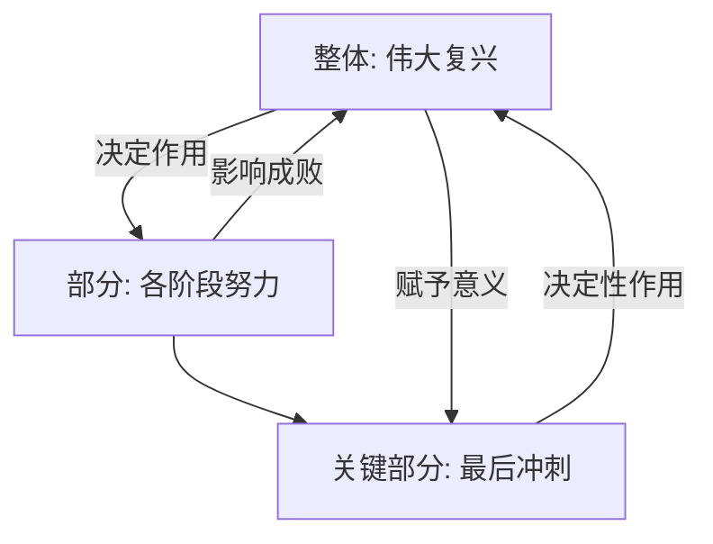

## 🌟 核心内容讲解

### 1. 啥是“行百里者半九十”？  
想象你跑步🏃，全程100米，眼看冲到90米了，腿却软了，喘不上气，最后10米反而比前面90米还难跑！“行百里者半九十”就是这个意思：走100里路，90里才算一半，因为最后10里最要命，最考验人。习大大用它比喻中华民族伟大复兴：越接近成功🎯，越困难重重，必须咬牙坚持💪！

---

### 2. 题目背景  
**原话**: “行百里者半九十。中华民族伟大复兴，绝不是轻轻松松、敲锣打鼓就能实现的。全党必须准备付出更为艰巨、更为艰苦的努力。”  
**题型**: 多选题  
**要求**: 找出其中蕴含的哲理（整体与部分的关系）  
**选项**:  
- A. 整体决定部分，部分的作用取决于其在整体中的地位  
- B. 整体和部分相互制约，关键部分的功能关系整体的成败  
- C. 部分决定整体，整体的性质由部分决定  
- D. 整体的功能是部分功能的相加  

---

### 3. 通俗讲解：整体与部分的“朋友圈”关系  
整体和部分就像一个团队：  
- **整体是大老板**：它给部分定方向，部分得听它的。  
- **部分是员工**：干得好坏，直接影响老板的业绩，尤其是关键员工✨，能决定整个公司的成败。  
- 但不是随便哪个员工都能当老板，也不是员工加起来就等于公司那么简单——公司还有自己的“灵魂”（整体效应）！

用“行百里者半九十”举例：  
- **整体** = 伟大复兴这个大目标  
- **部分** = 每个阶段的努力，尤其是最后冲刺  
- 最后阶段（关键部分）太重要了，掉链子就全盘皆输，但它的重要性是复兴这个“大老板”赋予的。

---

### 4. 选项分析（带例子+表格）

| **选项** | **含义** | **通俗例子** | **是否正确** | **理由** |
|----------|----------|--------------|---------------|----------|
| **A** | 整体决定部分，部分作用看地位 | 篮球比赛🏀，最后1分钟的得分手作用超大，因为比赛快结束了 | ✅ | 复兴目标（整体）让最后努力（部分）变得关键 |
| **B** | 整体和部分互相制约，关键部分定成败 | 搭积木🧱，最后一块放歪了全塌，积木整体也逼你小心搭 | ✅ | 最后努力（部分）影响复兴（整体），整体也要求部分坚持 |
| **C** | 部分决定整体，整体性质靠部分 | 做蛋糕🍰，全靠奶油好吃？面粉呢？ | ❌ | 太绝对，复兴不只靠最后阶段，前期也很重要 |
| **D** | 整体功能是部分相加 | 拼图🧩，每块加起来就是图？不，得拼对才行 | ❌ | 复兴不是努力堆砌，是质变，整体大于部分之和 |

---

### 5. 复杂部分图解（Mermaid 图表）
整体与部分的关系不好懂？看图！  

- **箭头含义**:  
  - A→B：整体定方向。  
  - B→A：部分影响整体。  
  - C（关键部分）特别牛，能“牵鼻子”影响整体成败。

## 🧠 记忆口诀
“整体是大佬定方向，关键部分拽全局，  
部分别想当老板，相加不能算成功。”  
- **A**: 大佬（整体）说了算。  
- **B**: 关键小弟（部分）拽全局。  
- **C/D**: 别乱想，错啦！

## 🔗 关系图谱（Obsidian 友好）
- **节点**:  
  - 整体与部分  
  - 关键部分  
  - 伟大复兴  
  - 辩证法  
- **连接**:  
  - 整体与部分 → 相互制约  
  - 关键部分 → 决定性作用  
  - 伟大复兴 → 语境实例  

