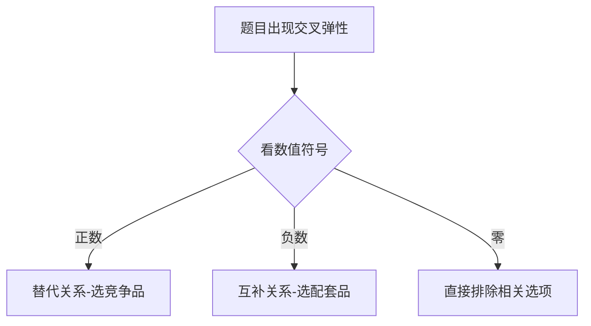

### 交叉弹性💡

```
🌟 核心口诀：
正数抢生意 → 替代品（你涨我受益）
负数共进退 → 互补品（你涨我哭泣）
零是陌生人 → 无关品（你涨我随意）
```

#### 一、3秒判断法 ⚡

| 交叉弹性值 | 关系   | 生活案例                | 记忆画面                 |
|------------|--------|-------------------------|--------------------------|
| **Exy＞0** | 替代品 | 奶茶🥤 vs 咖啡☕         | 奶茶涨价→咖啡卖爆🔥       |
| **Exy＜0** | 互补品 | 打印机🖨️ vs 墨盒🖨️💧   | 打印机涨价→墨盒滞销😭    |
| **Exy=0**  | 无关品 | 手机📱 vs 白菜🥬         | 手机涨价→白菜照买不误😎  |

#### 二、真题攻破技巧 🛠️


**例题精讲**：
1. 汽油价格↑导致汽车销量↓ → ❗交叉弹性为**负数** → 选**互补品**（如：汽车和汽油）
2. 汉堡涨价后炸鸡销量↑ → ❗交叉弹性为**正数** → 选**替代品**（如：汉堡和炸鸡）

#### 三、考场避坑指南 🚫
- 🚨 陷阱1：把**收入弹性**当交叉弹性 → 认准公式中的**其他商品价格变动**
  ```数学公式
  Exy = (ΔQx/Qx) / (ΔPy/Py)  # 看的是Y商品价格影响X销量
  ```
- 🚨 陷阱2：数值大小混淆 → 只需记住**符号方向**即可判断关系

#### 四、记忆强化测试 🧠
❓ 充电宝与共享充电器的交叉弹性为+2.5，说明它们属于？  
💡 答案：**替代品**（数值＞0，充电宝涨价→更多人用共享充电器）  

---

**✨ 特别技巧**：想象两个商品在跳双人舞  
- 替代品 → 互相抢舞伴（此消彼长）  
- 互补品 → 必须成对跳（同进同退）  
- 无关品 → 各跳各的舞（互不影响）