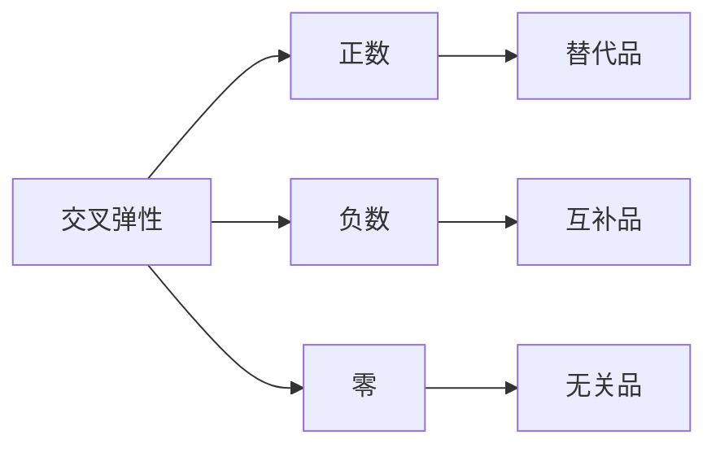

 #### 1. 如果两商品之间的<mark style="background: #FF5582A6;">交叉弹性</mark>小于零，表明这两种商品是可以()
A.替代的
<mark style="background: #FFB86CA6;">B.互补的</mark>
C.相关的
D.无关的

### 交叉弹性：商品关系的经济学密码 🔍

#### 1. 交叉弹性的定义  
**交叉弹性**（Cross Elasticity of Demand）衡量的是两种商品需求量之间的相互影响程度。简单来说，就是当一种商品的价格变化时，另一种商品的需求量会如何变化。  

#### 2. 数值含义 📊  

| 交叉弹性值 | 商品关系 | 例子 |  
|-----------|---------|------|  
| **正数（＞0）** | 替代品 | 苹果🍎和梨🍐：苹果涨价，人们转买梨，梨的需求量增加。 |  
| **负数（＜0）** | 互补品 | 羽毛球拍🏸和羽毛球：球拍涨价，买球拍的人少了，羽毛球的需求量也减少。 |  
| **零（=0）** | 无关品 | 电视📺和白菜🥬：电视价格变化，对白菜的需求量没影响。 |  

#### 3. 题目解析 🧩  
**题目**：如果两商品之间的交叉弹性小于零，表明这两种商品是可以()  
A. 替代的  
B. 互补的  
C. 相关的  
D. 无关的  

**答案**：<mark style="background: #FFB86CA6;">B. 互补的</mark>  

**解析**：交叉弹性小于零，说明两种商品是互补品。比如羽毛球拍和羽毛球，球拍涨价，买球拍的人少了，羽毛球的需求量也会减少。  

#### 5. 真题示例 📝  
**真题**：假设咖啡☕和茶🍵的交叉弹性为0.8，说明它们是什么关系？  
**答案**：替代品。因为交叉弹性为正数，表明咖啡涨价，茶的需求量会增加。  

#### 6. 图表辅助 📈  

---

