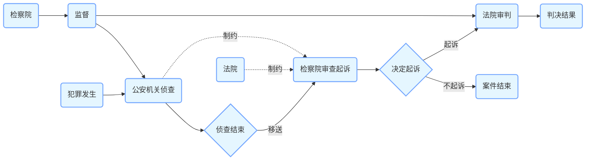

```mermaid
graph LR
    classDef process fill:#E5F6FF,stroke:#73A6FF,stroke-width:2px
    
    A(犯罪发生):::process --> B(公安机关侦查):::process
    B --> C{侦查结束}:::process
    C -->|移送| D(检察院审查起诉):::process
    D --> E{决定起诉}:::process
    E -->|起诉| F(法院审判):::process
    E -->|不起诉| G(案件结束):::process
    F --> H(判决结果):::process
    
    I(检察院):::process --> J(监督):::process
    J --> B(公安机关侦查):::process
    J --> F(法院审判):::process
    
    K(法院):::process -.->|制约| D(检察院审查起诉):::process
    B(公安机关侦查):::process -.->|制约| D(检察院审查起诉):::process
    
```
