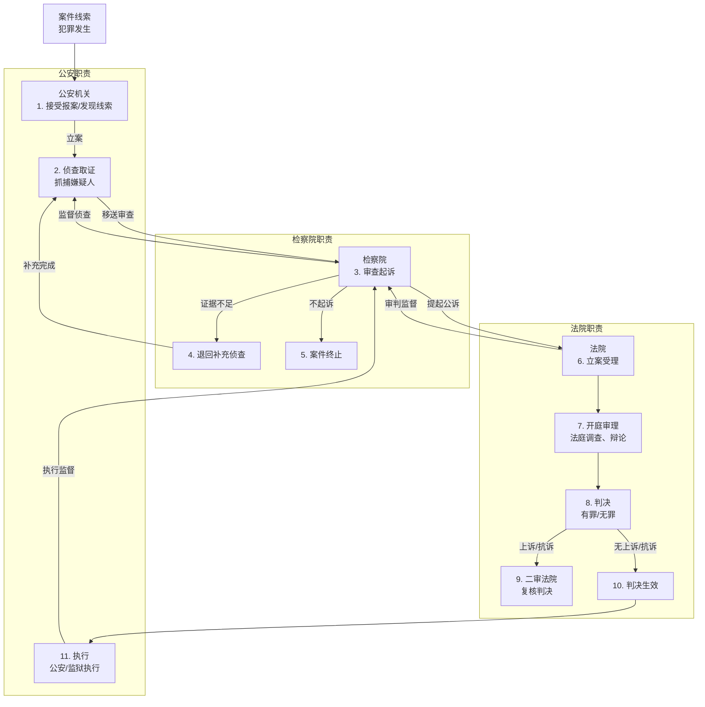
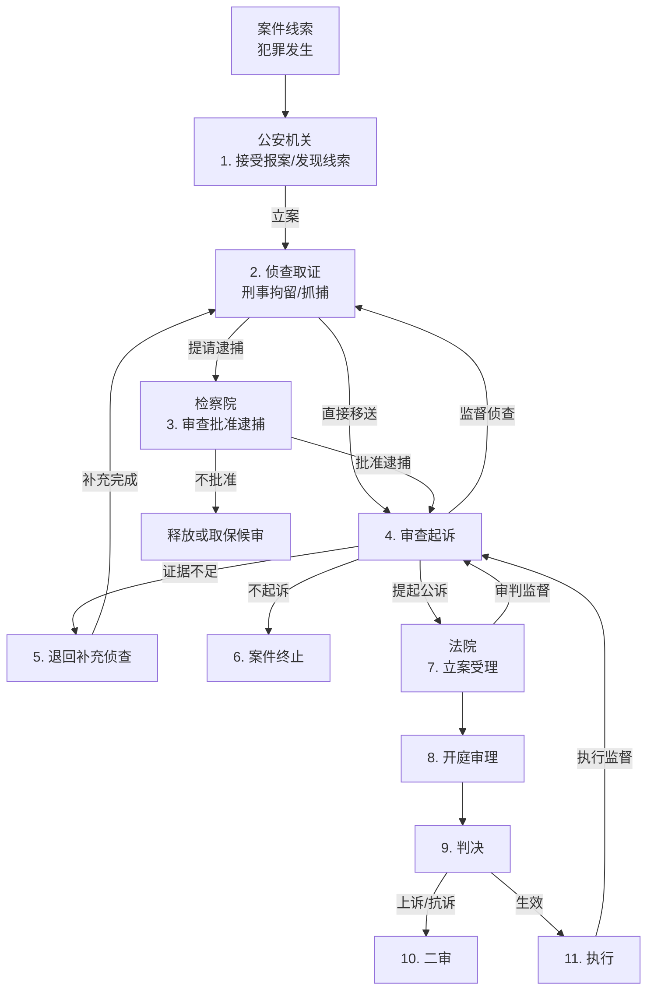

### 刑事司法完整流程简述
1. **公安机关**：案件起点，负责发现、立案、侦查、取证，抓嫌疑人。
2. **检察院**：中间站，审查公安移送的案件，决定起诉、不起诉或退回补充侦查，监督公安和法院。
3. **法院**：终点站，审理案件，判决结果，监督执行。

流程中还有反馈循环（如退回侦查）和监督关系，体现了三者协作与制约。

---

### Mermaid完整流程图
以下是Mermaid代码，表示公安机关、检察院、法院的完整流程：

---

### 流程详细说明
1. **案件线索**：有人报案或公安巡逻发现犯罪。
2. **公安立案侦查**：立案后调查、取证，抓嫌疑人。
3. **检察院审查起诉**：检查证据，决定下一步：
   - **退回补充侦查**：证据不够，公安再查。
   - **不起诉**：罪轻或证据不足，案件结束。
   - **提起公诉**：证据充分，送法院。
4. **法院立案受理**：接收起诉书，准备开庭。
5. **开庭审理**：法庭上查证据、辩论。
6. **判决**：判有罪（刑罚）或无罪。
7. **二审**：不服可上诉，检察院可抗诉，二审复核。
8. **判决生效**：无上诉或二审结束。
9. **执行**：公安或监狱执行刑罚（如监禁）。
10. **监督**：
    - 检察院监督公安侦查、法院审判、刑罚执行。
    - 法院监督检察院公诉（可驳回）。

在中国的刑事司法流程中，公安机关抓捕犯罪嫌疑人**不一定**需要经过检察院的批准，但具体情况取决于抓捕的类型和阶段。以下是详细解答，帮助你理解公安机关抓捕与检察院的关系：

---

### 公安机关抓捕是否需要检察院批准？
#### 1. 一般情况：不需要检察院批准
- **法律依据**：《中华人民共和国刑事诉讼法》（简称刑诉法）。  
- **公安职责**：公安机关是侦查机关，负责刑事案件的立案、侦查和抓捕。根据刑诉法第3条，公安机关有权自行决定采取侦查措施，包括抓捕嫌疑人。
- **常见抓捕形式**：
  - **刑事拘留**（刑诉法第82条）：公安机关对现行犯或重大嫌疑分子，可以先行拘留，无需检察院批准，但需在24小时内通知家属，且拘留后7日内提请检察院批准逮捕（紧急情况可延长至30日）。
  - **传唤/拘传**（刑诉法第119条、第123条）：公安可直接传唤嫌疑人到指定地点接受调查，或强制拘传，无需检察院批准。
  - **现场抓捕**：对于现行犯或紧急情况（如正在作案），公安可当场抓捕，无需任何批准。

#### 2. 需要检察院批准的情况：逮捕
- **逮捕定义**：逮捕是较长时间剥夺人身自由的强制措施，比拘留更严格。
- **法律要求**（刑诉法第89条、第91条）：公安机关拘留嫌疑人后，认为需要逮捕的，必须在拘留后3日内（特殊情况可延长至7日）提请检察院审查批准。检察院在7日内决定是否批捕。
- **流程**：
  1. 公安抓人（刑事拘留）。
  2. 收集证据，提请逮捕。
  3. 检察院审查，批准或不批准。
- **例外**：紧急情况下，公安可先抓捕，但事后必须补办手续。

#### 3. 特殊情况：检察院直接介入
- **检察院自行侦查**（刑诉法第18条）：对于贪污贿赂、渎职等职务犯罪，检察院有权直接立案侦查并抓捕，此时无需公安介入。
- **监督抓捕**：检察院可监督公安抓捕的合法性（如是否超期拘留），但不直接批准抓捕行为。

---

### 通俗解释
- **抓捕初期**：公安是“先锋队”，发现犯罪就动手抓，不用等检察院点头。比如街头抓小偷，公安直接上！
- **逮捕阶段**：要把人关久一点，公安得找检察院“签字”，检察院是“审核员”，看证据够不够。
- **比喻**：公安像“猎手”，抓到“猎物”后，检察院是“裁判”，决定能不能“锁起来”。

---

### Mermaid图表（补充逮捕流程）
以下是更新后的图表，突出公安抓捕与检察院逮捕批准的关系：

---

### 图表说明
- **公安抓捕（C）**：直接行动，无需检察院批准。
- **提请逮捕（D）**：公安需检察院批准才能正式逮捕。
- **后续衔接**：逮捕后进入审查起诉，再到法院审判。

---

### 回答你的问题
公安机关抓捕不一定经过检察院：
- **刑事拘留/现场抓捕**：公安自主决定，无需批准。
- **逮捕**：需要检察院批准，公安不能直接决定。

如果是问“抓捕后能不能一直关着”，那得看检察院批不批逮捕，否则只能放人或取保候审。

