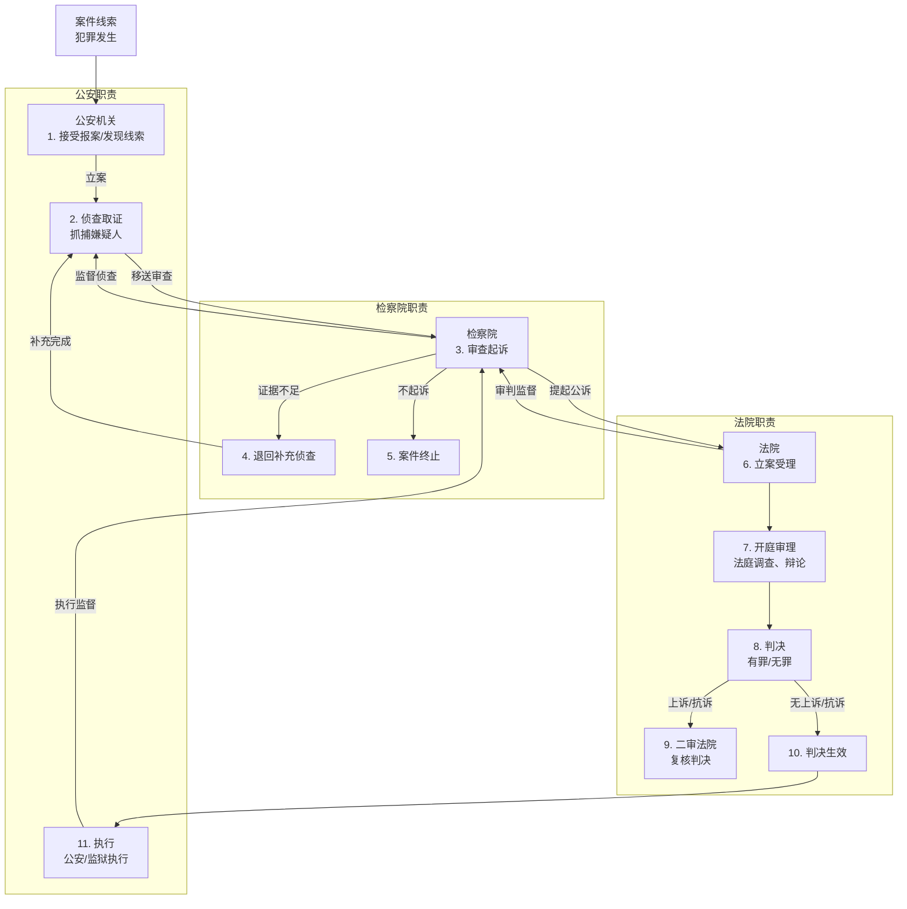

### 刑事司法完整流程简述
1. **公安机关**：案件起点，负责发现、立案、侦查、取证，抓嫌疑人。
2. **检察院**：中间站，审查公安移送的案件，决定起诉、不起诉或退回补充侦查，监督公安和法院。
3. **法院**：终点站，审理案件，判决结果，监督执行。

流程中还有反馈循环（如退回侦查）和监督关系，体现了三者协作与制约。

---

### Mermaid完整流程图
以下是Mermaid代码，表示公安机关、检察院、法院的完整流程：

---

### 流程详细说明
1. **案件线索**：有人报案或公安巡逻发现犯罪。
2. **公安立案侦查**：立案后调查、取证，抓嫌疑人。
3. **检察院审查起诉**：检查证据，决定下一步：
   - **退回补充侦查**：证据不够，公安再查。
   - **不起诉**：罪轻或证据不足，案件结束。
   - **提起公诉**：证据充分，送法院。
4. **法院立案受理**：接收起诉书，准备开庭。
5. **开庭审理**：法庭上查证据、辩论。
6. **判决**：判有罪（刑罚）或无罪。
7. **二审**：不服可上诉，检察院可抗诉，二审复核。
8. **判决生效**：无上诉或二审结束。
9. **执行**：公安或监狱执行刑罚（如监禁）。
10. **监督**：
    - 检察院监督公安侦查、法院审判、刑罚执行。
    - 法院监督检察院公诉（可驳回）。

