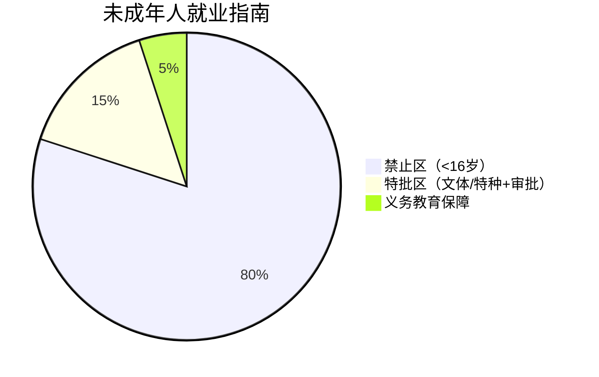
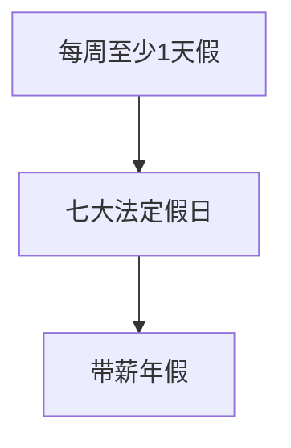
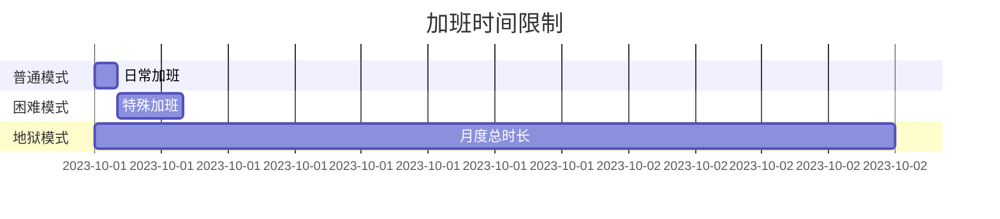
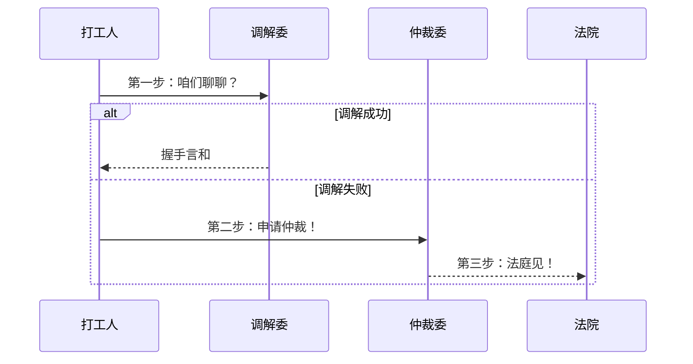

童工退退退：企业招用<16岁小盆友？❌
（就像禁止小学生进网吧，抓到要重罚！）

特工少年团：文艺/体育/特种工艺招童工？✅ 
双重保险 = 审批手续 + 义务教育保障
（类似少年杂技团要有教育局批文+文化课老师）

## ⏰ 休息休假篇
### 假期三件套

假期鄙视链：
- 🥉 单休（卑微打工人）
- 🥈 双休（标准配置）
- 🥇 大小周（薛定谔的休息）

年假小秘密：📅 连续搬砖1年 = 解锁带薪休假成就（就像游戏成就系统，满365天点亮技能）

## 💼 加班修罗场
### 加班三重奏

加班费速记口诀：
- 🕒 日常1.5倍（约会迟到要补偿）
- 🛌 双休2倍（毁人周末加倍痛）
- 🎆 法定3倍（节日加班爽到飞）

加班无限火力：🚒 抢险救灾等紧急情况（老板不能拿"着火了"当日常加班借口！）

## 💰 工资保卫战
### 工资三原则
|原则|内涵|记忆梗|
|----|----|----|
|保底原则|≥最低工资|老板说"按地板价发工资"，地板也得是政府认证的|
|及时原则|月结不拖欠|比大姨妈还准时|
|硬通货原则|只发人民币|用袜子抵工资？达咩！|

最低工资冷知识：
- 📍 各省自己定标准 → 深圳VS鹤岗能差3倍！（就像奶茶价格，一线城市和县城不一样）

## ⚖️ 纠纷解决流水线
### 维权三步走

重要考点：
- 🔥 仲裁是诉讼必经程序（就像上厕所要先脱裤子）
- 🔥 调解非必需（可以跳过居委会大妈直接找警察）

