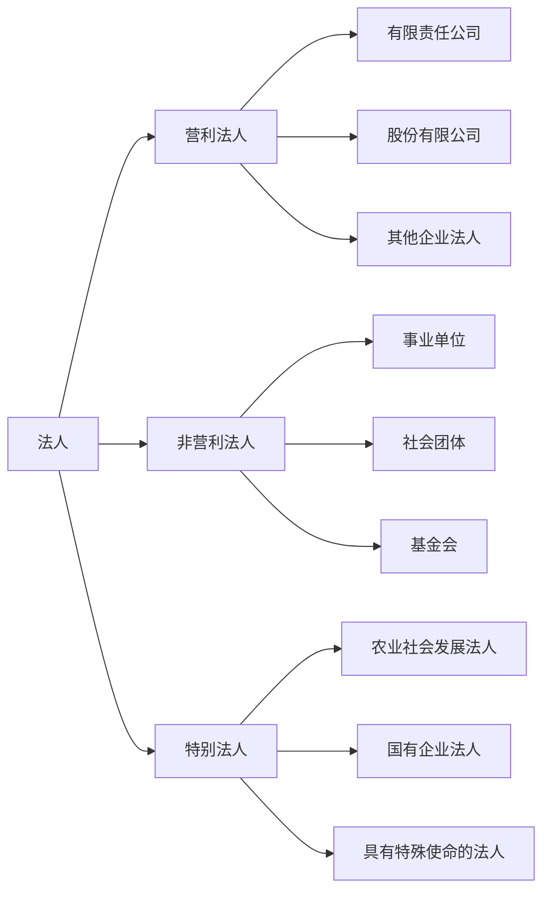

### 一、**自然人** 👤

#### （一）**自然人的民事权利能力** 🏛️

1. **概念**  
自然人的民事权利能力，是指自然人依法享有民事权利和承担民事义务的资格。换句话说，就是每个人从法律上来说都是有权利的，没得跑！👑

2. **起始时间**  
- **出生时**：从出生的那一刻起你就有了民事权利能力！
- **死亡时**：一旦死亡，民事权利能力就结束了。
- *例外情况*：没有出生证明、死亡证明的，以户籍登记或其他有效身份登记为准。

3. **胎儿的民事权利能力**  
- 涉及遗产继承、接受赠与等胎儿利益保护的，胎儿视为具有民事权利能力。
- **但注意**：如果胎儿生下来已经是死体，那就没有民事权利能力啦。

#### （二）**自然人的民事行为能力** 🧠

1. **概念**  
民事行为能力是指自然人能够合法行使权利和承担义务的能力。如果你想签合同、买房子或做其他法律行为，你必须具备这个能力。

2. **分类**  
根据年龄、智力和精神健康状况的不同，民事行为能力分为三种：  
   - **完全民事行为能力人** ✅  
     *年满18岁且精神正常的成年人*，或者*16岁以上并靠自己劳动收入为主要生活来源的未成年人*，可以独立做所有民事行为。  
     **例子**：成年人签合同、购房、结婚等都能独立操作。

   - **限制民事行为能力人** ⚖️  
     *8周岁以上未成年人*，或*精神上稍有障碍的人*，可以做一些简单的法律行为，比如买零食，或者与自己能力相符的合同。其他大事得有法定代理人帮忙。  
     **例子**：16岁的小明想买辆车，但得经过父母同意才能签约。

   - **无民事行为能力人** 🚫  
     *8岁以下未成年人*，或*不能完全辨认自己行为的成年人*。他们的任何民事行为都得由法定代理人代办，不能自己签合同。  
     **例子**：小刚不满8岁，他想买个玩具得由妈妈帮忙付款。

#### （三）**自然人的住所** 🏠

- **住所**：通常是指户籍所在地或其他有效的身份证明所载的住所。如果实际居住地与法定住所不同，以实际居住地为准。

#### （四）**监护** 🛡️

1. **概念**  
监护是指对未成年人或成年精神病人的保护制度，监护人负责监督和保护被监护人的合法权益。

2. **类型**  
   - **法定监护（未成年人）**  
     父母为孩子的法定监护人。如果父母去世或者无法履行职责，监护责任转给祖父母、外祖父母等亲戚。

   - **法定监护（成年精神病人）**  
     配偶、父母、子女优先担任监护人。

   - **指定监护**  
     如果监护人选不出来，居民委员会或民政部门可以指定。

   - **遗嘱监护**  
     父母可以通过遗嘱指定监护人。

   - **意定监护**  
     成年人可以提前与亲人协商，指定未来可能需要的监护人。

#### （五）**宣告失踪与宣告死亡** 🕵️‍♂️💀

1. **宣告失踪**  
- **条件**：自然人下落不明满2年，利害关系人可以申请宣告失踪。  
- **法律效果**：为失踪人设立财产代管人，处理失踪人的财产事务。

2. **宣告死亡**  
- **条件**：自然人下落不明4年（如果是意外事件下落不明，2年即可）。  
- **法律效果**：宣告死亡后婚姻关系解除，财产按照继承办理。

3. **死亡重新出现**  
- **效果**：如果失踪或死亡宣告被撤销，婚姻关系可以恢复，财产关系会根据实际情况调整。

---

### 二、**法人** 🏢

1. **概念**  
法人是指能够独立享有民事权利和承担民事义务的组织。法人与自然人一样，有自己的“法律生命”，它也能做事、背责任！

2. **成立条件**  
   - 法人必须依法成立，拥有独立的名称、组织结构、财产等。
   - 如果是特别的法人，还得经过有关机关批准。

3. **民事责任承担**  
   - 法人以其自身的财产承担责任，而不是股东个人财产。
   - 法定代表人代表法人行事，法人承担所有责任。

4. **法人的分类**  
   - 法人分为公司法人、非公司法人等，各有不同的法律地位和责任。

---

### 三、**非法人组织** 🏚️

- **概念**：非法人组织虽然没有法人资格，但依然可以以自己的名义进行民事活动，常见的如合伙企业、个人独资企业等。

- **责任**：非法人组织的责任通常是“无限责任”，即如果组织的财产不足以清偿债务，创办人或出资人将承担全部责任。

---

### 表格速记 📌

| 数字  | 含义                                        | 相关法律或场景            |
| --- | ----------------------------------------- | ------------------ |
| 1   | 自然人民事权利能力起始时间                             | 出生时                |
| 2   | 宣告失踪条件                                    | 自然人下落不明满2年         |
| 3   | 宣告死亡条件                                    | 自然人下落不明4年          |
| 4   | 宣告死亡条件（意外事件） | 自然人下落不明2年          |
| 5   | 胎儿民事权利能力                                  | 涉及遗产继承、接受赠与        |
| 6   | 完全民事行为能力人                                 | 年满18岁              |
| 7   | 限制民事行为能力人                                 | 8周岁以上              |
| 8   | 无民事行为能力人                                  | 8岁以下               |
| 9   | 完全民事行为能力人                                 | 16岁以上并靠劳动收入为主要生活来源 |

