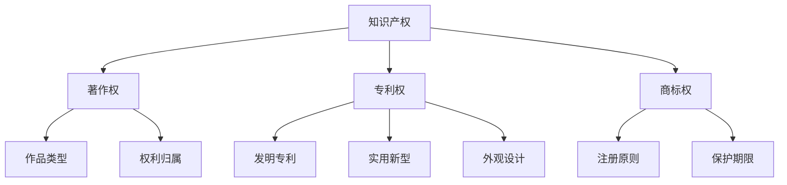
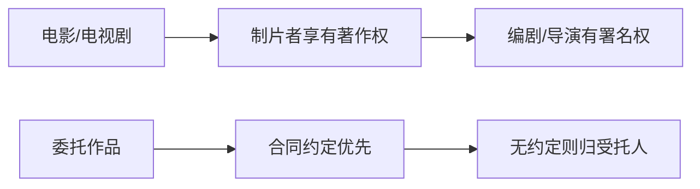
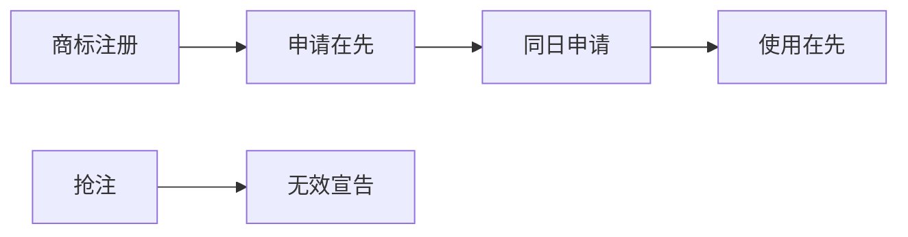

# 知识产权核心笔记 🧠✨

---

## 一、著作权核心要点 📖

### 1. 保护范围：什么算“作品”？ 
| ✅ 受保护作品 | ❌ 不受保护内容 |
|--------------|------------------|
| 小说、诗歌（文字） | 法律文件（如宪法条文） |
| 音乐、舞蹈 | 天气预报（单纯事实消息） |
| 建筑设计图 | 九九乘法表（通用数表） |
| 计算机软件 | 牛顿定律（科学发现） |

**独创性+可表现性**是核心！  
👉 例子：随手拍的风景照是摄影作品，但监控录像无独创性不算。

---

### 2. 著作权归属 🎬

- **职务作品**：
  - 一般情况：作者享有著作权，单位优先使用2年  
  - **例外**（单位享有著作权）：  
    🔧 利用单位资源创作（如工程设计图）  
    📰 新闻单位员工创作的职务作品（2023新增！）

---

### 3. 权利保护期 ⏳
| 权利类型 | 保护期限 |
|----------|----------|
| 署名权、修改权、保护完整权 | 永久有效 💎 |
| 发表权、财产权 | 作者终生+死后50年（合作作品算最后一位作者） |

> 📅 例如：鲁迅1936年去世，其作品财产权保护至1986年12月31日。

---

## 二、专利权三大法宝 🔬

### 1. 专利类型对比
| 类型 | 定义 | 保护期 | 例子 |
|------|------|--------|------|
| 发明专利 | 新产品/方法的技术方案 | 20年 | 抗癌新药配方 💊 |
| 实用新型 | 产品形状/结构的实用方案 | 10年 | 可折叠手机支架 📱 |
| 外观设计 | 产品外观美感设计 | 15年 | 流线型水杯造型 🥤 |

**2021新规**：外观设计保护期延长至15年！

---

### 2. 不授予专利的情形 🚫
- 科学发现（如发现新行星🪐）
- 疾病诊断方法（如癌症检测流程）
- 动植物品种（可通过《植物新品种条例》保护）
- 原子核变换物质（核反应方法❌）

👉 **记忆口诀**：发现疾病动原子，专利统统不授权！

---

## 三、商标权核心规则 🏷️

### 1. 商标构成要素
可注册标志包括：  
🔤 文字 + 🌈 颜色组合 + 🎵 声音（如英特尔“灯！等灯等灯”）  
+ 三维标志（如可口可乐瓶身）

---

### 2. 注册审查原则
| 情形 | 处理规则 | 示例 |
|------|----------|------|
| 同日申请相同商标 | 初步审定**使用在先**者 | A、B公司同天申请“北极熊”商标，A能证明去年已使用→A获注册 |
| 抢注他人在先商标 | 驳回申请 | C抢注D已使用的网红奶茶商标 → 无效 |

---

### 3. 保护期限与续展
- 有效期：**10年**（自核准注册日起）  
- 续展规则：期满前12个月内办理，宽限期6个月  
⚠️ 未续展则商标注销！  

---

## 四、高频考点速记 🚩

### 著作权
- 职务作品单位享有著作权的3种情形（尤其新增**新闻作品**）  
- 美术作品原件展览权归**所有者**（与著作权分离）  

### 专利权
- 外观设计保护期**15年**（2021年修改）  
- 疾病治疗方法**不可专利化**（但医疗设备可以）  

### 商标权
- 声音商标的合法性（如腾讯“滴滴”提示音🔔）  
- **申请在先为主，使用在先为辅**的冲突解决规则  

---

## 五、记忆口诀 📌
- **著作权归属**：  
  “电影制片是大佬，编剧导演留个名；委托作品看合同，没写就归打工人”  
- **不授予专利**：  
  “科学疾病动植物，原子核变不保护”  

---

## 六、真题示例 💯
【2022年真题】  
甲公司在2020年设计了一款新型可降解塑料袋，2021年申请实用新型专利，何时到期？  
A. 2031年  
B. 2041年  
C. 2036年  
✅ **答案**：A（实用新型保护期10年，自申请日起算）

---

