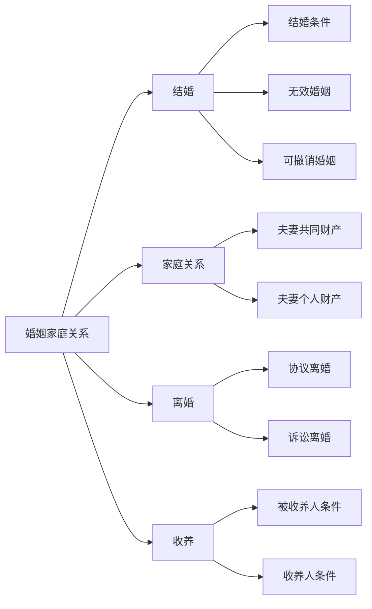

---

## 一、结婚核心要点 💒

### 1. 结婚条件
| 条件 | 内容 | 示例 |
|------|------|------|
| 自愿原则 | 双方完全自愿，禁止强迫/干涉 | 父母包办婚姻无效 🚫 |
| 法定婚龄 | 男≥22岁，女≥20岁 | 男21岁结婚 → 无效 ⚠️ |
| 禁止近亲结婚 | 直系血亲/三代以内旁系血亲 | 表兄妹结婚 → 无效 🧬 |

### 2. 无效婚姻
| 情形 | 示例 |
|------|------|
| 重婚 | 已婚者与他人再次结婚 💔 |
| 近亲结婚 | 表兄妹结婚 🧬 |
| 未到法定婚龄 | 男21岁结婚 ⚠️ |

### 3. 可撤销婚姻
| 情形 | 撤销期限 | 示例 |
|------|----------|------|
| 胁迫婚姻 | 胁迫终止后1年 | 被逼结婚 → 可撤销 ⏳ |
| 重大疾病未告知 | 知道后1年 | 隐瞒艾滋病 → 可撤销 🏥 |

---

## 二、家庭关系核心要点 🏠

### 1. 夫妻共同财产
| 财产类型 | 示例 |
|----------|------|
| 工资、奖金 | 夫妻双方工资 💰 |
| 投资收益 | 股票收益 📈 |
| 知识产权收益 | 专利授权费 📜 |
| 继承/赠与财产（无特别约定） | 继承的房产 🏡 |

### 2. 夫妻个人财产
| 财产类型 | 示例 |
|----------|------|
| 婚前财产 | 婚前购买的房子 🏠 |
| 人身损害赔偿 | 工伤赔偿 💼 |
| 遗嘱/赠与明确归一方 | 父母赠与的汽车 🚗 |
| 专用生活用品 | 个人衣物 👗 |

### 3. 夫妻约定财产制
- 约定形式：**书面形式**  
- 约定内容：婚前/婚后财产归各自所有、共同所有或部分各自所有  

---

## 三、离婚核心要点 💔

### 1. 离婚方式
| 方式 | 特点 | 示例 |
|------|------|------|
| 协议离婚 | 双方自愿，签订离婚协议 | 双方协商一致离婚 ✍️ |
| 诉讼离婚 | 一方起诉，法院判决 | 一方不同意离婚 → 诉讼 ⚖️ |

### 2. 离婚冷静期
- **30天冷静期**：申请离婚后30天内可撤回  
- **30天领证期**：冷静期满后30天内需领证，否则视为撤回  

### 3. 诉讼离婚情形
| 情形 | 示例 |
|------|------|
| 重婚/同居 | 一方与他人同居 💔 |
| 家庭暴力 | 一方实施家暴 🚨 |
| 恶习不改 | 赌博、吸毒屡教不改 🎲 |
| 分居满2年 | 因感情不和分居 ⏳ |

### 4. 子女抚养
| 子女年龄 | 抚养原则        |
| ---- | ----------- |
| <2岁  | 母亲直接抚养 👶   |
| ≥2岁  | 最有利于子女原则 🧒 |
| ≥8岁  | 尊重子女意愿 👧   |

### 5. 夫妻共同债务
| 债务类型 | 示例 |
|----------|------|
| 共同签名/追认债务 | 夫妻共同借款 💳 |
| 家庭日常生活债务 | 一方为家庭生活借款 🏠 |
| 超出家庭生活债务 | 一方个人借款（需证明用于共同生活） 💼 |

---

## 四、收养核心要点 👶

### 1. 被收养人条件
| 条件 | 示例 |
|------|------|
| 丧失父母的孤儿 | 父母双亡的儿童 🧒 |
| 查找不到生父母 | 被遗弃的婴儿 👶 |
| 生父母无力抚养 | 家庭困难无力抚养 💔 |

### 2. 收养人条件
| 条件 | 示例 |
|------|------|
| 无子女/仅1名子女 | 无子女夫妻 👨‍👩‍👧 |
| 年满30岁 | 30岁以上成年人 🎂 |
| 无违法犯罪记录 | 无犯罪记录 🚔 |
| 无不利于健康疾病 | 无重大疾病 🏥 |

## 七、真题示例 

【2020年真题】  
下列哪种情形属于无效婚姻？  
A. 男21岁结婚  
B. 女方隐瞒重大疾病  
C. 表兄妹结婚  
✅ **答案**：AC
