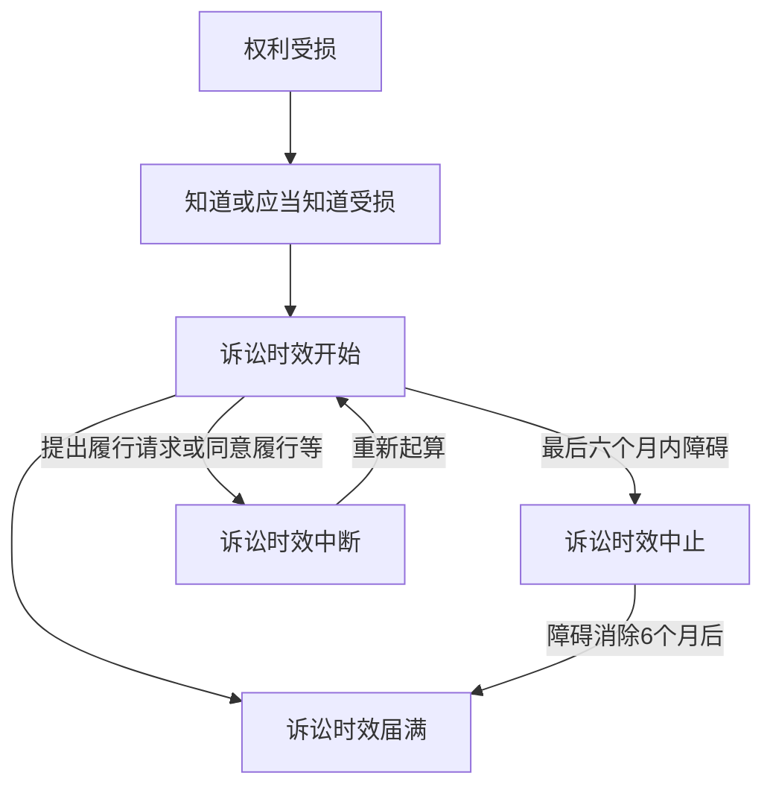

## 一、概念 🧐
诉讼时效是指民事权利受到侵害的权利人在法定的时效期间内不行使权利，当时效期间届满时，人民法院对权利人的权利不再进行保护的制度。[[人民法院不得主动适用诉讼时效的规定。]]

## 二、诉讼时效种类 🗂️

### 1. 普通诉讼时效 ⏳
向人民法院请求保护民事权利的诉讼时效期间为 **3 年**，法律另有规定的除外。

### 2. 最长诉讼时效 🚶‍♂️
诉讼时效期间自权利人知道或者应当知道权利受到损害以及义务人之日起计算。法律另有规定的，依照其规定。但是，自权利受到损害之日起超过 **二十年** 的，人民法院不予保护，有特殊情况的，人民法院可以根据权利人的申请决定延长。

## 三、诉讼时效的起算 📝
一般情况下，诉讼时效期间自权利人知道或者应当知道权利受到损害以及义务人之日起计算。

当事人约定同一债务分期履行的，诉讼时效期间自最后一期履行期限届满之日起计算。

未成年人遭受性侵害的损害赔偿请求权的诉讼时效期间，自受害人年满十八周岁之日起计算。

## 四、诉讼时效中止 🛑

在诉讼时效期间的最后六个月内，因下列障碍，不能行使请求权的，诉讼时效中止：

1. 不可抗力；
2. 无民事行为能力人或者限制民事行为能力人没有法定代理人，或者法定代理人死亡、丧失民事行为能力、丧失代理权；
3. 继承开始后未确定继承人或者遗产管理人；
4. 权利人被义务人或者其他人控制；
5. 其他导致权利人不能行使请求权的障碍。

自中止时效的原因消除之日起满六个月，诉讼时效期间届满。

## 五、诉讼时效中断 

诉讼时效中断是指非因权利人怠于行使权利，使已经过的时效期间丧失其效力，而须重新起算时效期间的制度。

### 诉讼时效中断的情形：
1. 权利人向义务人提出履行请求；
2. 义务人同意履行义务；
3. 权利人提起诉讼或者申请仲裁；
4. 与提起诉讼或者申请仲裁具有同等效力的其他情形。

## 六、诉讼时效届满的后果 

诉讼时效期间届满的，义务人可以提出不履行义务的抗辩。

诉讼时效期间届满后，义务人同意履行的，不得以诉讼时效期间届满为由抗辩；义务人已经自愿履行的，不得请求返还。

## 二、诉讼时效种类 

### 1. 普通诉讼时效
| 类型 | 期限 | 起算点 |
|------|------|--------|
| 普通诉讼时效 | **3年** | 知道或应当知道权利受损及义务人之日 |

### 2. 最长诉讼时效
| 类型 | 期限 | 起算点 |
|------|------|--------|
| 最长诉讼时效 | **20年** | 权利受到损害之日 |

> 📌 **注意**：20年最长时效可因特殊情况延长（需权利人申请）。

---

## 三、诉讼时效起算 📅

### 1. 一般规则
- 起算点：**知道或应当知道权利受损及义务人之日**  
  👉 例如：2023年1月1日发现借款未还 → 时效起算日为2023年1月1日。

### 2. 特殊规则
| 情形 | 起算点 |
|------|--------|
| 分期履行债务 | 最后一期履行期限届满之日 |
| 未成年人性侵害赔偿请求权 | 受害人年满18周岁之日 |

---

## 四、诉讼时效中止 ⏸️

### 1. 中止条件
在时效期间的最后6个月内，因以下障碍不能行使权利：  
- 不可抗力（如地震、洪水）  
- 无/限制民事行为能力人无法定代理人  
- 继承开始后未确定继承人或遗产管理人  
- 权利人被义务人或其他人控制  
- 其他障碍  

### 2. 中止后果
中止原因消除后，时效期间继续计算，剩余时间不足6个月的，补足6个月。

---

## 五、诉讼时效中断 ⏩

### 1. 中断情形
| 情形 | 示例 |
|------|------|
| 权利人提出履行请求 | 债权人催债 📞 |
| 义务人同意履行 | 债务人承诺还款 ✍️ |
| 权利人提起诉讼/仲裁 | 向法院起诉 ⚖️ |
| 其他同等效力情形 | 申请调解 🤝 |

### 2. 中断后果
中断后，已过的时效期间无效，时效期间重新计算。

---

## 六、诉讼时效届满后果 🚫

### 1. 义务人抗辩权
时效届满后，义务人可提出不履行义务的抗辩。  
👉 例如：债权人超过3年未催债 → 债务人可拒绝还款。

### 2. 自愿履行
时效届满后，义务人自愿履行的，不得请求返还。  
👉 例如：债务人主动还款后，不得以时效届满为由要求返还。

## 九、真题示例 💯

【2021年真题】  
甲于2020年1月1日借款给乙，约定2020年12月31日还款。乙未按时还款，甲于2023年2月1日向法院起诉。下列说法正确的是：  
A. 甲的请求权已过诉讼时效  
B. 甲的请求权未过诉讼时效  
C. 甲的请求权适用最长诉讼时效  
✅ **答案**：B（普通诉讼时效为3年，自2021年1月1日起算，2023年2月1日未届满）

