## 一、行政强制措施 🛑

**行政强制措施**是指行政机关在行政管理过程中，为制止违法行为、防止证据损毁、避免危害发生、控制危险扩大等情形，依法对公民的人身自由实施暂时性限制，或者对公民、法人或者其他组织的财物实施暂时性控制的行为。

## 二、行政强制执行 🔧

### （一）定义
**行政强制执行**是指行政机关或者行政机关申请人民法院，对不履行行政决定的公民、法人或者其他组织，依法强制履行义务的行为。

### （二）种类

行政强制执行主要分为 **直接强制执行** 和 **间接强制执行** 两类。

#### 1. 直接强制执行
直接针对义务人的人身、财产或行为，直接采取强制手段使义务得以履行或者达到与履行义务相同的状态。比如，直接划拨银行存款、拍卖或收缴财物。

#### 2. 间接强制执行
- **代履行（代执行）**：义务人不履行义务时，由他人代替其履行，并由义务人支付执行费用。
- **执行罚**：义务人不履行义务时，执行机关按日科以新的金钱给付义务，促使义务人履行义务的强制执行方式。

### （三）设定权限 🛂
行政强制执行由法律设定。法律没有规定行政机关强制执行的，作出行政决定的行政机关应当申请人民法院强制执行。

### （四）关于行政强制执行的其他规定 📜
1. **催告义务**：行政机关作出强制执行决定前，应当事先催告当事人履行义务。催告应当以书面形式作出，并载明下列事项：履行义务的期限；履行义务的方式；涉及金钱给付的，应有明确的金额和给付方式等。
2. **执行时间限制**：行政机关不得在夜间或者法定节假日实施行政强制执行，但情况紧急的除外。行政机关不得对居民生活采取停止供水、供电、供热、供燃气等方式迫使当事人履行相关行政决定。
3. **强制拆除**：对违法的建筑物、构筑物、设施等需要强制拆除的，应由行政机关予以公告，限期当事人自行拆除。当事人在法定期限内不申请行政复议或者提起行政诉讼，又不拆除的，行政机关可以依法强制拆除。

```mermaid
graph LR
A[行政强制]
B[行政强制措施]
C[行政强制执行]
D[直接强制执行]
E[间接强制执行]
F[代履行]
G[执行罚]
H[设定权限]
I[其他规定]
A --> B
A --> C
C --> D
C --> E
E --> F
E --> G
C --> H
C --> I
```

