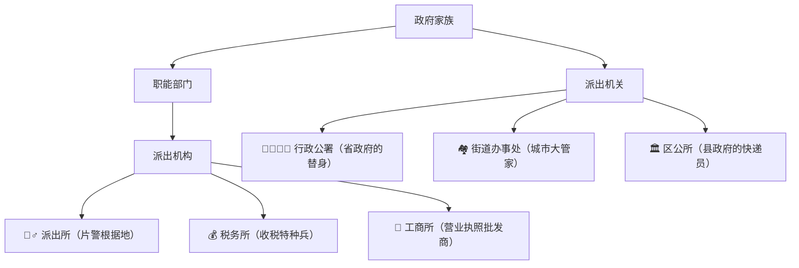

### 派出机关

- **定义**：派出机关是由各级人民政府设立的，代表该人民政府行使行政职权的行政机关😉。
- **设立机关**
    
    - **省、自治区人民政府**：可设立派出机关 —— 行政公署。例如，过去内蒙古自治区曾设有锡林郭勒盟行政公署等。
    - **县、自治县人民政府**：可设立区公所作为派出机关。不过在现在的行政体制中，区公所已经比较少见了。
    - **市辖区、不设区的市的人民政府**：设立的派出机关为街道办事处。像北京市东城区的东华门街道办事处等，在城市管理、服务居民等方面发挥着重要作用。
    
- **职能范围**：派出机关具有广泛的行政职能，涵盖经济、社会、文化等多个领域，相当于一级人民政府，可以综合行使行政职权。以街道办事处为例，它可以管理辖区内的民政、卫生健康、社会治安等各项行政工作。
- **主体资格**：派出机关在行政诉讼中具有独立的主体资格，能够以自己的名义进行行政行为，并独立承担相应的法律责任。

### 派出机构

- **定义**：派出机构是由政府职能部门设立的，旨在代表该职能部门行使特定行政职权的机构🤔。
- **设立机关**：通常由政府的职能部门设立。比如公安局设立派出所，税务局设立税务所，工商局设立工商所等。
- **职能范围**：派出机构的职能相对较为集中和专门，只负责某一类或某几项特定的行政事务。例如，派出所主要负责维护社会治安、户籍管理等工作；税务所主要负责税收征管等与税务相关的工作。
- **主体资格**：一般情况下，派出机构在行政诉讼中不具有独立的主体资格，但在法律、法规授权的情况下，可以以自己的名义进行行政行为，并承担相应的法律责任。比如，税务所根据《税收征管法》的授权，在一定范围内可以以自己的名义作出税务行政处罚等具体行政行为。

### 两者的区别

- **设立主体**：派出机关由各级人民政府设立；派出机构由政府职能部门设立。
- **职能性质**：派出机关的职能具有综合性；派出机构的职能具有专门性。
- **主体地位**：派出机关在行政活动中具有完全独立的主体地位；派出机构一般不具有独立主体地位，只有在法律授权时才具有一定的主体地位。


| 类型   | 举例                                                                                                                                                         |
| ---- | ---------------------------------------------------------------------------------------------------------------------------------------------------------- |
| 派出机关 | 1. 省、自治区人民政府设立的行政公署，如内蒙古自治区曾设的锡林郭勒盟行政公署<br>2. 县、自治县人民政府设立的区公所 <br>3. 市辖区、不设区的市的人民政府设立的街道办事处，如北京市东城区东华门街道办事处 <br>4. 隶属于某一级人民政府的开发区管委会，如天津和平区五大道管委会          |
| 派出机构 | 1. 公安局设立的派出所，如玉山县公安局冰溪派出所 <br>2. 税务局设立的税务所 <br>3. 工商局设立的工商所 <br>4. 审计署派驻的审计特派员办事处 <br>5. 各级政府驻外办事机构，如驻京办、驻外办等 <br>6. 政府在特殊经济区域或特殊地区的派出机构，如各类开发区及风景名胜区管理机构等 |

确定一个机构是派出机关还是派出机构，可以从以下几个关键方面来判断：

### 看设立主体

- **派出机关**：由各级人民政府设立。具体而言，省、自治区人民政府设立行政公署；县、自治县人民政府设立区公所；市辖区、不设区的市的人民政府设立街道办事处。
- **派出机构**：通常由政府职能部门设立。像公安局设立派出所，税务局设立税务所，自然资源局设立自然资源所等。

### 看职能范围

- **派出机关**：具有综合性的行政职能，涵盖经济、社会、文化、治安等多个领域，相当于一级政府，能全面管理辖区内的各项行政事务。比如街道办事处，要负责辖区内的民政、卫生、教育、治安等诸多工作。
- **派出机构**：职能较为单一和专门，只负责某一类或某几项特定的行政事务。例如税务所，主要负责税收征管、纳税服务等与税务相关的工作。

### 看主体资格

- **派出机关**：在行政活动中具有完全独立的主体资格，能够以自己的名义作出行政行为，并独立承担相应的法律责任。在行政复议和行政诉讼中，可作为独立的被申请人或被告。
- **派出机构**：一般情况下不具有独立的主体资格，但在法律、法规授权的范围内，可以以自己的名义作出行政行为，并承担相应法律责任。比如，治安管理处罚法授权派出所可以作出警告、500 元以下罚款的行政处罚，在此范围内派出所具有行政主体资格。

### 看名称和性质

- **派出机关**：名称通常为行政公署、区公所、街道办事处等，一般具有政府行政机关的性质，是政府的派出组织。
- **派出机构**：名称一般以所、分局、办事处等结尾，如派出所、工商所、审计特派员办事处等，是政府职能部门的延伸机构。

### 看设立依据

- **派出机关**：其设立通常由宪法、组织法等法律法规明确规定，设立程序相对严格，需要经过法定的审批程序。
- **派出机构**：设立依据多为部门规章或政府的规范性文件，根据职能部门的工作需要和实际情况进行设立，设立程序相对灵活。


# 🕵️♂️ 派出机关 vs 派出机构

## 🌟 核心段子
"政府爸爸生三娃，部门叔叔养专家！街道办是居委会plus，派出所是片警总动员~"



## 🎭 角色卡牌对对碰

| 特征        | 派出机关（政府亲儿子）             | 派出机构（部门养女）               |
|-------------|----------------------------------|----------------------------------|
| **出生证明** | 政府爸爸亲自生（省/县/市政府）     | 部门叔叔偷偷养（公安/税务等）      |
| **超能力**   | 全能战士（管天管地管空气🌍）       | 专业达人（只会特定招式🎯）         |
| **背锅侠**   | 自己闯祸自己扛（独立被告😎）       | 需要爸爸撑腰才行（授权才被告🙇）   |
| **经典皮肤** | 街道办事处/行政公署🏛️             | 派出所/税务所🏢                   |

## 💡 灵魂三问判断法
1. **谁生的？**  
   → 政府生的：派出机关（如街道办）  
   → 部门生的：派出机构（如派出所）

2. **管多宽？**  
   → 啥都管：派出机关（街道办管结婚离婚+垃圾分类）  
   → 只管专项：派出机构（派出所只管抓小偷+办身份证）

3. **能被告？**  
   → 能独立当被告：派出机关（法院传票直接收）  
   → 要爸爸陪着当被告：派出机构（除非有特别授权书）

## 🚨 考试翻车现场
```question
【2023司法考试真题】哪个机构能独立当行政诉讼被告？
A) 朝阳区望京街道办事处  
B) 海淀区中关村派出所  
C) 国家税务总局海淀分局  
D) 北京市政府驻上海办事处

答案：A ✅  
解析：街道办事处是政府派出的"亲儿子"（派出机关），派出所要公安局授权才能当被告！
```

## 🧠 记忆黑科技
- **吃货记忆法**：  
  派出机关像自助餐厅（啥都有）🍔🍟🍕  
  派出机构像专卖店（只卖奶茶）🧋

- **追星比喻**：  
  派出机关 = 全能偶像（唱跳rap篮球）🏀  
  派出机构 = 专业歌手（只唱情歌）🎤

- **游戏术语**：  
  派出机关：满级账号（全技能解锁）🎮  
  派出机构：新手村NPC（只会发任务）🛡️


```

> 💣 **避坑警报**：遇到"开发区管委会"先看户口本！  
> - 政府直接设立的 → 派出机关  
> - 部门设立的 → 派出机构  
> （比如浦东新区管委会是市政府亲生的，但某开发区环保站是环保局养的）

## 🎁 彩蛋：行政法冷笑话
为什么派出所不敢单独上法庭？  
——因为它的"主体资格证"被妈妈（公安局）锁在保险柜里啦！🔐👮♀️
```


