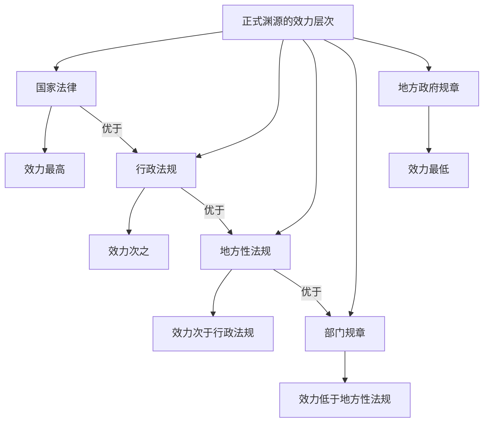

```mermaid
graph TD
    A[正式渊源的效力层次]
    A1[国家法律]
    A2[行政法规]
    A3[地方性法规]
    A4[部门规章]
    A5[地方政府规章]

    A --> A1
    A --> A2
    A --> A3
    A --> A4
    A --> A5

    A1 --> B1[效力最高]
    A2 --> B2[效力次之]
    A3 --> B3[效力次于行政法规]
    A4 --> B4[效力低于地方性法规]
    A5 --> B5[效力最低]
    
    A3 -->|优于| A4
    A2 -->|优于| A3
    A1 -->|优于| A2

```

