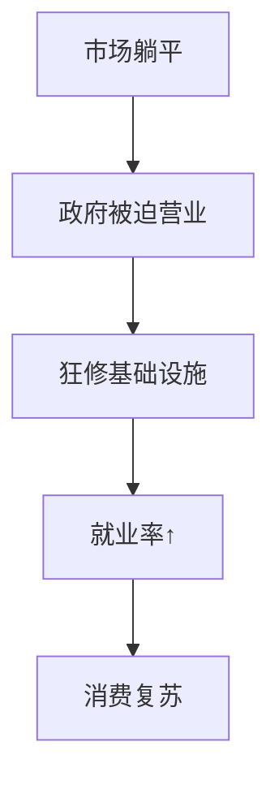

- **市场 “失灵” 要政府出手**：在市场里，商家都想赚钱。但公共物品有两个怪脾气，一个是 “非竞争性”，就是多一个人用也不咋增加成本；另一个是 “非排他性”，很难不让别人用。就像公园的长椅，多坐一个人也不增加啥成本，而且也没办法只让一部分人坐。这样一来，商家觉得无利可图，就不愿意提供了。这时候政府就得发挥经济职能，来提供这些公共物品，保证社会正常运转。
- **稳定经济的法宝**：政府提供公共物品能让经济稳稳当当发展。比如说在经济不好的时候，大家都不咋花钱，政府就去修桥铺路。这么做能让很多人有活干，有了收入就会去消费，企业的东西也能卖出去，经济就能慢慢好起来。这就是政府通过提供公共物品来调节经济。

### 公共物品在经济职能里的表现

- **合理分配资源**：政府能把钱和资源用到该用的地方。比如建一个机场，这能带动周围很多产业，像酒店、餐饮等，让资源从其他地方流到这里，让整个社会的经济更有效率。
- **助力经济发展**：提供公共物品就像给经济发展铺了一条好路。就拿教育来说，政府办学校、培养人才，这些有本事的人以后能搞出很多新发明、新科技，让企业生产出更好的东西，经济就能一直发展下去。

### 这种默认也有毛病

- **只看经济，忘了社会**：公共物品可不只是对经济有用，对社会也很重要。像医院，它能保证大家的健康，这是社会公平的一部分。要是只把提供医院当成经济职能，就忽略了每个人都有看病的权利，也忽略了它对社会稳定的作用。
- **看问题不全面**：很多公共物品有好几种用处。比如说图书馆，它能吸引游客、带动周边消费，这是经济方面的作用；但它更重要的是能让大家学到知识、丰富精神世界，这是社会文化方面的作用。只把它当成经济职能，就看不到它的全部好处啦。

📜 **政府的经济职能为啥总跟公共物品锁死？**  
——原来是一段"市场失灵→政府填坑"的虐恋故事💔

---

### 🕵️♂️ **默认CP的三大真相**  

1️⃣ **市场是个渣男** 💼  
"公共物品有两大怪癖：  
🔸 **非竞争性** → 坐长椅就像追星，100人坐和101人坐成本差不多  
🔸 **非排他性** → 想收门票？保安大叔会累到哭😭  
商家：这赔钱买卖谁干啊！溜了溜了~"  

📍**考点警报**：2022真题考过这两个特性区别（记住长椅vs电影院的例子！）

2️⃣ **政府是经济救心丸** 💊  
"经济扑街时：  
政府突然掏出《基建の奥义》📖  
修桥！铺路！建公园！  
👷♂️打工人复活 → 💸钱包鼓了 → 🛍️买爆商场 → 📈GDP起死回生"  

🌰 **魔性案例**：  
2008金融危机时，我国狂修高铁，直接让钢铁侠（行业）原地复活！

---

### 🚧 **这个CP的BUG在哪**  
**🕳️ 致命漏洞1：经济脑上头**  
"医院=治病+赚钱？错！  
🏥本质是生命权保障 → 🤒你生病时医院说'先充钱再抢救'试试？  
政府要是只算经济账，迟早被市民举牌抗议！"  

**🕳️ 致命漏洞2：选择性眼瞎**  
"图书馆の千层套路：  
📚表面：吸引游客→周边奶茶店暴富  
📖内核：知识平权→让清洁工阿姨也能读《时间简史》  
只看经济作用？简直暴殄天物！"  

📍**记忆口诀**：  
"公共物品像瑞士军刀🔪，别只当开瓶器用！"

