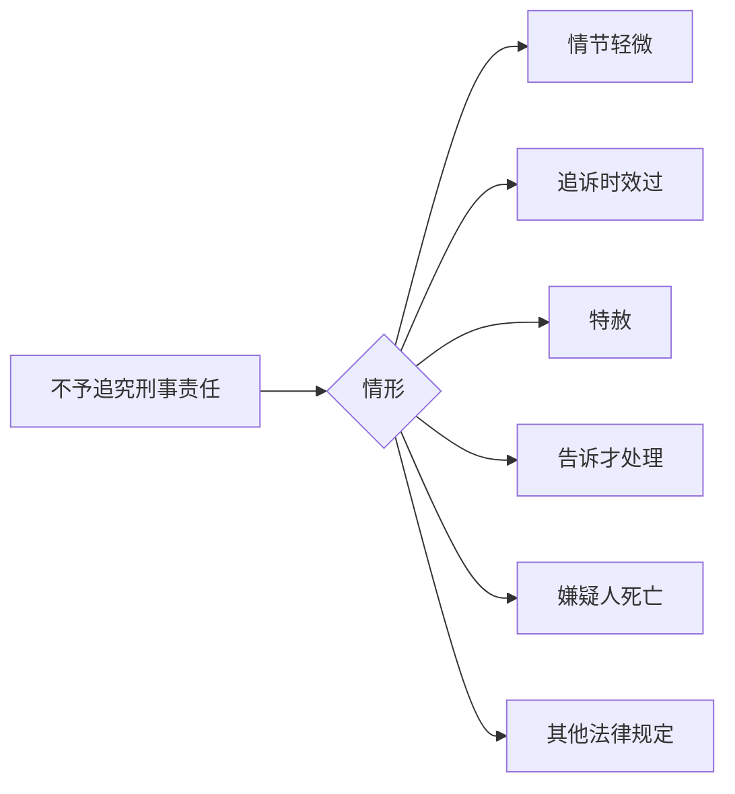

## 一、刑事诉讼的基本原则 
### 1. 侦查权、检察权、审判权由专门机关行使
- **重点**：警察抓人、检察官起诉、法官判案，分工明确！
- **表情包**：👮‍♂️ "抓人归我！" 👩‍⚖️ "判案归我！"

### 2. 未经法院判决，不得确定有罪
- **重点**：法院说了算，其他人都别瞎BB！
- **例子**：张三被抓了，但没判刑前，他还是无罪的！
- **表情包**：🙅‍♂️ "没判之前，别乱说！"

### 3. 法定情形不予追究刑事责任
- **重点**：以下6种情况，不追究责任！
- **考点**：记住这6条，考试常考！

## 二、刑事诉讼的主体 🎭
### 1. 犯罪嫌疑人 vs 被告人
- **重点**：检察院起诉前叫“犯罪嫌疑人”，起诉后叫“被告人”！
- **例子**：张三偷东西被抓→“犯罪嫌疑人”；检察院起诉→“被告人”。
- **表情包**：👤 "我是嫌疑人！" 👤 "不，现在你是被告！"

### 2. 辩护人
- **重点**：嫌疑人/被告人可以请律师或亲友辩护！
- **考点**：哪些人不能当辩护人？→ 正在服刑、被开除公职的人！
- **表情包**：👨‍⚖️ "请个律师，保你平安！"

## 三、管辖 🗺️
### 1. 立案管辖
- **重点**：法院、检察院、公安各管各的案子！
- **例子**：
  - **法院**：告诉才处理的案件（如侮辱、诽谤）。
  - **检察院**：司法工作人员犯罪（如刑讯逼供）。
  - **公安**：普通刑事案件。
- **表情包**：🏢 "法院管小案，公安管大案！"

### 2. 审判管辖
- **重点**：案子由哪级法院管？
- **考点**：
  - **基层法院**：普通案件。
  - **中级法院**：危害国家安全、恐怖活动、无期徒刑/死刑案件。
  - **高级法院**：全省性重大案件。
  - **最高法院**：全国性重大案件。
- **表情包**：🏛️ "案子越大，法院越高！"

## 四、回避 🚫
### 1. 回避对象
- **重点**：法官、检察官、侦查人员等，有利益冲突得回避！
- **例子**：法官是嫌疑人的亲戚→必须回避！
- **表情包**：🙅‍♂️ "有利益冲突？回避！"

### 2. 回避事由
- **重点**：4种情况必须回避！
- **考点**：
  1. 是本案当事人或近亲属。
  2. 与本案有利害关系。
  3. 担任过本案证人、鉴定人等。
  4. 与当事人有其他关系，可能影响公正。
- **表情包**：🤔 "这案子跟我有关系？回避！"

## 五、证据 🕵️‍♂️
### 1. 证据种类
- **重点**：8种证据，记住关键词！
- **考点**：
  1. **物证**：物品、痕迹。
  2. **书证**：书面材料。
  3. **证人证言**：证人说的话。
  4. **被害人陈述**：被害人说的话。
  5. **口供**：嫌疑人/被告人的供述。
  6. **鉴定意见**：专家意见。
  7. **勘验笔录**：现场记录。
  8. **视听资料**：录音、录像。
- **表情包**：📜 "证据种类多，记住关键词！"

### 2. 证据分类
- **重点**：原始证据 vs 传来证据，直接证据 vs 间接证据！
- **例子**：
  - **原始证据**：凶器（直接来自案件）。
  - **传来证据**：别人转述的证言（间接来源）。
- **表情包**：🔍 "原始证据最靠谱！"

## 六、刑事强制措施 ⛓️
### 1. 拘传
- **重点**：强制到案，最长24小时！
- **表情包**：⏳ "24小时，别想跑！"

### 2. 取保候审
- **重点**：交钱或找保证人，暂时自由！
- **考点**：哪些人不能取保候审？→ 累犯、暴力犯罪！
- **表情包**：💰 "交钱保自由！"

### 3. 监视居住
- **重点**：在家待着，别乱跑！
- **表情包**：🏠 "在家监视，别出门！"

### 4. 拘留
- **重点**：紧急情况，先抓人！
- **表情包**：🚨 "紧急情况，先抓再说！"

### 5. 逮捕
- **重点**：证据确凿，必须抓！
- **表情包**：🔒 "证据确凿，逮捕！"

## 七、刑事诉讼程序 ⚖️
### 1. 立案 → 侦查 → 起诉 → 审判 → 执行
- **重点**：5个阶段，按顺序走！
- **表情包**：📝 "立案开始，执行结束！"

### 2. 二审程序
- **重点**：上诉不加刑！
- **表情包**：🔄 "上诉不加刑，放心！"
